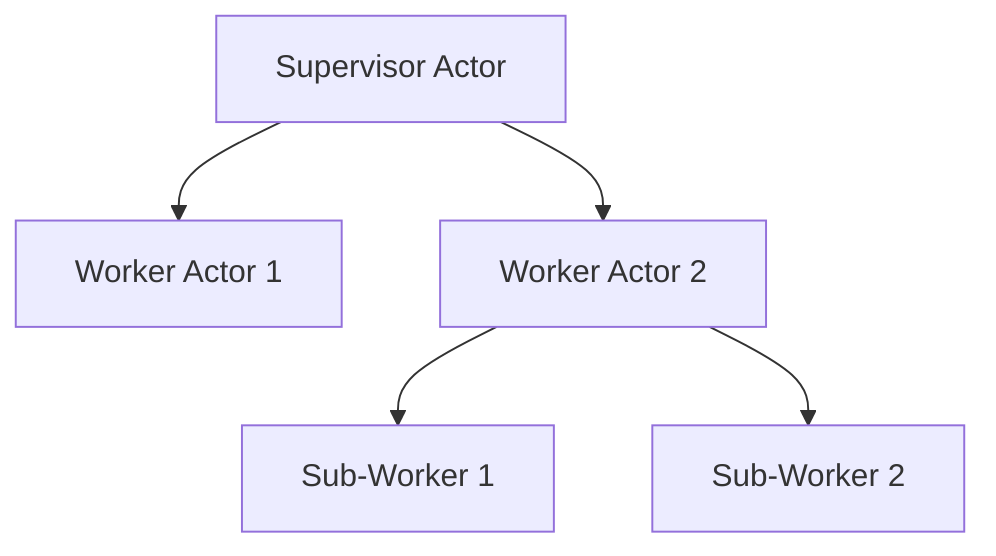

# Scale-Free Architecture: The Fractal Nature of the Actor Model

## Introduction

The shift from a graph-based to an actor-based architecture in Choir represents more than just a technical implementation decision. It embodies a fundamental metapattern - a scale-free, fractal approach to system design that provides resilience, adaptability, and coherence across multiple levels of organization. This document explores how the actor model manifests these fractal properties and why this approach is particularly well-suited for managing hypercomplex systems in an era of explosive change.

## Scale-Free Systems: Patterns That Transcend Scale

Scale-free systems exhibit similar patterns at different levels of organization. Like fractals in nature - where the branching pattern of a tree resembles both the larger forest and the smaller leaf veins - scale-free architectures maintain consistent principles across different levels of system organization.

The actor model inherently embodies these scale-free properties:

```
Individual Actor → Actor System → Distributed Network
```

At each level, the same principles apply:
- Encapsulation of state
- Message-based communication
- Independent lifecycle management
- Failure isolation
- Supervised recovery

This consistency across scales creates what we might call "architectural coherence" - a unified conceptual framework that remains valid regardless of whether we're discussing a single actor, a subsystem of actors, or a globally distributed actor network.

## Fractal Properties of the Actor Model

### 1. Self-Similarity Across Scales

In Choir's actor architecture, we see self-similarity across multiple scales:

| Scale | Implementation | Properties |
|-------|----------------|------------|
| Micro | Individual Actor | Isolated state, message processing, lifecycle |
| Meso | Phase Worker Pool | Specialized actors, worker abstraction, modality handling |
| Macro | PostChain System | End-to-end processing, system-level resilience, distributed state |
| Meta | Multi-Chain Network | Cross-chain communication, ecosystem emergence, collective intelligence |

Each level contains the essential patterns of the levels below it, yet emerges into new capabilities at its own level.

### 2. Recursive Composition

Actors can contain other actors, creating recursive structures:



This recursive composition allows for:
- Hierarchical supervision patterns
- Delegation of complex tasks
- Nested domains of responsibility
- Scalable organization principles

### 3. Locality and Global Emergence

The actor model combines strict locality (each actor only knows about its own state) with emergent global patterns:

- **Local Rules**: Each actor follows simple, well-defined rules for processing messages and managing state
- **Global Behaviors**: Complex system behaviors emerge from the interactions between actors
- **Boundary Formation**: Natural boundaries form around related actors, creating "organs" of functionality
- **Adaptive Reconfiguration**: The system can reconfigure itself based on changing conditions

This combination of strict locality with emergent global behavior is characteristic of many natural scale-free systems, from neural networks to social structures.

## Narratives for Navigating Hypercomplex Systems

As systems become increasingly complex, our ability to understand and manage them through traditional means diminishes. The actor model provides a narrative framework - a story we tell ourselves - that helps us navigate this complexity.

### The Actor Narrative

The actor model offers a powerful narrative for understanding complex systems:

1. **Independent Entities**: Every component is an independent entity with agency
2. **Communication Through Messages**: All interactions happen through clear, explicit messages
3. **Resilience Through Isolation**: Failures are contained and managed locally
4. **Emergence Through Interaction**: Complex behaviors emerge from simple interactions

This narrative shifts our thinking from controlling a monolithic system to cultivating an ecosystem of interacting entities.

### From Control to Cultivation

Traditional system design often focuses on control - creating deterministic systems with predictable behaviors. The actor model shifts this paradigm toward cultivation:

| Control Paradigm | Cultivation Paradigm |
|------------------|----------------------|
| Centralized state | Distributed state |
| Command execution | Message passing |
| Error prevention | Error containment |
| Deterministic design | Emergent design |
| Rigid structure | Adaptive structure |

This shift from control to cultivation aligns with how we must approach increasingly complex systems where complete understanding becomes impossible.

## Choir's Implementation of Scale-Free Architecture

Choir's actor-based architecture embodies these scale-free principles through several key mechanisms:

### 1. Phase Worker Pool Pattern

The Phase Worker Pool pattern creates a fractal structure:

- **Phase Types**: Define abstract capabilities (Action, Experience, etc.)
- **Actor Implementations**: Provide specialized implementations for different modalities
- **Worker Pools**: Abstract resource management across implementations

This pattern allows the same conceptual model to apply across different modalities (text, audio, video) while maintaining architectural coherence.

### 2. Supervision Hierarchies

Supervision trees provide recovery mechanisms at multiple scales:

- **Local Recovery**: Individual actors can recover from internal errors
- **Supervisor Recovery**: Supervisors can restart failed child actors
- **System Recovery**: The system can recover from subsystem failures

These nested recovery mechanisms create resilience at multiple levels of the system.

### 3. Message-Based Communication

All system components communicate through messages, creating a uniform interaction pattern across scales:

- **Actor-to-Actor**: Direct message passing between actors
- **Subsystem-to-Subsystem**: Message routing between actor groups
- **System-to-System**: Message translation between distributed systems

This consistent communication model simplifies understanding and debugging, regardless of system scale.

## Application to Dynamic Worlds and Hypercomplex Systems

The fractal, scale-free nature of the actor model makes it particularly well-suited for navigating dynamic worlds characterized by:

1. **Explosive Change**: Actors can be added, removed, or modified without disrupting the entire system
2. **Hypercomplex Interactions**: Local interactions can produce emergent behaviors without central coordination
3. **Continuous Evolution**: The system can evolve organically as new capabilities are added
4. **Resilience to Shocks**: Failures are contained and managed locally, preventing cascading failures

In a world where change is the only constant, a scale-free architecture provides the conceptual tools to build systems that thrive through adaptation rather than breaking under pressure.

## Conclusion: The Meta-Story of Scale-Free Design

The actor model provides more than just an implementation approach - it offers a meta-story about how we can design systems in an increasingly complex world. By embracing principles that work across scales, we create architectures that can adapt to changing conditions, recover from failures, and evolve over time.

Choir's pivot to an actor-based architecture represents an embrace of this meta-pattern - a recognition that in dynamic worlds of hypercomplex systems and explosive change, our architectural patterns must themselves be adaptive, resilient, and scale-free.

The stories we tell ourselves about how systems should be designed shape the systems we create. By adopting the scale-free narrative of the actor model, we position ourselves to create systems that can thrive in an uncertain future - not through rigid control, but through adaptable patterns that work across scales.
