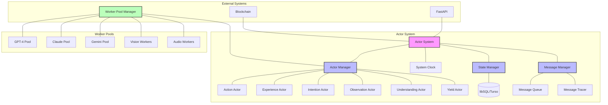
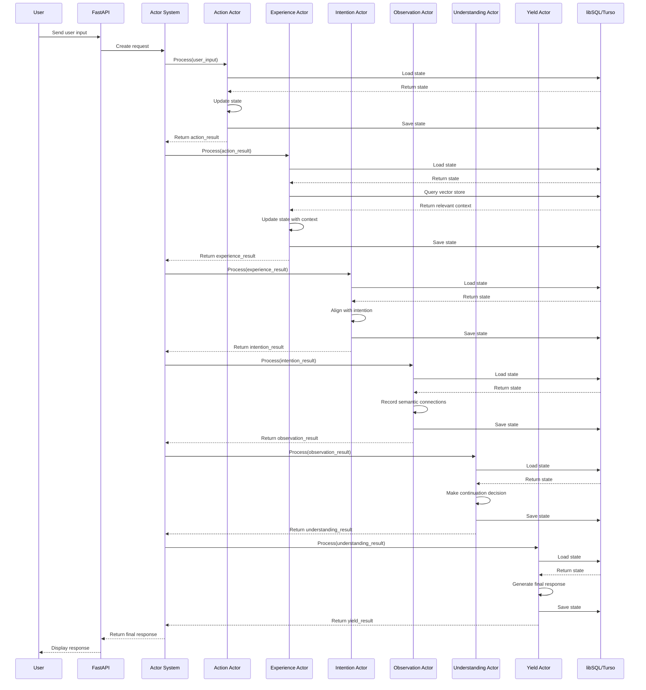
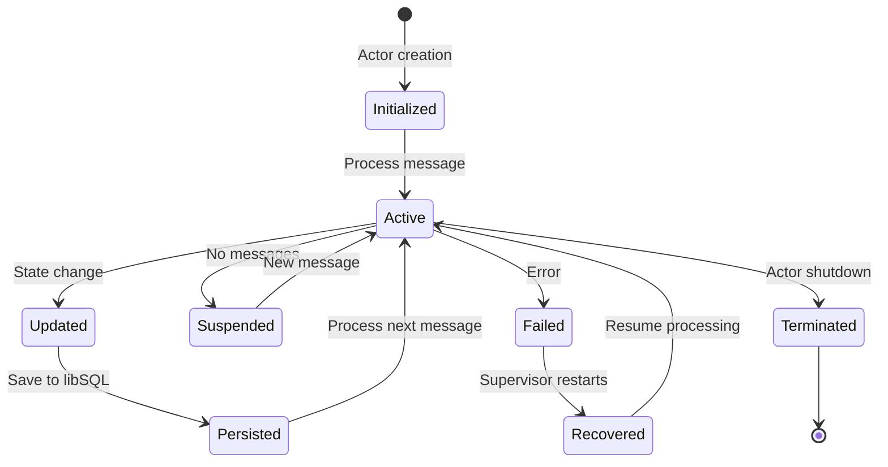
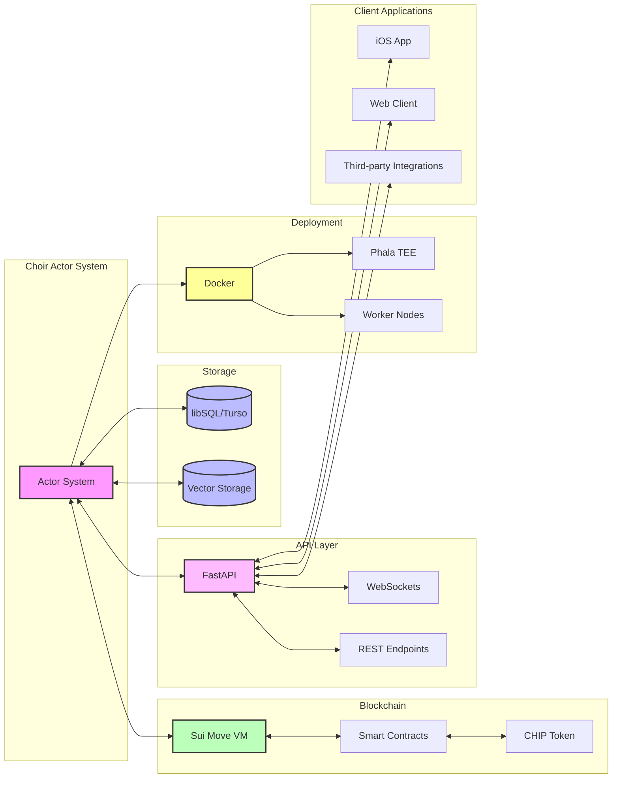
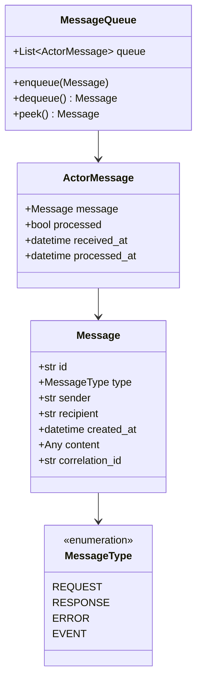

# Actor System Architecture Diagrams

This document provides visual representations of Choir's actor-based architecture to help developers understand the system structure, message flow, and component interactions.

## Core Actor System Components

The following diagram shows the primary components of the actor-based architecture:

## PostChain Message Flow

This sequence diagram illustrates the message flow through the actor system during a typical PostChain execution:

## Actor State Lifecycle

This diagram illustrates the lifecycle of an actor's state:

## Phase Worker Pool Architecture

This diagram shows how the Phase Worker Pool pattern extends the actor model:

```mermaid
graph TD
    subgraph "Phase Types"
        PT1[Action Type]
        PT2[Experience Type]
        PT3[Intention Type]
        PT4[Observation Type]
        PT5[Understanding Type]
        PT6[Yield Type]
    end

    subgraph "Modality-Specific Actors"
        PT1 --> A1T[Text Action Actor]
        PT1 --> A1A[Audio Action Actor]
        PT1 --> A1V[Video Action Actor]
        PT1 --> A1C[Code Action Actor]

        PT2 --> A2T[Text Experience Actor]
        PT2 --> A2A[Audio Experience Actor]
        PT2 --> A2V[Video Experience Actor]
        PT2 --> A2C[Code Experience Actor]

        %% Other actor types would follow the same pattern
    end

    subgraph "Domain-Specific Actors"
        PT2 --> A2M[Medical Experience Actor]
        PT2 --> A2L[Legal Experience Actor]
        PT2 --> A2F[Financial Experience Actor]
    end

    subgraph "Worker Pools"
        WP1[GPT-4 Pool]
        WP2[Claude Pool]
        WP3[Gemini Pool]
        WP4[Vision Pool]
        WP5[Audio Pool]
        WP6[Embedder Pool]
    end

    A1T --> WP1
    A1T --> WP2
    A2T --> WP1
    A2T --> WP3
    A1V --> WP4
    A1A --> WP5
    A2M --> WP1
    A2L --> WP2

    style PT1 fill:#f96,stroke:#333,stroke-width:2px
    style PT2 fill:#f96,stroke:#333,stroke-width:2px
    style PT3 fill:#f96,stroke:#333,stroke-width:2px
    style PT4 fill:#f96,stroke:#333,stroke-width:2px
    style PT5 fill:#f96,stroke:#333,stroke-width:2px
    style PT6 fill:#f96,stroke:#333,stroke-width:2px
```

## Integration Architecture

This diagram shows how the actor system integrates with external systems:

## Message Structure

This diagram illustrates the structure of messages passed between actors:

These diagrams provide a visual understanding of Choir's actor-based architecture. The diagrams can be rendered using Mermaid.js, which is supported by many Markdown viewers and documentation tools.
