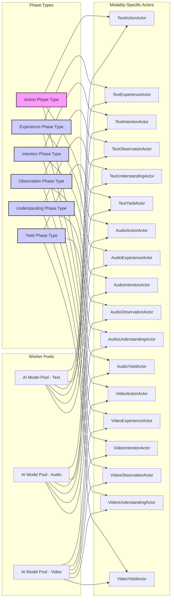

# Phase Worker Pool Architecture

## Extending the Actor Model for Modality and Specialization

The Phase Worker Pool architecture extends the actor model to handle diverse input modalities and specialized processing requirements while maintaining the conceptual clarity of the PostChain. By abstracting AI models as workers and implementing modality-specific actors, the system can adapt to new input types, specialized domains, and evolving AI capabilities without requiring a redesign of the core architecture.

## Motivation

### Handling Diverse Modalities

The core PostChain defines the processing flow, but doesn't specify *how* each phase should handle different input types like text, audio, video, or code. A scalable architecture needs to:

1. **Abstract Modality Handling**: Isolate modality-specific logic from core phase logic
2. **Support Multiple Modalities**: Enable the system to process diverse input types
3. **Evolve with New Modalities**: Allow easy addition of new modality support

### Supporting Specialized Domains

Similarly, the core PostChain is domain-agnostic, but real-world applications require specialized knowledge and processing:

1. **Domain Specialization**: Support specialized phases for medical, legal, financial domains
2. **Knowledge Integration**: Integrate domain-specific knowledge bases and models
3. **Expertise Injection**: Allow easy injection of domain expertise into the workflow

### Abstracting AI Models

Directly embedding specific AI models into actors creates tight coupling and limits flexibility. A more robust architecture should:

1. **Abstract Model Access**: Decouple actors from specific AI model implementations
2. **Enable Model Interchangeability**: Allow easy swapping of models for different tasks
3. **Manage Model Resources**: Efficiently manage and pool AI model instances

## Phase Worker Pool Pattern

The Phase Worker Pool pattern addresses these challenges by introducing three key components:

1. **Phase Types**: Abstract phase definitions (Action, Experience, etc.) that are modality-agnostic
2. **Modality-Specific Actors**: Concrete actor implementations specialized for each modality (TextActionActor, AudioExperienceActor, etc.)
3. **Worker Pools**: Pools of AI model instances that are dynamically assigned to actors as needed

### 1. Phase Types

Phase types define the abstract processing steps in the PostChain workflow (Action, Experience, Intention, Observation, Understanding, Yield). They are modality-agnostic and specify:

- **Phase Name**: Unique identifier (e.g., "Action", "Experience")
- **Input Schema**: Expected input message format
- **Output Schema**: Expected output message format
- **Core Logic**: High-level processing steps (independent of modality)

### 2. Modality-Specific Actors

Modality-specific actors are concrete implementations of phase types, specialized for handling a specific modality (e.g., TextActionActor for text inputs in the Action phase). Each modality-specific actor:

- **Implements a Phase Type**: Extends a base class or interface for a phase type
- **Handles a Specific Modality**: Processes messages of a specific modality (text, audio, video)
- **Uses Worker Pools**: Accesses AI models from modality-specific worker pools
- **Encapsulates Modality Logic**: Contains all modality-specific processing code

### 3. Worker Pools

Worker pools manage pools of AI model instances, abstracting model access for modality-specific actors. Each worker pool:

- **Manages a Pool of Models**: Creates and manages a pool of pre-initialized AI model instances (e.g., OpenAI GPT-4, Anthropic Claude)
- **Abstracts Model Invocation**: Provides a simple interface for actors to request model access without knowing model details
- **Handles Load Balancing**: Distributes requests across available model instances
- **Enables Model Interchangeability**: Allows easy swapping of models in the pool

## Benefits of Phase Worker Pool

This architecture provides several key benefits:

### Modality Extensibility

New modalities (e.g., code, medical imaging) can be added by:

1. Defining new modality-specific actors for each phase (e.g., CodeActionActor, MedicalExperienceActor)
2. Creating new worker pools for modality-specific AI models (e.g., CodeModelPool, MedicalModelPool)
3. Wiring up new actors and worker pools in the system configuration

### Domain Specialization

Specialized domain actors can be implemented by:

1. Creating specialized actor implementations for relevant phases (e.g., LegalIntentionActor, FinancialUnderstandingActor)
2. Integrating domain-specific knowledge bases and models in worker pools
3. Deploying specialized actors alongside or instead of general-purpose actors

### AI Model Abstraction

AI models can be swapped or upgraded without changing actor logic:

1. Replace models within a worker pool (e.g., swap OpenAI GPT-4 for a fine-tuned model)
2. Update worker pool configuration without modifying actor code
3. Experiment with different models and compare performance

### Resource Efficiency

Worker pools improve resource utilization by:

1. Reusing model instances across multiple actors and requests
2. Reducing model cold-start latency
3. Enabling dynamic scaling of model resources based on demand

### Conceptual Clarity

The Phase Worker Pool pattern maintains the conceptual clarity of the PostChain by:

1. Preserving the core AEIOU-Y phase workflow
2. Isolating modality and domain specialization in separate actor implementations
3. Abstracting AI model management through worker pools

## Implementation Notes

### Dynamic Worker Assignment

Actors dynamically request workers from pools when processing messages. A worker pool manager actor can handle worker assignment and load balancing.

### Modality-Specific Message Handling

Modality-specific actors handle message formatting and pre/post-processing for their modality.

### Configuration-Driven Deployment

The system configuration defines which modality-specific actors and worker pools are deployed for each phase, enabling flexible system specialization.

## Conclusion

The Phase Worker Pool architecture extends the actor model to create a flexible, scalable, and extensible foundation for Choir's PostChain. By separating phase types, modality-specific actors, and worker pools, the architecture can adapt to diverse input modalities, specialized domains, and evolving AI capabilities while maintaining conceptual coherence and code maintainability. This pattern enables Choir to evolve into a truly multimodal, domain-aware, and model-agnostic AI platform.
