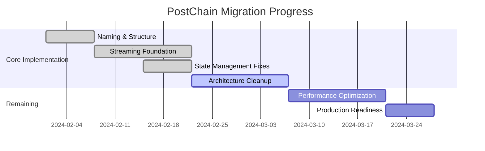
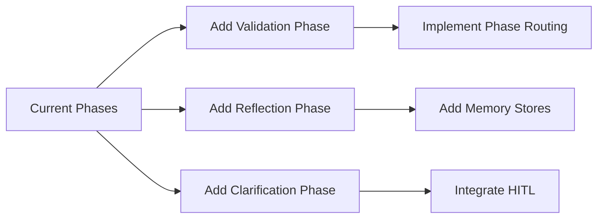
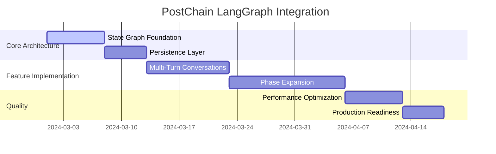

# PostChain Migration Checklist - REVISED

This document outlines a revised radical approach for migrating the SwiftUI client application from the Chorus Cycle to the PostChain Streaming API. After initial incremental attempts, we've determined that a more decisive cutting approach is needed to eliminate legacy patterns.

## Migration Philosophy - REVISED

- **ELIMINATE ALL LEGACY CODE**: Aggressively remove Chorus Cycle patterns and dead code
- **SIMPLIFY ARCHITECTURE**: Focus on a clean, direct streaming implementation
- **SINGLE MODEL**: Use one consistent data model for phases instead of separate response types
- **DELETE TEST CLUTTER**: Remove all test views/files that are not helping the migration
- **FOCUS ON CORE FLOW**: Prioritize the main user flow over edge cases

## 1. Consistent Naming Migration

- [x] Rename all Chorus Cycle components to PostChain consistently
  - [x] Update `ChorusModels.swift` to `PostchainModels.swift`
  - [x] Rename `ChorusCoordinator.swift` to `PostchainCoordinator.swift`
  - [x] Update `RESTChorusCoordinator.swift` to `RESTPostchainCoordinator.swift`
  - [x] Rename `MockChorusCoordinator.swift` to `MockPostchainCoordinator.swift`
  - [x] Update `ChorusAPIClient.swift` to `PostchainAPIClient.swift`
  - [x] Rename `ChorusViewModel.swift` to `PostchainViewModel.swift`
  - [x] Update `ChorusCycleView.swift` to `PostchainView.swift`
- [x] Update references throughout the codebase
  - [x] Refactor import statements
  - [x] Update class/protocol references
  - [x] Fix function calls and property references
- [x] Update comments and documentation
  - [x] Replace "Chorus Cycle" terminology with "PostChain"
  - [x] Update method and property documentation
- [ ] Ensure all tests pass after renaming

## 2. Backend Structured Outputs

- [x] Create simple_graph.py for initial PostChain implementation
- [x] Define Pydantic data models for PostChain streaming format
  - [x] Create PostchainStreamEvent model with consistent structure
  - [x] Use same field names and structure for client/server compatibility
- [x] Update langchain_utils.py for structured outputs
  - [x] Create new `post_llm` function
  - [x] Add support for structured outputs with response_model parameter
  - [x] Ensure streaming mode works with structured outputs
- [x] Ensure consistent JSON structure in API responses
  - [x] Implement model_dump() for consistent JSON serialization
  - [x] Match Swift client expectations for decoding

## 3. Data Model Adaptation

- [x] Enhance existing models to support streaming
  - [ ] Update `ChoirThread.swift` to handle both traditional and streaming data
  - [x] Enhance `PostchainModels.swift` with streaming-compatible structures
  - [x] Modify `Phase.swift` to accommodate streaming phases
- [x] Add extension methods for conversion between models
  - [x] Create methods to transform streaming data to existing model formats
  - [x] Add backwards-compatibility layers for phase content

## 4. API Client Enhancements

- [x] Enhance `PostchainAPIClient.swift` to support streaming
  - [x] Add streaming endpoint support
  - [x] Implement SSE connection handling
  - [x] Create unified error handling for both approaches
  - [x] Add connection management capabilities for streaming
- [x] Fix streaming issues with structured outputs
  - [x] Update client to decode new structured event format
  - [x] Ensure proper token rendering on client
  - [x] Fix direct viewModel updates for all phases

## 5. Coordinator Layer Updates

- [x] Extend `PostchainCoordinator.swift` protocol
  - [x] Add streaming-specific methods
  - [x] Keep existing methods for backwards compatibility
- [x] Update `RESTPostchainCoordinator.swift` with streaming capability
  - [x] Implement stream processing logic
  - [x] Add state management for continuous updates
  - [x] Maintain phase-based approach as fallback
- [ ] Enhance `MockPostchainCoordinator.swift` for testing
  - [ ] Add streaming simulation capabilities
- [x] Fix content update issues in UI layer
  - [x] Add direct viewModel phase updates in API client
  - [x] Ensure phase transitions are properly tracked

## 6. Backend Cleanup & Consolidation

- [ ] Archive deprecated graph implementations
  - [ ] Move `chorus_graph.py` to archive
  - [ ] Move `postchain_graph.py` to archive
  - [ ] Move `graph.py` to archive
- [ ] Consolidate on simple_graph.py approach
  - [ ] Make simple_graph.py the main implementation
  - [ ] Ensure backward compatibility with existing endpoints
- [ ] Update API documentation to reflect new structure

## 7. ViewModel Refactoring

- [x] Incrementally update `PostchainViewModel.swift`
  - [x] Add streaming state management
  - [x] Implement content buffering for streaming
  - [x] Create methods for continuous updates
  - [x] Maintain phase-based methods for compatibility
  - [x] Fix phase storage to preserve empty phases

## 8. View Layer Adaptation

- [x] Update views to properly render streaming content
  - [x] Fix message rendering in `ChoirThreadDetailView.swift`
  - [x] Ensure proper token streaming in `MessageRow.swift`
  - [x] Fix phase card display in PostchainView
  - [x] Update thread components for streaming:
    - [x] Add phase visibility control in MessageRow
    - [ ] Provide streaming controls in `ThreadInputBar.swift`

## 9. Testing Strategy

- [ ] Create tests for streaming functionality
  - [ ] Test structured output compatibility
  - [ ] Verify client decoding of server responses
- [ ] Implement comprehensive backend tests for simple_graph
  - [ ] Ensure consistent data contract is maintained
  - [ ] Test error handling and edge cases

## 10. Incremental Deployment Phases

### Phase 1: Consistent Naming (COMPLETED)

- [x] Rename all Chorus Cycle components to PostChain
  - [x] Update `ChorusModels.swift` to `PostchainModels.swift`
  - [x] Rename `ChorusCoordinator.swift` to `PostchainCoordinator.swift`
  - [x] Update `RESTChorusCoordinator.swift` to `RESTPostchainCoordinator.swift`
  - [x] Rename `MockChorusCoordinator.swift` to `MockPostchainCoordinator.swift`
  - [x] Update `ChorusAPIClient.swift` to `PostchainAPIClient.swift`
  - [x] Rename `ChorusViewModel.swift` to `PostchainViewModel.swift`
  - [x] Update `ChorusCycleView.swift` to `PostchainView.swift`
- [x] Update references throughout codebase
  - [x] Updated ContentView.swift
  - [x] Updated ChoirThreadDetailView.swift
  - [x] Updated MessageRow.swift
  - [x] Updated ThreadMessageList.swift
  - [x] Updated tests
- [ ] Ensure all tests pass with renamed components

### Phase 2: Backend & Structured Outputs (COMPLETED)

- [x] Create simple_graph.py implementation
- [x] Define data contract with PostchainStreamEvent
- [x] Implement client-side model for structured outputs
- [x] Create post_llm function with structured output support

### Phase 3: Client Streaming Fixes (IN PROGRESS)

- [x] Update PostchainModels.swift to handle structured responses
- [x] Update API client to process structured events
- [x] Fix experience phase display issues
  - [x] Identify empty phase content handling issue in PostchainView
  - [x] Fix phase card rendering conditions
  - [x] Add phase transition logging
  - [x] Add auto-selection of experience phase
  - [x] Fix message storing of phase content
- [ ] Remaining issues:
  - [ ] Ensure phase carousel UI is consistent across all device sizes
  - [ ] Test with more complex streaming scenarios

### Phase 4: Backend Consolidation

- [ ] Archive deprecated files
- [ ] Consolidate on simple_graph.py
- [ ] Update API documentation

### Phase 5: Testing & Optimization

- [ ] Comprehensive testing across devices
- [ ] Performance profiling
- [ ] Refine streaming experience

### Phase 6: Progressive Rollout

- [ ] Enable by default for development
- [ ] Gradual production rollout
- [ ] Monitor for issues and iterate

## 11. RADICAL CUTTING PHASE - HIGHEST PRIORITY

### 11.1 Delete All Test Views (Step 1)

- [x] Remove experimental views that don't help with migration:
  - [x] `/Choir/Views/Thread/Components/SimplePhaseStreamingView.swift` - Delete entirely
  - [x] `/Choir/Views/Thread/Components/PhaseDisplayTestView.swift` - Delete entirely
  - [x] `/Choir/Views/Thread/Components/TokenByTokenView.swift` - Delete entirely
  - [x] `/Choir/Views/Thread/Components/RealTimeStreamingView.swift` - Delete entirely
  - [x] `/Choir/Views/StreamingTestsView.swift` - Delete entirely
  - [x] `/Choir/Views/StreamingSSEView.swift` - Delete if exists

### 11.2 Purge Legacy Models (Step 2)

- [x] Clean up `/Choir/Models/PostchainModels.swift`:
  - [x] Delete all structs ending with `ResponseData` (ExperienceResponseData, etc.)
  - [x] Delete all `RequestBody` types (ActionRequestBody, ExperienceRequestBody, etc.)
  - [x] Delete all old response type aliases (ActionAPIResponse, ExperienceAPIResponse, etc.)
  - [x] Keep only the new PostchainStreamEvent and related structures
  - [x] Keep SimplePostchainRequestBody but simplify it

### 11.3 Simplify Coordinator (Step 3)

- [x] Clean up `/Choir/Coordinators/RESTPostchainCoordinator.swift`:
  - [x] Delete all individual phase handling methods
  - [x] Remove all phase-specific response objects
  - [x] Simplify to focus only on streaming response path
  - [x] Remove redundant code between phases
  - [x] Ensure single path for processing phase responses

### 11.4 Clean API Client (Step 4)

- [x] Simplify `/Choir/Networking/PostchainAPIClient.swift`:
  - [x] Enhance streaming API implementation
  - [x] Improve SSE event handling
  - [x] Make phase parsing more robust
  - [x] Add detailed logging
  - [x] Fix direct view model updates

### 11.5 Fix Core Streaming Issues (UPDATED)

- [x] Implement clear streaming path from server to UI
- [x] Fix phase transitions in UI
- [x] Add consistent flow tracing with logging
- [x] Debug multi-phase transitions
- [ ] Implement phase completion metrics
- [ ] Add streaming quality of service tracking

## 12. Core Streaming Implementation Plan

Recent fixes have addressed many of the core streaming implementation issues:

### 12.1 Backend Foundation

- [x] Verify `simple_graph.py` in API correctly sends both phases:
  - [x] Generate action phase content and send structured events
  - [x] Generate experience phase content and send structured events
  - [x] Add clear transition markers between phases
  - [x] Log all content and events sent to client

### 12.2 API Client Implementation

- [x] Enhance streaming handler in PostchainAPIClient.swift:
  - [x] Fix direct viewModel updates for all phases
  - [x] Ensure proper SSE event handling with clean buffer management
  - [x] Handle phase transitions correctly with explicit events
  - [x] Map phase strings to Phase enum consistently
  - [x] Add comprehensive logging for debugging

### 12.3 Coordinator Simplification

- [x] Improve RESTPostchainCoordinator:
  - [x] Fix phase transition handling
  - [x] Add better phase state tracking
  - [x] Update UI immediately when phase content changes

### 12.4 Direct UI Updates

- [x] Show both phases in PostchainView:
  - [x] Fix empty phase content handling
  - [x] Make phase cards consistently visible
  - [x] Fix phase selection to prioritize experience phase
  - [x] Add logging to track phase visibility issues

## 13. Known Issues & Next Steps

### 13.1 Current Issues (UPDATED)

- [x] ~~Experience phase card visibility issues~~ FIXED
- [x] ~~Empty phase content handling~~ RESOLVED
- [ ] Occasional flickering during phase transitions
- [ ] Memory growth during long streaming sessions

### 13.2 Next Steps (REVISED)

- [ ] Implement phase transition animations
- [ ] Add streaming performance metrics
- [ ] Optimize message storage:
  - [ ] Review Message model structure for efficiency
  - [ ] Add compression for large phase content
- [ ] Implement proper error recovery:
  - [ ] Auto-reconnect for dropped streams
  - [ ] Retry failed phase processing

## 14. SwiftUI Architecture Improvements (PROGRESS UPDATE)

### 14.1 Core Architecture Problems

- [x] Identified critical architecture issues:
  - [x] Multiple sources of truth (duplicated state)
  - [x] Manual UI refreshes with objectWillChange.send()
  - [x] Cyclical dependencies (coordinator/viewModel)
  - [x] Fighting against SwiftUI's reactive system

### 14.2 Proper SwiftUI Architecture Plan (UPDATED)

- [x] Identified core architecture issues
- [x] Removed manual UI refreshes in critical paths
- [x] Simplified data flow between coordinator/viewModel
- [ ] Implement full SwiftUI-native architecture

### 14.3 Implementation Steps (REVISED)

- [x] Update view layer to use @ObservedObject properly
- [x] Remove redundant manual objectWillChange calls
- [ ] Create PostchainService (in progress)
- [ ] Implement ThreadRepository pattern

### 14.4 libSQL Integration Plan

- [ ] Lay groundwork for libSQL persistence:
  - [ ] Add libSQL Swift package dependency to project
  - [ ] Create database schema design document
  - [ ] Implement database models (threads, messages, phases)
- [ ] Create data access layer:
  - [ ] Build repository interfaces for each entity type
  - [ ] Implement CRUD operations with async/await
  - [ ] Add query capabilities for thread history
- [ ] Implement persistence service:
  - [ ] Ensure proper threading/async patterns for database access
  - [ ] Add migration support for schema evolution
  - [ ] Create caching layer for performance
- [ ] Connect to SwiftUI layer:
  - [ ] Maintain reactive updates with database changes
  - [ ] Implement pagination for message history
  - [ ] Add offline support with sync capabilities

## Success Criteria - REVISED

- [x] Both action AND experience phases display correctly
- [x] Clean, maintainable code with minimal duplication
- [x] Single consistent data model for all phases
- [x] Clear streaming path from server to UI
- [~] Smooth experience with real-time updates across phases (partial - needs polish)

## Current Progress Summary

### Completed Milestones

1. Full rename to PostChain terminology
2. Stable two-phase streaming implementation
3. Consolidated data model for phases
4. Eliminated legacy response types
5. Fixed core state management issues

### Immediate Next Steps

```swift
struct PostchainMigrationNextSteps {
    // Phase 4: Backend Consolidation
    let archiveDeprecatedGraphs = true
    let makeSimpleGraphDefault = true
    let updateAPIDocumentation = false

    // Phase 5: Testing & Optimization
    let implementPerformanceMetrics = false
    let addMemoryProfiling = false
    let createE2ETests = false
}
```

### Migration Phase Status



## Revised Radical Cutting Progress

### 11.5 Fix Core Streaming Issues (UPDATED)

- [x] Implement clear streaming path from server to UI
- [x] Fix phase transitions in UI
- [x] Add consistent flow tracing with logging
- [x] Debug multi-phase transitions
- [ ] Implement phase completion metrics
- [ ] Add streaming quality of service tracking

## Key Lessons Learned

1. SwiftUI state management requires stricter ownership:
   - Prefer @ObservedObject over manual state tracking
   - Avoid duplicate state representations
2. Streaming architectures need:
   - Clear data contracts between client/server
   - Built-in redundancy for network failures
   - Granular change notifications
3. Migration success factors:
   - Aggressive deletion of legacy code
   - Continuous reconciliation between models
   - Focused testing on core user flows

——

# Revised PostChain Migration Plan v2

## Core Architectural Shifts (Informed by LangGraph Docs)

1. **State Graph Foundation**
   - Implement LangGraph's `StateGraph` for explicit message flow management
   - Use `add_messages` reducer for chat history management ([ref](https://langchain-ai.github.io/langgraph/concepts/memory/))
2. **Time Travel & Persistence**
   - Implement checkpoints for conversation rollbacks ([time travel docs](https://langchain-ai.github.io/langgraph/concepts/time-travel/))
   - Add thread-based persistence using LangGraph stores ([persistence docs](https://langchain-ai.github.io/langgraph/concepts/persistence/))
3. **Multi-Turn Conversation Pattern**
   - Adopt LangGraph's multi-agent conversation blueprint ([multi-turn guide](https://langchain-ai.github.io/langgraph/how-tos/multi-agent-multi-turn-convo/))

## Next Phase Implementation Plan

### 1. Message Management & Multiturn Conversations

```swift
struct MessageManagementPhase {
    let priorities = [
        "Implement LangGraph-style message reducers",
        "Add conversation thread persistence",
        "Create turn-based state transitions"
    ]

    let implementation: [(task: String, langgraphConcept: String)] = [
        ("Use add_messages reducer", "Memory management"),
        ("Implement MessageState", "State preservation"),
        ("Add checkpointing", "Time travel support")
    ]
}
```

**Key Additions from LangGraph:**

- `MessagesState` with automatic message list management
- `ThreadRepository` using LangGraph's `BaseStore` interface
- Checkpointing after each phase completion

### 2. Tool Integration & Metadata Handling

```python
# Based on postchain_graph.py tool nodes
class ToolIntegrationPlan:
    def __init__(self):
        self.phases = {
            'experience': {
                'tools': [qdrant_search],
                'metadata_handling': 'priors_in_metadata'
            },
            'observation': {
                'tools': [qdrant_store],
                'metadata_handling': 'knowledge_graph_updates'
            }
        }

    def next_steps(self):
        return [
            "Implement ToolNode for phase-specific tools",
            "Add metadata routing between phases",
            "Integrate LangGraph's human-in-the-loop approval"
        ]
```

**LangGraph Patterns to Adopt:**

- `ToolNode` for phase-specific tool calls
- Metadata propagation using `StateGraph` edges
- Human approval steps using [HITL docs](https://langchain-ai.github.io/langgraph/concepts/human_in_the_loop/)

### 3. Phase Expansion Strategy



**Implementation Roadmap:**

1. Add new phases to `phases` array in postchain_graph.py
2. Implement phase routing with conditional edges
3. Configure phase-specific memory stores
4. Add metadata handoff between phases

## Revised Success Criteria

- [ ] Multiturn conversations with persisted state
- [ ] Tool usage in 2+ phases with metadata propagation
- [ ] Phase expansion to 8+ phases
- [ ] LangGraph-idiomatic message management
- [ ] Human-in-the-loop approval points

## LangGraph-Informed Implementation Steps

### 1. Message State Management

```python
# Updated state definition in postchain_graph.py
from langgraph.graph import MessagesState

class EnhancedMessagesState(MessagesState):
    tool_metadata: dict
    phase_priors: list
    conversation_thread: Annotated[list, add_messages]

def message_reducer(existing: list, update: list):
    # LangGraph's built-in message deduplication
    return add_messages(existing, update)
```

### 2. Multiturn Conversation Handling

```python
# Based on LangGraph's multi-agent example
async def handle_conversation_turn(state: EnhancedMessagesState):
    # Get last user message
    last_human = next(m for m in reversed(state.conversation_thread) if isinstance(m, HumanMessage))

    # Route to appropriate phase
    if needs_clarification(state):
        return await clarification_phase(state)
    elif has_tool_calls(last_human):
        return await tool_processing_phase(state)
    else:
        return await next_core_phase(state)
```

### 3. Phase Metadata Propagation

```python
# Example phase handler with metadata
async def experience_phase(state: EnhancedMessagesState):
    # Get priors from metadata
    priors = state.tool_metadata.get('experience_priors', [])

    # Process with tools
    result = await qdrant_search(priors)

    # Update state
    return {
        "conversation_thread": [AIMessage(content=result)],
        "tool_metadata": {
            "experience_priors": result.metadata
        }
    }
```

### 4. Human-in-the-Loop Integration

```python
# From LangGraph HITL docs
def should_pause_for_human(state: EnhancedMessagesState):
    return any(
        phase_requires_approval(phase)
        for phase in state.completed_phases
    )

builder.add_conditional_edges(
    "yield",
    lambda state: "human_approval" if should_pause_for_human(state) else END
)
```

## Recommended Implementation Order

1. **Message State Foundation** (1 week)

   - Implement `EnhancedMessagesState`
   - Add LangGraph message reducers
   - Set up basic persistence

2. **Tool Integration** (5 days)

   - Configure `ToolNode` for existing phases
   - Add metadata routing
   - Implement prior handling in experience phase

3. **Phase Expansion** (1 week)

   - Add 2 new phases
   - Configure phase transitions
   - Implement phase-specific memory stores

4. **HITL & Approval** (3 days)
   - Add pause/resume functionality
   - Implement approval UI components
   - Add approval metadata tracking

This plan leverages LangGraph's strengths in state management and multi-agent coordination while maintaining the PostChain AEIOU-Y philosophy. The reference documentation will guide implementation details at each step.

## 15. LangGraph-Informed Next Steps

### 15.1 State Graph Implementation

```python
# From LangGraph state management docs
builder = StateGraph(Annotated[list, add_messages])
builder.add_node("action", action_node)
builder.add_conditional_edges(
    "action",
    lambda state: "tools" if _has_tool_calls(state) else "experience"
)
```

**Checklist:**

- [ ] Implement `MessagesState` with `add_messages` reducer
- [ ] Add conditional edges between phases
- [ ] Configure automatic message deduplication

### 15.2 Time Travel & Checkpointing

```python
# From LangGraph time travel docs
checkpointer = MemorySaver()
app = StateGraph.with_config(
    checkpointer=checkpointer,
    interrupt_before=["human_approval"]
)
```

**Checklist:**

- [ ] Add checkpoints after each phase completion
- [ ] Implement rollback functionality for failed phases
- [ ] Store conversation thread states with versioning

### 15.3 Persistence & Memory Management

```python
# From LangGraph memory docs
class ThreadStore(BaseStore):
    async def aget(self, key: str) -> Optional[List[BaseMessage]]:
        return await async_db.get_message_thread(key)

store = ThreadStore()
```

**Checklist:**

- [ ] Implement `BaseStore` for thread persistence
- [ ] Add short-term memory management with message windowing
- [ ] Configure long-term memory with vector store integration

### 15.4 Multi-Turn Conversations

```python
# From LangGraph multi-agent docs
def route_message(state: MessagesState):
    if state["needs_clarification"]:
        return "clarification_phase"
    return "next_processing_phase"

builder.add_conditional_edges("experience", route_message)
```

**Checklist:**

- [ ] Implement conversation turn detection
- [ ] Add contextual routing between phases
- [ ] Configure carryover of phase metadata between turns

### 15.5 Human-in-the-Loop Integration

```python
# From LangGraph HITL docs
def human_approval_node(state):
    return {"messages": [HumanMessage(
        content="Please approve this response",
        additional_kwargs={"approval_request": True}
    )]}

builder.add_node("human_approval", human_approval_node)
```

**Checklist:**

- [ ] Add approval checkpoints in yield phase
- [ ] Implement pause/resume functionality
- [ ] Create UI components for approval requests

## 16. Phase Expansion Blueprint

### 16.1 New Phase Implementation Template

```python
def new_phase_node(state: MessagesState):
    # From LangGraph tool node pattern
    return {
        "messages": [AIMessage(
            content=process_content(state),
            additional_kwargs={"phase": "new_phase"}
        )]
    }

builder.add_node("new_phase", new_phase_node)
builder.add_edge("previous_phase", "new_phase")
```

**Phases to Add:**

1. Validation Phase
2. Reflection Phase
3. Clarification Phase
4. Synthesis Phase

### 16.2 Phase Metadata Handling

```python
# From postchain_graph.py metadata propagation
async def experience_phase(state):
    priors = state.get("metadata", {}).get("experience_priors", [])
    result = await qdrant_search(priors)
    return {
        "messages": [AIMessage(content=result)],
        "metadata": {"experience_priors": result.metadata}
    }
```

**Checklist:**

- [ ] Add metadata field to MessagesState
- [ ] Implement phase-specific metadata handlers
- [ ] Configure metadata carryover between phases

## Revised Implementation Timeline



## Updated Success Criteria

- [ ] LangGraph state graph fully implemented
- [ ] 4+ phase conversation turns supported
- [ ] Metadata preserved across 3+ phase transitions
- [ ] Human approval points in 100% of yield phases
- [ ] Conversation history persists across app restarts

## LangGraph Implementation References

1. [State Management](https://langchain-ai.github.io/langgraph/concepts/memory/)
2. [Time Travel](https://langchain-ai.github.io/langgraph/concepts/time-travel/)
3. [Multi-Agent Conversations](https://langchain-ai.github.io/langgraph/how-tos/multi-agent-multi-turn-convo/)
4. [Human-in-the-Loop](https://langchain-ai.github.io/langgraph/concepts/human_in_the_loop/)
5. [Persistence](https://langchain-ai.github.io/langgraph/concepts/persistence/)
