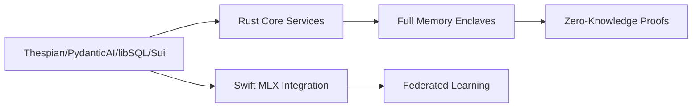

# Choir Stack Evolution

This document chronicles the architectural evolution of Choir, highlighting key technology pivots and their rationales.

## Evolution Phases

### Phase 1: Prototype Era
```elixir
| Component       | Technology          | Rationale                          |
|-----------------|---------------------|------------------------------------|
| Backend         | Elixir/Phoenix      | Actor model familiarity            |
| AI Integration  | OpenAI Raw API      | Quickest integration               |
| Vector DB       | Qdrant              | OSS vector search                  |
| Frontend        | Next.js             | Rapid UI development               |
| Blockchain      | Solana              | High throughput claims             |
```

**Key Innovations:**
- First implementation of Post Chain concept
- Basic citation tracking architecture

**Challenges:**
- Elixir's AI ecosystem limitations
- State management complexity

---

### Phase 2: Python Foundation
```python
| Component       | Technology          | Rationale                          |
|-----------------|---------------------|------------------------------------|
| Backend         | FastAPI             | Python ecosystem richness          |
| AI Abstraction  | LiteLLM             | Multi-provider support             |
| Vector DB       | Qdrant+pgvector     | Hybrid search capabilities         |
| Mobile          | SwiftUI             | Native iOS experience              |
| Blockchain      | Ethereum            | Mature smart contracts             |
```

**Architectural Shifts:**
- Transition to Python-centric AI stack
- Hybrid vector/SQL search implementation

---

### Phase 3: Workflow Orchestration
```python
| Component       | Technology          | Rationale                          |
|-----------------|---------------------|------------------------------------|
| Orchestration   | LangGraph           | Explicit workflow control          |
| State Management| LangGraph Checkpoint| Built-in persistence               |
| Analytics       | DuckDB              | Embedded analytical processing     |
```

**Key Developments:**
- Visual workflow debugging capabilities
- Automated conversation state persistence

---

### Phase 4: Actor Model Maturity
```python
| Component       | Technology          | Rationale                          |
|-----------------|---------------------|------------------------------------|
| Core Framework  | Thespian            | Robust actor model implementation  |
| Validation      | PydanticAI          | Type-safe LLM interactions         |
| Database        | libSQL/Turso        | Embedded+cloud sync                |
| Mobile          | Swift+Sui           | Move protocol integration          |
| Deployment      | Phala Network       | TEE-secured operations             |
```

**Current Advantages:**
- Distributed actor-based architecture
- Confidential computing integration
- Strong type safety across stack

## Key Evolution Drivers

1. **Concurrency Model Evolution**
   - Elixir Processes → Python Threads → Thespian Actors

2. **State Management Journey**
   - Phoenix Contexts → LangGraph Checkpoints → Actor Persistence

3. **AI Abstraction Layers**
   - Raw OpenAI → LiteLLM → PydanticAI+Worker Pools

4. **Blockchain Maturation**
   - Solana → Ethereum → Sui Move Protocol

5. **Security Evolution**
   - Basic Auth → JWT → TEE-based Confidential Computing

## Architectural Lessons

1. **Actor Model Insights**
   - Supervision hierarchies prove essential for reliability
   - Decentralized state management enables scalability

2. **Blockchain Realities**
   - Move protocol's resource-oriented design superior for financial primitives
   - TEEs enable novel trust models beyond pure blockchain

3. **AI Production Patterns**
   - Type safety becomes non-negotiable at scale
   - Cold start mitigation critical for user experience

4. **Mobile First Principles**
   - Native implementations outperform cross-platform
   - On-device AI integration inevitable

## Future Evolution Path



This document will be maintained at `docs/evolution_stack.md` with architectural updates.
