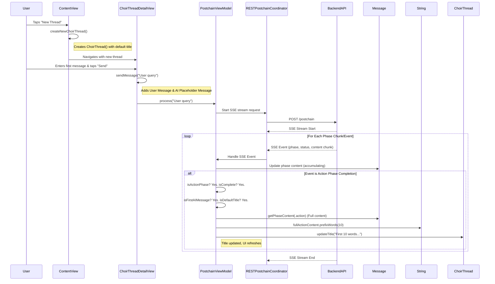

**Status:** Implemented on 2025-04-09

# Feature Plan: Automatic Thread Titles

**Goal:** Implement a mechanism to automatically generate titles for new Choir threads based on the first 10 words of the AI's "Action" phase response in the initial message, without overwriting manually set titles.
**This feature is now live.** Choir threads automatically receive a generated title based on the first 10 words of the initial AI Action phase response, unless the user manually sets a title.

**Implementation Strategy:** Client-Side

**Detailed Steps:**

1.  **Trigger Location:** Modify the logic within the `RESTPostchainCoordinator` (or potentially `PostchainViewModel`) where Server-Sent Events (SSE) are handled.
2.  **Identify Action Phase Completion:** Detect the SSE event where `phase == "action"` and `status == "complete"`.
3.  **Add Detection Logic:**
    *   When the `Action` phase completion event arrives:
        *   Check if the message being updated is the *first AI message* in the thread (e.g., check `thread.messages.count == 2` and the message `isUser == false`).
        *   Check if the current thread title still matches the default "ChoirThread [timestamp]" pattern (using a regex or prefix check). This prevents overwriting manually set titles.
4.  **Extract & Generate Title:**
    *   If all conditions are met:
        *   Retrieve the *complete* `Action` phase content from the `Message` object (it should be fully populated by this point).
        *   Implement a helper function `String.prefixWords(10)` (likely as a String extension) to get exactly the first 10 words. Handle potential edge cases like fewer than 10 words.
        *   Generate the title: `let generatedTitle = fullActionContent.prefixWords(10)`.
        *   If `generatedTitle` is empty, use a fallback: `let finalTitle = generatedTitle.isEmpty ? "New Thread" : generatedTitle`.
5.  **Update Thread Title:**
    *   Call `thread.updateTitle(finalTitle)` on the corresponding `ChoirThread` object. The existing persistence logic within `updateTitle` will handle saving.

**Sequence Diagram:**

**Key Decisions:**
*   Update title only after the *entire* Action phase is complete.
*   Do *not* overwrite manually edited titles.
*   Use *exactly* the first 10 words, without filtering filler words for this initial version.
