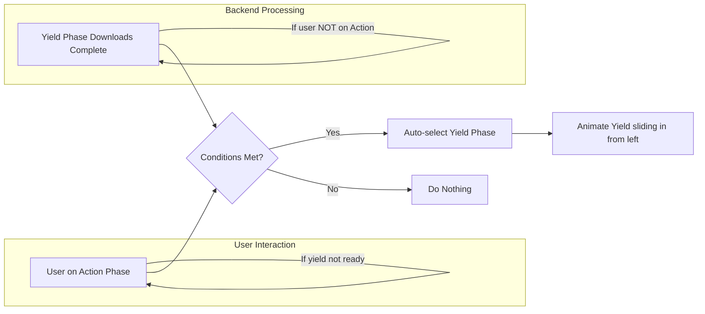

**Status:** Implemented on 2025-04-09

# Close the Loop: Auto-Select Yield Phase with Wrap-Around Animation

**This feature is now live.** When the yield phase completes downloading, if the user is viewing the action phase, the UI automatically transitions to display the final response with a wrap-around animation.

## Objective
When the **yield** phase (final response) finishes downloading, and the user is currently viewing the **action** phase, **auto-select** the yield phase. Animate it sliding **in from the left**, visually looping the phase sequence from end back to start.

---

## Why?
- Improves UX by seamlessly transitioning to the final output.
- Mimics a circular phase flow, reinforcing the conceptual loop.
- Avoids user confusion or manual navigation when the final response is ready.

---

## Implementation Plan

### 1. Detect Yield Phase Completion

In the **view model** (where phase updates are processed):

- **When:**
  - `phase == .yield`
  - `status == "complete"`
  - `message.selectedPhase == .action`

- **Then:**

```swift
withAnimation(.spring()) {
    updateSelectedPhase(for: message, phase: .yield)
}
```

This auto-selects the yield phase **only if** the user is on the action phase when yield completes.

---

### 2. Modify Offset Calculation for Wrap-Around Effect

In `PostchainView.swift`, update `calculateOffset(for:phase,cardWidth,totalWidth)`:

```swift
if selectedPhase == .yield && phase == .action {
    // Action is visually to the right of yield during wrap-around
    return cardWidth + dragOffset
}
if selectedPhase == .action && phase == .yield {
    // Yield is visually to the left of action during wrap-around
    return -cardWidth + dragOffset
}
```

- This ensures that when switching from action to yield, the yield card **slides in from the left**.
- For all other cases, keep the existing offset logic.

---

### 3. Maintain Intuitive User Experience

- **Only** auto-switch if the user is on the action phase.
- If the user navigates elsewhere, **do not** force switch.
- This respects user control and prevents jarring transitions.

---

### 4. Testing & Animation

- When yield completes:
  - If on action, yield slides in from the left.
  - If on another phase, no forced switch.
- Swiping manually should still work smoothly.
- Wrap-around offset logic applies **only** between action and yield.

---

## Mermaid Diagram: Phase Selection Logic



---

## Summary

- **Detect** yield phase completion + user on action.
- **Auto-select** yield phase with animation.
- **Adjust offset** to create wrap-around effect.
- **Respect user control**.
- **Maintain smooth carousel behavior**.

---

## Notes

- The wrap-around effect is **only visual**; the phase order remains linear.
- This approach can be extended to other phase transitions if needed.
