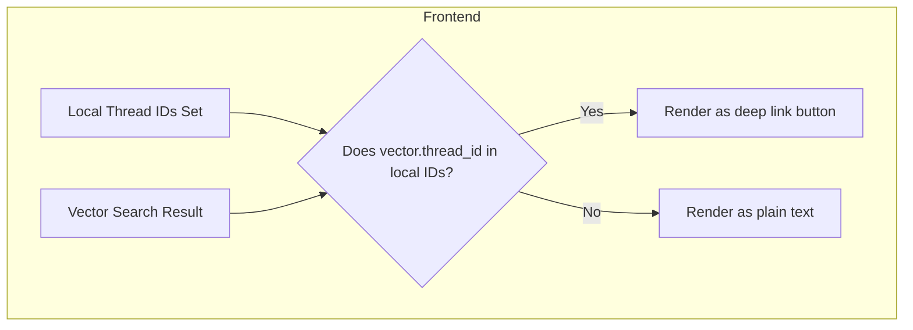

# Deep Linking Vector and Web Search Results

## Overview

This document outlines the plan to enable deep linking of vector search results to threads, and inline linking of web search results, within the Choir PostChain workflow.

---

## Backend

- The client generates a UUID for each new thread.
- This `thread_id` is sent to the backend and saved as metadata when storing query vectors.
- The backend returns vector search results with this `thread_id` metadata.
- Web results include URLs as usual.

---

## Frontend

### Local Thread IDs

- The client maintains a set of local thread UUIDs.
- These UUIDs are **shared** with the backend, so they match the `thread_id` metadata in vector search results.

### Loading Local Thread IDs (Updated)

- On app startup, **load all existing thread UUIDs** from persistent storage (Core Data, files, etc.).
- Maintain this set in a shared model or service (e.g., `ThreadPersistenceService`).
- When a new thread is created, **add its UUID** to this set immediately.
- Pass this populated set into all `PostchainView`, `PhaseCard`, `SearchResultListView`, and related UI components.
- If the set is empty (current state), **no deep links will be shown**.

---

## Rendering Logic

- When displaying vector search results:
  - Extract `thread_id` from the result metadata.
  - If this ID **exists in the local thread ID set**, render the snippet as a **deep link button** to `choir://thread/{thread_id}`.
  - Otherwise, render as plain text.
- When displaying web search results:
  - Render the URL as a clickable link as usual.

---

## Pseudocode

```swift
if localThreadIDs.contains(threadIDFromMetadata) {
    // Render as deep link button
    openURL(URL(string: "choir://thread/\(threadIDFromMetadata)")!)
} else {
    // Render as plain text
}
```

---

## Mermaid Diagram



---

## Summary

- Thread IDs are shared between client and backend.
- The frontend matches vector result `thread_id` metadata to local thread IDs.
- Matching results become deep links to open the thread.
- Web results remain clickable URLs.
- **Critical:** The local thread UUID set **must be populated** on app startup and kept in sync, or no deep links will appear.
