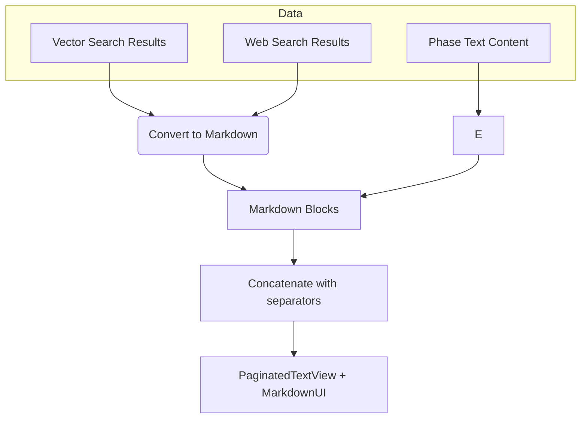

# Unified Markdown Rendering for Phase Cards

## Objective

Unify **all phase card content** (text, vector search results, web search results) into a **single Markdown string** rendered with **MarkdownUI** and **pagination**. This will:

- Fix inconsistent link behavior.
- Simplify UI code.
- Enable deep linking everywhere.

---

## Approach

### 1. Markdown Conversion Helpers

Create helper functions or extensions:

```swift
func markdown(for vectorResult: VectorSearchResult) -> String {
    """
    **\(vectorResult.title)**
    \(vectorResult.snippet)

    [View Source](\(vectorResult.url))
    """
}

func markdown(for webResult: SearchResult) -> String {
    """
    **\(webResult.title)**
    \(webResult.snippet)

    [Visit Website](\(webResult.url))
    """
}
```

---

### 2. Compose Combined Markdown Content

In your **ViewModel** or **PhaseCard**, generate:

```swift
let baseContent = message.getPhaseContent(phase)

let vectorMarkdown = message.vectorSearchResults
    .map { markdown(for: $0) }
    .joined(separator: "\n\n---\n\n")

let webMarkdown = message.webSearchResults
    .map { markdown(for: $0) }
    .joined(separator: "\n\n---\n\n")

let combinedMarkdown = [baseContent, vectorMarkdown, webMarkdown]
    .filter { !$0.isEmpty }
    .joined(separator: "\n\n---\n\n")
```

---

### 3. Refactor UI to Use Unified Markdown

- Pass `combinedMarkdown` as the **only** content to your existing `PaginatedTextView`.
- Remove the special-case switch logic for `.experienceVectors` and `.experienceWeb`.
- **Always** render paginated Markdown content, regardless of phase.

---

### 4. Migration Steps

- Implement helpers.
- Generate combined Markdown.
- Replace `UnifiedPaginatedView` calls with `PaginatedTextView`.
- Delete `UnifiedPaginatedView` and custom result cards (`VectorResultCard`, `WebResultCard`).
- Test each phase for correctness.

---

### 5. Data Flow Diagram



---

### 6. Testing Checklist

- All phase content paginates correctly.
- All links (text, vector, web) are clickable.
- No UI regressions.
- Deep links work in all contexts.

---

## Summary

Convert **all content** to Markdown, concatenate, and render with a **single paginated Markdown view**. This simplifies the UI, fixes link issues, and unifies the user experience.
