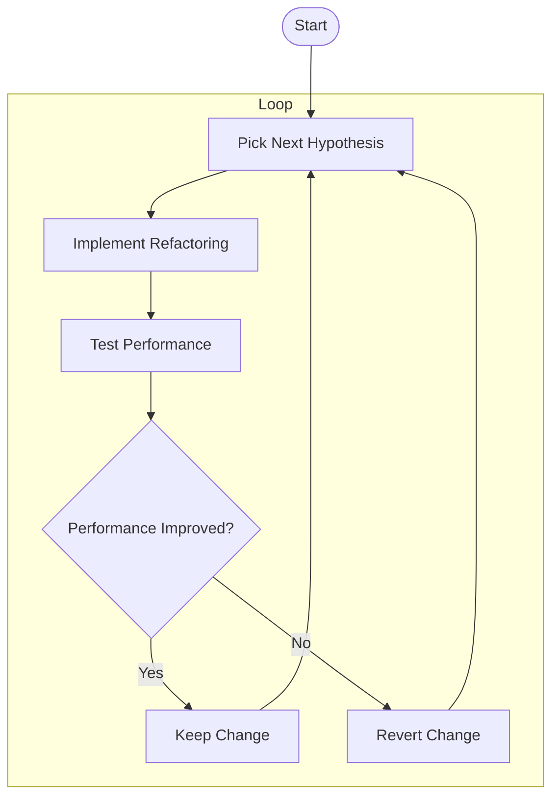

# Performance Refactoring Guide for Choir Phase Selection UI

---

## Objective

Systematically eliminate CPU and memory spikes during drag interactions in the phase selection UI by **attempting each of the following strategies one by one** until performance is solid.

---

## Instructions for AI Coder

- Treat each hypothesis below as a **targeted refactoring experiment**.
- After each change, **profile CPU and memory usage** during drag.
- **Keep changes that improve performance**, discard ineffective ones.
- **Repeat** until the UI is smooth and resource-efficient.

---

## Hypotheses & Refactoring Strategies

### 1. Excessive View Re-rendering
- Profile view recomputation during drag.
- Minimize view hierarchy depth.
- Use `.drawingGroup()` to offload rendering.
- Reduce number of views updated on drag.

### 2. Inefficient State Management
- Audit `@State`, `@ObservedObject`, `@StateObject`.
- Localize state updates to smallest possible scope.
- Avoid large observable objects triggering broad invalidations.
- Use `EquatableView` or `.equatable()` to limit updates.

### 3. Memory Leaks or Retain Cycles
- Use Xcode Memory Graph Debugger.
- Check for retained closures or gesture references.
- Fix strong reference cycles in view models or gestures.

### 4. Expensive Computations in Drag Handlers
- Profile `.onChanged` and `.onEnded`.
- Move heavy calculations off main thread.
- Cache or precompute expensive values.
- Simplify snapping logic.

### 5. Implicit Animations Elsewhere
- Disable implicit animations during drag with `.transaction`.
- Audit `.animation()` modifiers and implicit animations.
- Animate **only** on drag end.

### 6. Large Images or Complex Graphics
- Profile GPU usage.
- Downscale or compress images.
- Simplify gradients, shadows, or effects.
- Use static images instead of dynamic rendering where possible.

### 7. Excessive GeometryReader or PreferenceKey Use
- Minimize nested `GeometryReader`s.
- Avoid preference propagation during drag.
- Cache layout values instead of recomputing.

### 8. Data Model Updates During Drag
- Avoid triggering model writes or API calls during drag.
- Batch updates after drag ends.
- Use debouncing or throttling.

### 9. Debug Logging or Console Output
- Remove or comment out `print()` statements during drag.
- Avoid excessive console output.

### 10. UIKit/SwiftUI Bridging Overhead
- Minimize use of `UIViewRepresentable` or UIKit gestures.
- Prefer native SwiftUI gestures and views.

---

## Process Flow

---

## Success Criteria

- **Smooth drag interaction**
- **CPU usage < 50% during drag**
- **Stable memory footprint**
- **No UI stutter or lag**

---

## Notes

- Use **Instruments (Time Profiler, Allocations, SwiftUI)** to guide optimizations.
- Document each attempt and its impact.
- Combine effective strategies for best results.

---

## End of Guide
