# Phase Selection Sheet Implementation Plan

## Objective
Enable users to:
1. View entire phase content in selection sheet
2. Auto-scroll to current page
3. Auto-select current page's text within full content

## Implementation Steps

### 1. Context Menu Enhancements
- Add new options to PhaseCard context menu:
  - "Copy Entire Phase Content"
  - "Select Entire Phase Content"

### 2. Content Preparation
- Use existing `splitMarkdownIntoPages` function to:
  - Split full phase content into pages
  - Calculate current page's range (start offset + length)

### 3. TextSelectionSheet Modifications
- Extend to accept:
  ```swift
  struct PhaseContentSelection {
      let fullContent: String
      let currentPageRange: NSRange
  }
  ```

### 4. Auto-Selection Logic
- In `TextViewWrapper`:
  ```swift
  func updateUIView(_ uiView: UITextView, context: Context) {
      uiView.text = parent.text
      uiView.selectedRange = parent.currentPageRange
      uiView.scrollRangeToVisible(parent.currentPageRange)
  }
  ```

## Mermaid Flow

```mermaid
sequenceDiagram
    participant User
    participant PhaseCard
    participant TextSelectionSheet
    participant UITextView

    User->>PhaseCard: Long press → "Select Entire Phase"
    PhaseCard->>TextSelectionSheet: Pass (fullContent, currentPageRange)
    TextSelectionSheet->>UITextView: Set text + selectedRange
    UITextView->>UITextView: Scroll to selection
```


## Backward Compatibility
- Maintain existing single-page selection behavior
- Add new functionality as opt-in feature

## Testing Plan
1. Verify auto-scroll works for all page positions
2. Test with varying content lengths
3. Confirm selection matches current page exactly
