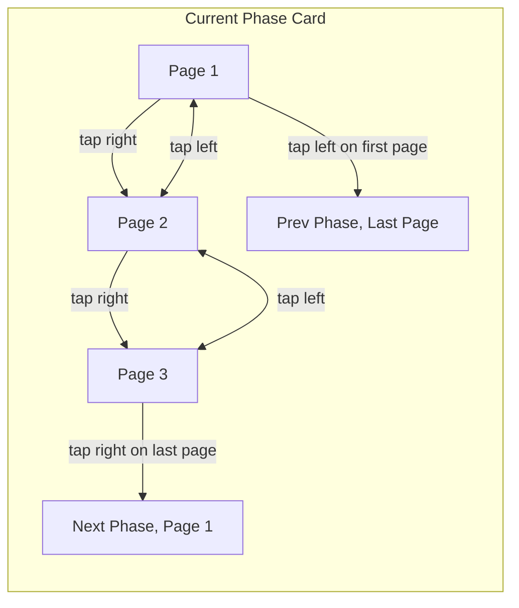

# Unified Tap and Drag Navigation for Phase Cards

---

## Objective

Create a seamless, intuitive navigation system for phase cards that:

- Uses **drag gestures** to switch **between phases**
- Uses **tap gestures** on left/right edges to **turn pages within a phase**
- When at the start or end of a phase, tapping **switches phases** accordingly
- Eliminates the need for pagination controls at the bottom, freeing vertical space

---

## Current Behavior

| Gesture Type | Action |
|--------------|--------|
| Drag left/right | Switch phase |
| Tap adjacent card | Switch phase |
| Tap page controls | Turn page |

---

## New Behavior

| Gesture Type | When | Action |
|--------------|-------|--------|
| **Drag Left/Right** | Always | Switch to next/previous **phase** |
| **Tap Right Edge** | Not last page | Next **page** in current phase |
| **Tap Right Edge** | Last page | Next **phase**, page 0 |
| **Tap Left Edge** | Not first page | Previous **page** in current phase |
| **Tap Left Edge** | First page | Previous **phase**, last page |

---

## Implementation Plan

1. **Remove** tap-to-select-phase on adjacent cards.
2. **Add** invisible tap zones on left/right edges of the **current phase card**.
3. **On tap**:
   - If **can turn page**, turn page.
   - Else, **switch phase** and set page accordingly (0 or last).
4. **Keep drag gestures** unchanged for phase switching.
5. **Remove page number label and arrows** from UI.
6. **Optional:** Add subtle overlay arrows/icons for discoverability.

---

## Navigation Flow Diagram

---

## Benefits

- **No vertical space lost** to pagination controls.
- **Intuitive**: tap to advance, swipe to switch phase.
- **Seamless**: tap through all pages and phases without UI clutter.
- **Simpler UI**: fewer controls, more content space.

---

## Summary

This design unifies navigation, simplifies the UI, and improves the reading experience of paginated Markdown content with deep linking.
