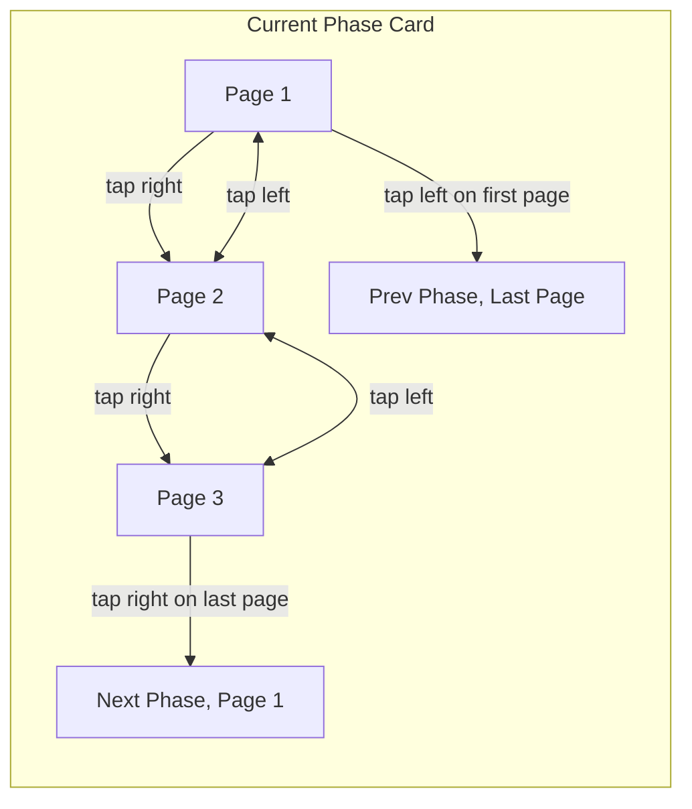

# Unified Tap and Drag Navigation — Implementation Plan (Simplified)

---

## Goal

Replace tap-to-select-phase with **tap-to-turn-page**, while keeping drag-to-switch-phase.

---

## Current Gesture Summary

- `.onTapGesture` on each phase card **selects that phase**.
- `.gesture(DragGesture())` on container **switches phases**.

---

## New Gesture Design

| Gesture | When | Action |
|---------|-------|--------|
| **Drag Left/Right** | Always | Switch phase |
| **Tap Right Edge** | Not last page | Next page |
| **Tap Right Edge** | Last page | Next phase, page 0 |
| **Tap Left Edge** | Not first page | Previous page |
| **Tap Left Edge** | First page | Previous phase, last page |

---

## Simplified Implementation Steps

### 1. **Keep** the existing `.onTapGesture` on phase cards.

### 2. **Replace** its body with:

```swift
if currentPage < totalPages - 1 {
    currentPage += 1
} else {
    switchToNextPhase()
}
```

### 3. **Add** a `.simultaneousGesture` or separate `.onTapGesture` on the **left edge** of the selected phase card:

```swift
if currentPage > 0 {
    currentPage -= 1
} else {
    switchToPreviousPhase()
}
```

### 4. **Keep drag gesture** for phase switching.

### 5. **Remove page controls UI**

- Remove bottom pagination bar.
- Navigation is now **only** via taps and drags.

---

## Diagram



---

## Benefits

- **Minimal code changes**.
- **No extra overlay views needed**.
- **Intuitive**: tap to advance, swipe to switch phase.
- **Seamless**: tap through all pages and phases without UI clutter.
- **Simpler UI**: fewer controls, more content space.

---

## Summary

This plan **reuses** the existing tap gesture, replacing its logic to turn pages first, then switch phases at page boundaries. It simplifies implementation while improving the user experience.
