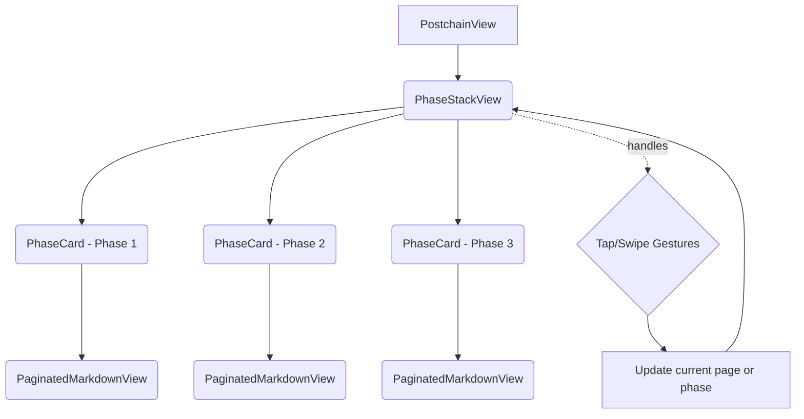

# Unified Navigation Implementation Plan (Architectural Overhaul)

---

## Overview

Centralize all tap and swipe gesture handling **outside** of individual phase cards, in a **dedicated container view** that manages:

- **Page turning** within the current phase
- **Phase switching** when at page boundaries
- **Deep link modal previews** (handled inside content views)
- **Clean separation of concerns**

---

## Why Centralize Gestures?

- Avoids gesture conflicts in overlapping ZStack phase cards
- Simplifies logic: one place controls navigation
- Easier to maintain, extend, and debug
- Matches the UX goal: **tap/swipe anywhere** to navigate naturally

---

## High-Level Architecture



---

## Step-by-Step Implementation Plan

### 1. **Create `PhaseStackView` Container**

- Wraps the **ZStack of `PhaseCard`s**
- Owns:
  - `@State` or `@Binding` for **current phase**
  - `@State` or `@Binding` for **current page** per phase
  - Access to **total pages** per phase (via `Message` or bindings)

---

### 2. **Remove `.onTapGesture` from `PhaseCard`**

- No tap/swipe gestures on individual cards
- They only **render content** and **expose page bindings**

---

### 3. **Implement Tap Zones in `PhaseStackView`**

- Overlay **two transparent buttons or hit areas**:
  - **Left edge**: previous page or previous phase
  - **Right edge**: next page or next phase
- Alternatively, use `.simultaneousGesture` with tap location detection

---

### 4. **Tap Navigation Logic**

- **Tap Right Edge:**
  - If **not last page** in current phase: `currentPage += 1`
  - Else: switch to **next phase**, reset `currentPage = 0`
- **Tap Left Edge:**
  - If **not first page**: `currentPage -= 1`
  - Else: switch to **previous phase**, set `currentPage = lastPage`

---

### 5. **Implement Swipe Gestures**

- **Swipe Left:** switch to **next phase**, reset `currentPage = 0`
- **Swipe Right:** switch to **previous phase**, set `currentPage = lastPage`

---

### 6. **Expose Total Pages**

- In `Message` model, add:

```swift
@Published var phaseTotalPages: [Phase: Int] = [:]
```

- Update this from inside `PaginatedMarkdownView` whenever pagination recalculates
- Pass as `@Binding` from `PhaseCard` to `PaginatedMarkdownView`

---

### 7. **Update `PaginatedMarkdownView`**

- Add:

```swift
@Binding var totalPages: Int
```

- Update this binding in `paginateContent()`

---

### 8. **Update `PhaseCard`**

- Pass bindings for:
  - `currentPage` (already done)
  - `totalPages` (new)
- Remove any gesture logic

---

### 9. **Update `PostchainView`**

- Replace ZStack of `PhaseCard`s with `PhaseStackView`
- Pass necessary bindings/state

---

### 10. **Deep Link Previews**

- Continue to intercept `.onOpenURL` **inside `PaginatedMarkdownView`**
- Present **translucent modal previews** there
- This is **orthogonal** to navigation gestures

---

## Summary

- **Centralize navigation gestures** in a new container (`PhaseStackView`)
- **Remove gestures from phase cards**
- **Overlay tap zones** or detect tap locations
- **Use swipe gestures** for phase switching
- **Track total pages per phase** to decide navigation
- **Keep deep link modal previews inside content views**

---

## Benefits

- Clean, maintainable architecture
- Intuitive, unified navigation UX
- Avoids gesture conflicts
- Prepares for future features (privacy, rewards, speech)

---

_Last updated: April 10, 2025_
