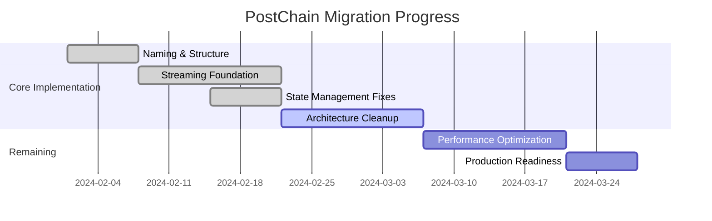
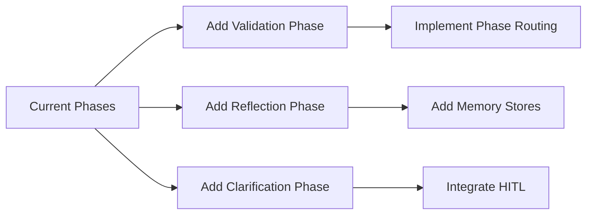
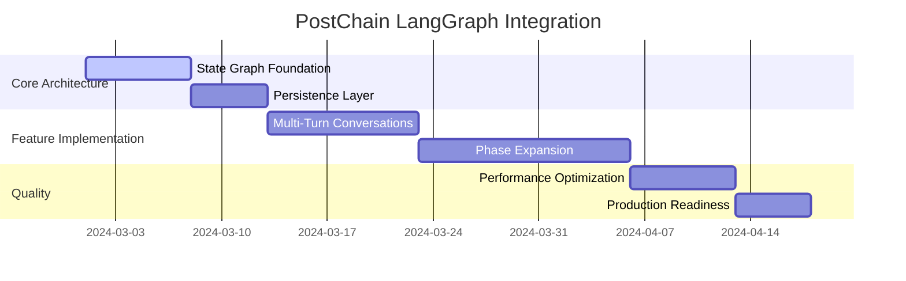

# Level 3 Documentation


=== File: docs/plan_anonymity_by_default.md ===


==
plan_anonymity_by_default
==


==
anonymity_by_default.md
==

# Anonymity by Default: A Core Principle of Choir

VERSION anonymity_by_default: 7.0

Anonymity is not just a feature of Choir; it's a fundamental principle, a design choice that shapes the platform's architecture and informs its values. By making anonymity the default state for all users, Choir prioritizes privacy, freedom of expression, and the creation of a space where ideas are judged on their merits, not on the identity of their author.

**Core Tenets:**

1. **Privacy as a Fundamental Right:** Choir recognizes that privacy is a fundamental human right, essential for individual autonomy and freedom of thought. Anonymity protects users from surveillance, discrimination, and the potential chilling effects of being constantly identified and tracked online.
2. **Freedom of Expression:** Anonymity fosters a space where users can express themselves freely, without fear of judgment or reprisal. This is particularly important for discussing sensitive topics, challenging প্রচলিত norms, or exploring unconventional ideas.
3. **Focus on Ideas, Not Identities:** By separating ideas from their authors, anonymity encourages users to evaluate contributions based on their intrinsic value, rather than on the reputation or status of the contributor. This promotes a more meritocratic and intellectually rigorous environment.
4. **Protection from Bias:** Anonymity can help to mitigate the effects of unconscious bias, such as those based on gender, race, or other personal characteristics. It allows ideas to be judged on their own merits, rather than through the lens of preconceived notions about the author.
5. **Lower Barrier to Entry:** Anonymity makes it easier for new users to join the platform and start contributing, as they don't need to go through a complex verification process or share personal information.

**How Anonymity Works on Choir:**

- **Default State:** All users are anonymous by default upon joining the platform. They can interact, contribute content, and earn CHIP tokens without revealing their real-world identity.
- **Unique Identifiers:** Users are assigned unique, randomly generated identifiers that allow them to build a consistent presence on the platform without compromising their anonymity.
- **No Personal Data Collection:** Choir does not collect or store any personally identifiable information about anonymous users.
- **"Priors" and Anonymity:** The "priors" system, which shows the lineage of ideas, maintains anonymity by design. It reveals the connections between ideas, not the identities of the individuals who proposed them.

**Balancing Anonymity with Accountability:**

- **CHIP Staking:** The requirement to stake CHIP tokens to post new messages acts as a deterrent against spam and malicious behavior, even for anonymous users.
- **Community Moderation:** The platform relies on community moderation to maintain the quality of discourse and address any issues that arise.
- **Reputation Systems:** While users are anonymous by default, they can still build reputations based on the quality of their contributions, as tracked through the "priors" system and potentially through community ratings.

**The Value of Anonymity in a High-Information Environment:**

- **Encourages Honest Discourse:** Anonymity can encourage more honest and open discussions, particularly on sensitive or controversial topics.
- **Promotes Intellectual Risk-Taking:** Users may be more willing to take intellectual risks and explore unconventional ideas when they are not worried about the potential repercussions for their personal or professional lives.
- **Facilitates Whistleblowing and Dissent:** Anonymity can provide a safe space for whistleblowers and those who wish to express dissenting views without fear of retaliation.
- **Protects Vulnerable Users:** Anonymity can be particularly important for users in marginalized or vulnerable communities who may face risks if their identities are revealed.

**Conclusion:**

Anonymity by default is a core design principle of Choir, one that reflects the platform's commitment to privacy, freedom of expression, and the creation of a truly meritocratic space for the exchange of ideas. It's a bold choice in a world where online platforms increasingly demand real-name identification, but it's a choice that has the potential to unlock new levels of creativity, honesty, and collective intelligence. By prioritizing anonymity, Choir is not just building a platform; it's building a new model for online interaction, one that empowers individuals and fosters a more open and equitable exchange of ideas.

=== File: docs/plan_identity_as_a_service.md ===


==
plan_identity_as_a_service
==


# Identity as a Service (IDaaS)

VERSION identity_service: 7.1

Identity on Choir is optional yet valuable. By default, users can participate anonymously, preserving privacy and free expression. However, those who opt into KYC-based verification unlock the ability to participate in binding governance decisions, operate Social AI (SAI) agents under their account, and gain additional social trust signals. This document explains how Identity as a Service (IDaaS) fits into the Choir platform.

---

## Overview

Traditional online platforms typically force users to accept a real-name policy or harvest personal data without explicit consent. Choir takes a different stance:

• **Default Anonymity**: Everyone can read messages, post anonymously, and earn CHIP tokens without providing personal data.
• **Paid Identity**: Those requiring the social or governance benefits of verified status can pay for IDaaS, enabling official KYC-based identity on the platform.

The result is a tiered approach that preserves anonymity for casual or privacy-conscious users, while offering valuable identity features to those who want or need them.

---

## Core Principles

1. **Anonymity First**: No user is required to reveal their personal information to use the basic features of Choir.
2. **Paid Identity**: Identity verification introduces real-world accountability and signals commitment to the community.
3. **Signaling, Not Pay-to-Win**: Verified status does not grant better content visibility—it grants governance participation, the ability to run SAIs, and optional social credibility.
4. **Jurisdictional Compliance**: KYC standards vary globally, so IDaaS is flexible enough to accommodate region-specific regulations.
5. **Privacy Respect**: Despite verification, Choir stores personally identifying information offline and only retains essential proofs on-chain.

---

## Benefits of Verified Identity

- **Governance Participation**: Only verified users can submit binding on-chain votes in futarchy or other proposals.
- **SAI Operator Verification**: KYC ensures that an AI-driven account is mapped to a real individual for accountability.
- **Jurisdictional Compliance**: Verification aligns Choir with relevant regulations, which is critical for the platform’s long-term viability.

Additionally, verified accounts may enjoy intangible benefits like higher reputational trust within the community, though this is a social dynamic rather than a platform-engineered outcome.

---

## IDaaS Workflow

1. **Voluntary Enrollment**: You choose if/when to enroll in IDaaS.
2. **KYC Process**: Provide a government-issued ID or other documentation; a third-party service verifies authenticity.
3. **On-Chain Confirmation**: A non-reversible cryptographic link is posted on-chain (no personally identifying information, just proof of verification).
4. **Subscription or One-Time Fee**: Payment for IDaaS can be structured as recurring or one-time.
5. **Privileges Granted**: The verified user can now vote in binding governance proposals, run SAI agents, and optionally display a verified badge or signal in UI.

---

## Use Cases

- **Governance**: Ensuring that major decisions are made by real individuals with accountability.
- **SAI Execution**: Operating advanced AI software that can influence the platform, under the direct responsibility of a verified user.
- **Enterprise Collaboration**: In corporate settings, having verified internal team members fosters trust and ensures compliance with company or legal requirements.

---

## Monetization and Sustainability

Because IDaaS revenues support the system’s operational costs, they help offset free-tier usage by anonymous participants. This aligns the business model, ensuring that those who need additional capabilities also help fund the platform’s continued growth and stability.

---

## Conclusion

By offering Identity as a Service, Choir establishes a nuanced balance: anonymity remains a core value and default, while verified identity is treated as a premium feature. This approach ensures that governance decisions are accountable, advanced AI operations remain traceable to real individuals, and the platform remains compliant with jurisdictional regulations. Through IDaaS, Choir invites each user to choose the identity model that suits their needs, forging a new path forward for responsible digital communities.

=== File: docs/plan_langgraph_postchain.md ===


==
plan_langgraph_postchain
==


# LangGraph PostChain Implementation Plan

## Current Implementation Overview

The current Chorus Cycle implementation is a sequence of calls to a single LLM with RAG to a single vector database. The cycle follows the AEIOU-Y pattern:

1. **Action**: Initial response with "beginner's mind"
2. **Experience**: Enrichment with prior knowledge via RAG
3. **Intention**: Analysis of planned actions and consequences
4. **Observation**: Reflection on analysis and intentions
5. **Understanding**: Decision to loop back or proceed to yield
6. **Yield**: Final synthesized response

Each step uses the same model (currently Claude 3.5 Haiku) with different system prompts, and the cycle can loop back from Understanding to Action if needed.

## Migration Goals

1. Implement the Chorus Cycle using LangGraph's StateGraph
2. Create a multi-model workflow where different models handle different steps
3. Add agentic capabilities with integrated tools (Qdrant vector database and web search)
4. Improve observability and debugging
5. Enable dynamic chain modification
6. Provide a unified streaming API endpoint for the entire cycle

## Revised Chorus Cycle Flow

The new Chorus Cycle will be enhanced with integrated tools:

1. **Action**: Initial LLM response to user input (vanilla LLM call)
2. **Experience (Vector)**: Retrieve relevant information from vector database
3. **Experience (Web)**: Retrieve recent information from web search
4. **Intention**: Reflective analysis on prompt, action, and experiences
5. **Observation**: Optional storage of important insights to vector database
6. **Understanding**: Decision to continue or loop back to action
7. **Yield**: Final synthesized response

Each step can be handled by a different model provider, with proper context preservation between transitions.

## Implementation Checklist

### Phase 0: Environment Setup ✅

- [x] Add LangGraph and related dependencies to requirements.txt
  ```
  langchain>=0.1.0
  langchain-core>=0.1.0
  langgraph>=0.0.15
  langserve>=0.0.30
  langchain-openai>=0.0.5
  langchain-anthropic>=0.1.0
  langchain-google-genai>=0.0.5
  langchain-mistralai>=0.0.1
  langchain-fireworks>=0.1.0
  langchain-cohere>=0.0.1
  ```
- [x] Configure environment with necessary API keys for all providers
- [x] Create simple test script to verify API connectivity with each provider
- [x] Document API rate limits and token quotas for each provider

### Phase 1: Individual Model Testing ✅

- [x] Test each model in simple single-turn conversations
- [x] Test each model in multi-turn conversations
  - [x] Verify context window handling
  - [x] Test conversation memory
- [x] Test structured output capabilities of each model
  - [x] JSON schema validation
  - [x] Error handling for malformed outputs
  - [x] Consistency across multiple calls
- [x] Create compatibility matrix documenting strengths/weaknesses of each model

### Phase 2: Basic LangGraph Integration ✅

- [x] Set up project structure for PostChain
- [x] Implement state schema with Pydantic/TypedDict
- [x] Create simple single-node graph with one model
- [x] Test state transitions and data flow
- [x] Expand to basic linear chain with all AEIOU-Y steps
- [x] Implement basic error handling and recovery

### Phase 3: Multi-Model Integration ✅

- [x] Define model configuration for each step
- [x] Create model selection logic (including random model selection)
- [x] Implement node handlers for each step
- [x] Test cross-model context preservation
- [x] Evaluate performance and token usage
- [x] Optimize prompt templates for each model

### Phase 4: Tool Integration 🚧

- [x] Implement Qdrant vector database tools (search, store, delete)
- [x] Implement web search tools
- [x] Test tool compatibility with each model provider
- [x] Create provider compatibility matrix for tool usage
- [x] Implement tool usage tracking in state management
- [x] Test error handling for tool failures
- [x] Measure tool effectiveness across models
- [ ] Create specialized tool nodes for each phase:
  - [ ] Experience (Vector): Vector database querying
  - [ ] Experience (Web): Web search operations
  - [ ] Observation: Vector database storage

### Phase 5: Advanced Flow Control 🚧

- [x] Implement conditional edges for looping
- [x] Create dynamic routing based on probability-based decisions
- [x] Add web search node integration
- [x] Test complex flows with looping
- [x] Implement cycle detection and recursion limits
- [ ] Create visualization of graph execution
- [ ] Implement branching logic for tool selection

### Phase 6: API Integration 🚧

- [x] Create API endpoints
- [x] Implement streaming support
- [ ] Create unified streaming API endpoint for the entire cycle
- [ ] Add authentication and rate limiting
- [ ] Create client library
- [x] Test API performance
- [ ] Document API usage

### Phase 7: Observability and Testing 🚧

- [x] Add tracing and logging throughout the system
- [x] Create comprehensive test suite for behavior verification
- [x] Implement performance monitoring
- [x] Create debugging tools (detailed logging)
- [ ] Document troubleshooting procedures
- [x] Conduct end-to-end testing with various scenarios
- [ ] Test tool usage in real-world scenarios

## Tool Integration Details

### Qdrant Vector Database Tools ✅

The Qdrant vector database tools have been successfully implemented and tested:

1. **Search Tool (`qdrant_search`)**:

   - Retrieves semantically similar information from the vector database
   - Accepts query text and returns formatted results with relevance scores
   - Compatible with all major providers (OpenAI, Anthropic, Mistral)
   - Supports search limit configuration and collection specification

2. **Store Tool (`qdrant_store`)**:

   - Stores new information in the vector database
   - Stores text content with automatically generated embeddings
   - Supports metadata storage for additional context
   - Returns vector IDs for future reference

3. **Delete Tool (`qdrant_delete`)**:
   - Removes vectors from the database by ID
   - Provides confirmation of successful deletion
   - Includes error handling for non-existent vectors


### Web Search Tools ✅

The web search tools enable retrieving up-to-date information:

1. **Web Search Tool**:
   - Performs searches for real-time information
   - Returns relevant snippets and URLs
   - Formats results for easy consumption by LLMs
   - Handles attribution and source tracking

## Implementation Plan for Next Phase

### 1. State Schema Update

The core state schema for our tool-enhanced Chorus Cycle:

```python
class ChorusToolState(TypedDict):
    messages: List[Dict[str, Any]]
    current_phase: str
    loop_count: int
    vector_search_results: Optional[List[Dict[str, Any]]]
    web_search_results: Optional[List[Dict[str, Any]]]
    stored_vector_ids: List[str]
    loop_probability: float
```

### 2. Phase Handlers with Tool Integration

Example of an Experience (Vector) phase handler:

```python
def experience_vector_handler(config: Config):
    """Handler for the vector search experience phase."""
    async def handler(state: ChorusToolState) -> ChorusToolState:
        messages = state["messages"]

        # Get the user prompt and action response
        user_prompt = next((m["content"] for m in messages if m["role"] == "user"), "")
        action_response = next((m["content"] for m in messages if m["role"] == "assistant"
                              and m.get("phase") == "action"), "")

        # Set up the system message for this phase
        system_message = {
            "role": "system",
            "content": (
                "You are the Experience phase of the Chorus Cycle. "
                "Your task is to search the vector database for relevant information "
                "related to the user's query and previous interactions. "
                "You have access to the qdrant_search tool to find semantic matches."
            )
        }

        # Create a message for the model to use the vector search tool
        experience_prompt = {
            "role": "user",
            "content": (
                f"Please search for information relevant to this query: '{user_prompt}'\n\n"
                f"The initial response was: '{action_response}'\n\n"
                "Use the qdrant_search tool to find semantically similar content."
            )
        }

        # Use LangGraph's ToolNode pattern to handle the tool interaction
        model = get_tool_compatible_model(config)
        vector_search_result = await run_tool_interaction(
            model=model,
            tools=[qdrant_search],
            messages=[system_message, experience_prompt]
        )

        # Extract and store the search results
        vector_search_results = extract_search_results(vector_search_result)

        # Update the state
        new_messages = messages + [{
            "role": "assistant",
            "content": vector_search_result["messages"][-1]["content"],
            "phase": "experience_vector"
        }]

        return {
            **state,
            "messages": new_messages,
            "vector_search_results": vector_search_results,
            "current_phase": "experience_vector"
        }

    return handler
```

### 3. Unified API Endpoint

The new unified API endpoint will:

1. Accept a user query
2. Process it through the entire Chorus Cycle with tools
3. Stream the results of each phase as they complete
4. Return the final yield result

```python
@router.post("/chorus", response_model=StreamingResponse)
async def process_chorus_cycle(request: ChorusRequest):
    """Process a complete Chorus Cycle with integrated tools and streaming."""
    config = Config()

    # Initialize the Chorus graph with tools
    graph = create_chorus_tool_graph(config)

    # Create initial state
    initial_state = {
        "messages": [
            {"role": "system", "content": SYSTEM_PROMPT_WITH_TIMESTAMP},
            {"role": "user", "content": request.content}
        ],
        "current_phase": "start",
        "loop_count": 0,
        "vector_search_results": None,
        "web_search_results": None,
        "stored_vector_ids": [],
        "loop_probability": 0.0
    }

    # Create streaming response
    return StreamingResponse(
        graph.astream(initial_state),
        media_type="text/event-stream"
    )
```

## Progress Summary

We have made significant progress on the LangGraph PostChain implementation:

1. **Core Graph Implementation**:

   - Successfully implemented the complete AEIOU-Y state graph with proper node connections
   - Implemented a probability-based looping mechanism from understanding to action/yield
   - Added comprehensive state management ensuring state consistency across phases

2. **Error Handling**:

   - Implemented robust error handling in streaming and callback scenarios
   - Ensured graceful recovery from errors with appropriate phase setting
   - Added recursion limit safety to prevent infinite loops

3. **Testing Framework**:

   - Created a comprehensive testing framework that captures interactions
   - Implemented analysis tools to verify phase distribution and transitions
   - Added tools for visualizing and tracking chain behavior

4. **Tool Integration**:

   - Successfully implemented and tested Qdrant vector database tools
   - Verified cross-provider compatibility for tool usage
   - Implemented RandomToolMultiModelTester for comprehensive testing
   - Documented tool compatibility across different model providers

5. **Next Steps**:
   - Integrate tools directly into the Chorus Cycle workflow
   - Split the Experience phase into Vector and Web search components
   - Implement the Observation phase with vector storage capabilities
   - Create a unified streaming API endpoint for the entire cycle

## Conclusion

The implementation of tool-enhanced Chorus Cycle represents a significant advancement over the current design. By integrating Qdrant vector database tools and web search capabilities, we can enhance the cycle's ability to retrieve and store information, improving the quality and relevance of responses.

The revised implementation maintains the core AEIOU-Y structure while adding powerful new capabilities:

1. **Richer Context**: Vector search and web search provide more comprehensive information
2. **Memory Enhancement**: Vector storage allows observations to be persisted for future reference
3. **Multi-Model Flexibility**: Different models can handle different phases of the cycle
4. **Tool Agentic Capabilities**: Models can use tools within the appropriate phases

This plan outlines a clear path forward to implementing a unified, streaming API endpoint that leverages the full power of the PostChain architecture with LangGraph and integrated tools.

=== File: docs/plan_langgraph_postchain_iteration.md ===


==
plan_langgraph_postchain_iteration
==


# PostChain LangGraph Implementation Plan

This document outlines our iterative approach to implementing the full PostChain (AEIOU-Y) using LangGraph. We'll build on the existing Action+Experience implementation, gradually adding features while maintaining a working system at each stage.

## 📚 Key Reference Files

Before beginning implementation, familiarize yourself with these files:

- `api/app/postchain/simple_graph.py` - Current implementation with Action and Experience phases
- `api/app/routers/postchain.py` - FastAPI router handling PostChain endpoints
- `api/app/langchain_utils.py` - Utility functions for working with language models
- `api/app/config.py` - Configuration settings including model identifiers
- `docs/plan_postchain_migration_checklist.md` - Original migration plan

## 🎯 Overall Strategy

We'll follow an incremental approach with these key phases:

1. **Foundation**: Add proper memory management and multiturn support to existing graph
2. **Model Flexibility**: Implement model-agnostic architecture with fallback mechanisms
3. **Integration**: Connect with tools and external systems, prioritizing search results in the Experience phase
4. **Expansion**: Add remaining AEIOU-Y phases one by one
5. **Refinement**: Optimize performance and UX

Each milestone will result in a working system that can be tested with our SwiftUI frontend.

## 📝 AEIOU-Y Phase Requirements

The PostChain consists of these phases, each with distinct responsibilities:

1. **Action**: Initial response to user input

   - Generate direct response based on user query
   - Set context for subsequent phases

2. **Experience**: Enrichment with prior knowledge

   - Augment initial response with search and stored knowledge
   - Use tools to gather supporting information
   - Format and incorporate search results for display in UI

3. **Intention**: Alignment with user intent

   - Analyze and clarify user intention
   - Detect ambiguities or misalignments
   - Prepare for context building

4. **Observation**: Recording semantic connections

   - Identify and record key contextual elements
   - Create associations with prior knowledge
   - Prepare metadata for understanding phase

5. **Understanding**: Decision on continuation

   - Evaluate if further refinement is needed
   - Determine which phase to revisit if necessary
   - Can hand off to ANY previous phase based on needs
   - Decide when to proceed to final output

6. **Yield**: Final response production
   - Format final output for presentation
   - Combine insights from all phases
   - Clean up state and prepare final metadata

The graph will generally flow sequentially, but the Understanding phase can direct execution to any previous phase when needed, allowing flexible, adaptive behavior.

## 📋 Implementation Checklist

### Phase 1: Foundation (Memory & Multiturn)

- [ ] **Structured State Management**

  - [ ] Create `PostChainState` Pydantic model for type safety in `api/app/postchain/schemas/state.py`
  - [ ] Define clear schema for conversation history
  - [ ] Implement phase metadata tracking
  - [ ] **Add context window configuration parameters**

- [ ] **Persistence Implementation**

  - [ ] Integrate LangGraph's `MemorySaver` for thread-level persistence
  - [ ] Add thread ID validation (UUIDv4 format)
  - [ ] Implement robust state recovery for interrupted conversations
  - [ ] Add explicit checkpointer configuration during graph compilation
  - [ ] Create helper functions for state loading and saving

- [ ] **Multiturn Support**

  - [ ] Modify handlers to properly maintain conversation context
  - [ ] Implement message filtering for context window management
  - [ ] Add sliding window context management (last 10 messages by default)
  - [ ] Implement message attribution with phase metadata

- [ ] **Interrupt Handling**
  - [ ] Implement proper LangGraph interrupt handlers with `InterruptibleGraphCancelled`
  - [ ] Add graceful cancellation across all phases
  - [ ] Create appropriate user feedback for interruptions
  - [ ] Add state recovery for interrupted conversations
  - [ ] **Implement human-in-the-loop capabilities using the interrupt function**

### Phase 2: Model Flexibility & Resilience

- [ ] **Model-Agnostic Architecture**

  - [ ] Abstract model selection from node implementation in `api/app/postchain/simple_graph.py`
  - [ ] Create model capability detection (tool-compatible vs non-tool models)
  - [ ] Implement phase-specific model selection

- [ ] **Fallback & Retry Mechanisms**

  - [ ] Implement automatic model fallback on failure
  - [ ] Add retry policy with exponential backoff (using LangGraph's `RetryPolicy`)
  - [ ] Create graceful degradation for when preferred models are unavailable
  - [ ] **Add context compaction as fallback strategy for model errors**

- [ ] **Model Error Handling**
  - [ ] Implement comprehensive error detection for different providers
  - [ ] Add model-specific formatting for prompts
  - [ ] Create robust recovery from failed model invocations
  - [ ] **Use prebuilt ToolNode for improved tool error handling**
  - [ ] **Add automatic error message cleanup**

### Phase 3: Tool & External Integration (Prioritized)

- [ ] **Tool Integration for Experience Phase**

  - [ ] Add Qdrant vectorstore connection (see `api/app/tools/qdrant.py`)
  - [ ] Implement web search tools (see `api/app/tools/brave_search.py`, `api/app/tools/tavily_search.py`)
  - [ ] Create search result formatting for Experience phase
  - [ ] Add calculator and other specialized tools (see `api/app/tools/calculator.py`)
  - [ ] **Implement result filtering and prioritization**

- [ ] **API Integration for SwiftUI Client**
  - [ ] Add proper streaming for search results in `api/app/routers/postchain.py`
  - [ ] Implement client event handling for displaying search data
  - [ ] Create UI components for displaying search results in Experience phase
  - [ ] Add deep linking to priors and web results
  - [ ] **Implement streaming event format with search result sections**

### Phase 4: AEIOU-Y Expansion (After Tool Integration)

- [ ] **Intention Phase**

  - [ ] Implement `intention_node` handler based on requirements
  - [ ] Add user intent alignment logic
  - [ ] Create conditional routing based on intent
  - [ ] **Implement intent-aware context filtering**

- [ ] **Observation Phase**

  - [ ] Implement `observation_node` handler based on requirements
  - [ ] Add semantic connections recording
  - [ ] Integrate context building
  - [ ] **Add metadata annotation for important messages**

- [ ] **Understanding Phase**

  - [ ] Implement `understanding_node` handler based on requirements
  - [ ] Add continuation decision logic
  - [ ] **Create flexible routing to ANY previous phase using agent handoffs**
  - [ ] **Implement conversation summarization**

- [ ] **Yield Phase**
  - [ ] Implement `yield_node` handler based on requirements
  - [ ] Add final response formatting
  - [ ] Implement state cleanup
  - [ ] **Add summary metadata to final response**

### Phase 5: Refinement & Optimization

- [ ] **Context Management**

  - [ ] **Implement message deletion mechanisms**
  - [ ] **Add privacy-preserving message pruning**
  - [ ] Implement automatic context compaction
  - [ ] Create automatic compaction tool
  - [ ] **Implement summary-augmented memory**
  - [ ] **Add incremental summarization**
  - [ ] Add memory prioritization

- [ ] **Performance Optimization**

  - [ ] Implement parallel processing where appropriate
  - [ ] Add caching for repeated operations
  - [ ] Optimize token usage
  - [ ] **Add selective message filtering**

- [ ] **Error Handling & Recovery**
  - [ ] Implement comprehensive error states
  - [ ] Add automatic retry logic
  - [ ] Create graceful degradation paths
  - [ ] **Add error message cleanup procedures**
  - [ ] **Implement API endpoints for manual message pruning**

## 🛠️ Technical Details

### Environment Setup

Make sure you're working in the correct environment:

```bash
# From project root
cd api
source venv/bin/activate  # IMPORTANT: Always use existing venv
```

### Required Dependencies

All dependencies should be in the existing `requirements.txt`, but key ones include:

```
langgraph>=0.0.27
langchain-core>=0.1.27
pydantic>=2.5.0
```

### State Management

We'll use Pydantic models for state management:

```python
# File: api/app/postchain/schemas/state.py
from pydantic import BaseModel, Field
from typing import List, Dict, Any, Optional
from langchain_core.messages import BaseMessage

class PostChainState(BaseModel):
    """Structured state model for PostChain."""
    messages: List[BaseMessage] = Field(default_factory=list)
    current_phase: str = Field("action")
    thread_id: Optional[str] = Field(None)
    phase_outputs: Dict[str, str] = Field(default_factory=dict)
    metadata: Dict[str, Any] = Field(default_factory=dict)
    tools_used: List[str] = Field(default_factory=list)
    search_results: List[Dict[str, Any]] = Field(default_factory=list)
    model_attempts: Dict[str, List[str]] = Field(default_factory=dict)
    summary: Optional[str] = Field(None, description="Summary of conversation history")
    context_window_size: int = Field(10, description="Number of messages to keep in context")
    next_phase: Optional[str] = Field(None, description="Override for next phase to execute")
```

### Persistence Implementation

For thread persistence:

```python
# In api/app/postchain/simple_graph.py
from langgraph.checkpoint.memory import MemorySaver

# Create memory saver with thread ID
memory = MemorySaver(f"postchain_{thread_id}")

# Add to graph builder
builder.set_checkpoint(memory)

# When retrieving a conversation with robust error handling
try:
    existing_state = memory.load()
    if existing_state:
        state = existing_state
        # Add the new message from the user
        state.messages.append(HumanMessage(content=user_query))
    else:
        state = initial_state
except Exception as e:
    logger.error(f"Error loading state: {e}")
    state = initial_state
```

### Context Window Management

```python
# Message filtering for context window management
def filter_messages(state: PostChainState) -> List[BaseMessage]:
    """Filter messages to fit in context window."""
    window_size = state.context_window_size
    if len(state.messages) <= window_size:
        return state.messages

    # Always include system message if present
    system_messages = [m for m in state.messages if isinstance(m, SystemMessage)]

    # Add most recent messages up to window size
    recent_messages = state.messages[-window_size:]

    # If we have a summary, include it as context
    if state.summary:
        summary_message = SystemMessage(content=f"Conversation summary: {state.summary}")
        return system_messages + [summary_message] + recent_messages

    return system_messages + recent_messages
```

### Human-in-the-loop Implementation

```python
# Add to experience phase for human review
from langgraph.types import interrupt

async def experience_with_human_review(state: PostChainState) -> Dict[str, Any]:
    """Experience phase with optional human review of search results."""
    # First part: gather search results
    search_results = await perform_search(state.messages[-1].content)

    # Interrupt for human review
    reviewed_results = interrupt({
        "type": "review_search",
        "original_results": search_results,
        "message": "Please review these search results before proceeding."
    })

    # Continue with human-reviewed (or original) results
    final_results = reviewed_results or search_results

    # Complete the experience phase with the results
    return {
        "search_results": final_results,
        "current_phase": "experience"
    }
```

### Flexible Phase Routing

```python
# Add to understanding phase
def understanding_router(state: PostChainState) -> str:
    """Route to the appropriate phase based on understanding evaluation."""
    # Check for explicit next phase in state
    if state.next_phase:
        return state.next_phase

    # Default sequential progression
    if state.current_phase == "understanding":
        # Determine if we need more refinement
        needs_refinement = evaluate_needs_refinement(state)
        if needs_refinement == "action":
            return "action"  # Restart from action
        elif needs_refinement == "experience":
            return "experience"  # Get more information
        elif needs_refinement == "intention":
            return "intention"  # Clarify intent
        elif needs_refinement == "observation":
            return "observation"  # Enhance context
        else:
            return "yield"  # Proceed to final output

    # Fallback to yield
    return "yield"
```

### Tool Error Handling

```python
# Using prebuilt ToolNode for better error handling
from langgraph.prebuilt import ToolNode

# Define tools
tools = [search_tool, calculator_tool, qdrant_tool]

# Create tool node with proper error handling
tool_node = ToolNode(tools)

# Add to graph
builder.add_node("tools", tool_node)
```

### Agent Handoffs

```python
# Configure conditional edges for flexible routing
builder.add_conditional_edges(
    "understanding",
    understanding_router,
    ["action", "experience", "intention", "observation", "yield"]
)
```

### Interrupt Handling

```python
# Import in api/app/routers/postchain.py
from langgraph.errors import InterruptibleGraphCancelled
from langgraph.types import Command

# When streaming
@router.post("/simple")
async def process_simple_postchain(
    request: SimplePostChainRequest,
    config: Config = Depends(get_config)
):
    if request.stream:
        async def stream_generator():
            try:
                async for chunk in stream_simple_postchain(
                    user_query=request.user_query,
                    config=config,
                    thread_id=request.thread_id
                ):
                    if "__interrupt__" in chunk:
                        # Handle interruption for human review
                        interrupt_data = chunk["__interrupt__"][0].value
                        # Here you would typically wait for human input
                        # For now, we'll just continue with original data
                        resume_value = interrupt_data.get("original_results")
                        # Resume the graph
                        async for resumed_chunk in stream_simple_postchain(
                            Command(resume=resume_value),
                            config=config,
                            thread_id=request.thread_id
                        ):
                            yield f"data: {json.dumps(resumed_chunk)}\n\n"
                        return
                    yield f"data: {json.dumps(chunk)}\n\n"
            except InterruptibleGraphCancelled:
                # Provide informative interruption feedback
                yield f"data: {json.dumps({'status': 'cancelled', 'message': 'Operation was interrupted'})}\n\n"

            # End of stream
            yield "data: [DONE]\n\n"

        return StreamingResponse(
            stream_generator(),
            media_type="text/event-stream"
        )
```

## 🔄 Testing Strategy

Our primary testing harness will be the SwiftUI frontend:

1. **SwiftUI Frontend Testing**: Use the actual UI to validate functionality and user experience
2. **Backend API Testing**: Test endpoints with the actual frontend client using Choir iOS app
3. **Manual Testing**: Validate full conversation flows with real user scenarios
4. **API Testing**: You can test directly with curl or Postman:

```bash
# Test simple endpoint with curl
curl -X POST http://localhost:8000/postchain/simple \
  -H "Content-Type: application/json" \
  -d '{"user_query": "Tell me about quantum computing", "stream": true}'
```

5. **Run Python Tests**: Use the existing test framework when needed:

```bash
# From api directory
python -m tests.postchain.test_simple_multimodel
```

## 📊 Success Criteria

Each phase will be considered complete when:

1. The feature works correctly in the SwiftUI frontend (Choir iOS app)
2. Stream processing displays results appropriately
3. User experience meets expectations
4. Performance is acceptable on real devices
5. System gracefully handles model failures and provider outages
6. Context management keeps token usage optimized
7. Conversation history is properly maintained and summarized

## 📅 Implementation Order

1. Structured state & memory management with persistence
2. Context window management and message filtering
3. Multiturn support with proper conversation handling
4. Interrupt handling with state recovery
5. Model flexibility & fallback mechanisms
6. Web search & Qdrant integration with Experience phase
7. UI components for displaying search results
8. Message summarization and context optimization
9. Intention phase
10. Observation phase
11. Understanding phase with flexible routing
12. Yield phase
13. Advanced context management (deletion, privacy)
14. Performance optimization

This approach ensures we have a robust, flexible system that can work with any model, handle conversation history effectively, and gracefully manage failures before we expand to additional phases.

## ⚠️ Important Notes

1. **Always use the existing virtual environment** - Do not install new packages without approval
2. **Run tests from the api directory** - This ensures correct import paths
3. **Maintain backwards compatibility** - Existing endpoints must continue to work
4. **Gradual deployment** - Each phase should be deployable independently
5. **Error handling is critical** - The system must gracefully handle any failure
6. **Log extensively** - Use the logger to track execution flow for debugging
7. **Manage context window carefully** - Always implement message filtering to prevent token limits
8. **Implement proper state recovery** - Handle interruptions and failures gracefully
9. **Use thread IDs consistently** - Always validate and normalize thread IDs
10. **Consider privacy implications** - Implement message deletion capabilities

=== File: docs/plan_libsql.md ===


==
plan_libsql
==


# libSQL Integration Plan for Choir

## Overview

This document outlines the implementation plan for integrating libSQL/Turso as the local persistence layer for the Choir application. This system will provide both offline functionality and synchronization with our global vector database infrastructure, while supporting the FQAHO model parameters and Post Chain architecture.

## Core Objectives

1. Implement libSQL as the primary local persistence solution
2. Design a flexible schema that can accommodate evolving data models
3. Implement vector search capabilities to support semantic matching in the Experience phase
4. Create a synchronization system between local and global databases
5. Support the FQAHO model parameters (α, K₀, m) in the database schema
6. Enable offline functionality with seamless online synchronization

## Implementation Philosophy

Our approach to database implementation will be guided by these principles:

1. **Core System First** - Focus on getting the core UX and system operational before fully committing to a database schema
2. **Flexibility** - Design the database to be adaptable as our data model evolves
3. **Incremental Implementation** - Add database features in phases, starting with the most essential components
4. **Performance** - Optimize for mobile device constraints and offline-first operation

## Technical Implementation

### 1. Database Setup and Initialization

```swift
import Libsql

class DatabaseService {
    static let shared = try! DatabaseService()

    private let database: Database
    private let connection: Connection

    private init() throws {
        // Get path to document directory for local database
        let documentsDirectory = FileManager.default.urls(for: .documentDirectory, in: .userDomainMask).first!
        let dbPath = documentsDirectory.appendingPathComponent("choir.db").path

        // Initialize database with sync capabilities
        self.database = try Database(
            path: dbPath,
            url: Environment.tursoDbUrl,      // Remote database URL
            authToken: Environment.tursoToken, // Authentication token
            syncInterval: 10000               // Sync every 10 seconds
        )

        self.connection = try database.connect()

        // Initialize schema
        try setupSchema()
    }

    private func setupSchema() throws {
        try connection.execute("""
            -- Users table
            CREATE TABLE IF NOT EXISTS users (
                id TEXT PRIMARY KEY,
                name TEXT,
                last_active INTEGER
            );

            -- Threads table
            CREATE TABLE IF NOT EXISTS threads (
                id TEXT PRIMARY KEY,
                title TEXT,
                created_at INTEGER,
                updated_at INTEGER,
                k0 REAL,           -- FQAHO parameter K₀
                alpha REAL,        -- FQAHO parameter α (fractional)
                m REAL             -- FQAHO parameter m
            );

            -- Messages table with vector support
            CREATE TABLE IF NOT EXISTS messages (
                id TEXT PRIMARY KEY,
                thread_id TEXT,
                user_id TEXT,
                content TEXT,
                embedding F32_BLOB(1536),  -- Vector embedding for semantic search
                phase TEXT,                -- Post Chain phase identifier
                created_at INTEGER,
                approval_status TEXT,      -- For approval/refusal statistics
                FOREIGN KEY(thread_id) REFERENCES threads(id),
                FOREIGN KEY(user_id) REFERENCES users(id)
            );

            -- Vector index for similarity search in Experience phase
            CREATE INDEX IF NOT EXISTS messages_embedding_idx
            ON messages(libsql_vector_idx(embedding));

            -- Parameter history for FQAHO model tracking
            CREATE TABLE IF NOT EXISTS parameter_history (
                id INTEGER PRIMARY KEY AUTOINCREMENT,
                thread_id TEXT,
                timestamp INTEGER,
                k0 REAL,
                alpha REAL,
                m REAL,
                event_type TEXT,  -- What caused the parameter change
                FOREIGN KEY(thread_id) REFERENCES threads(id)
            );
        """)
    }
}
```

### 2. Thread and Message Operations

```swift
extension DatabaseService {
    // MARK: - Thread Operations

    func createThread(id: String, title: String, k0: Double, alpha: Double, m: Double) throws {
        let now = Int(Date().timeIntervalSince1970)

        try connection.execute("""
            INSERT INTO threads (id, title, created_at, updated_at, k0, alpha, m)
            VALUES (?, ?, ?, ?, ?, ?, ?)
        """, [id, title, now, now, k0, alpha, m])

        // Record initial parameters
        try connection.execute("""
            INSERT INTO parameter_history (thread_id, timestamp, k0, alpha, m, event_type)
            VALUES (?, ?, ?, ?, ?, ?)
        """, [id, now, k0, alpha, m, "thread_creation"])
    }

    func getThread(id: String) throws -> Thread? {
        let results = try connection.query(
            "SELECT * FROM threads WHERE id = ?",
            [id]
        )

        guard let result = results.first else { return nil }

        return Thread(
            id: result["id"] as! String,
            title: result["title"] as! String,
            createdAt: Date(timeIntervalSince1970: TimeInterval(result["created_at"] as! Int)),
            updatedAt: Date(timeIntervalSince1970: TimeInterval(result["updated_at"] as! Int)),
            k0: result["k0"] as! Double,
            alpha: result["alpha"] as! Double,
            m: result["m"] as! Double
        )
    }

    func updateThreadParameters(threadId: String, k0: Double, alpha: Double, m: Double, eventType: String) throws {
        let now = Int(Date().timeIntervalSince1970)

        // Update thread
        try connection.execute("""
            UPDATE threads
            SET k0 = ?, alpha = ?, m = ?, updated_at = ?
            WHERE id = ?
        """, [k0, alpha, m, now, threadId])

        // Record parameter change
        try connection.execute("""
            INSERT INTO parameter_history (thread_id, timestamp, k0, alpha, m, event_type)
            VALUES (?, ?, ?, ?, ?, ?)
        """, [threadId, now, k0, alpha, m, eventType])
    }

    // MARK: - Message Operations

    func createMessage(id: String, threadId: String, userId: String, content: String,
                       embedding: [Float], phase: String) throws {
        let now = Int(Date().timeIntervalSince1970)
        let vectorString = "vector32('\(embedding)')"

        try connection.execute("""
            INSERT INTO messages (id, thread_id, user_id, content, embedding, phase, created_at, approval_status)
            VALUES (?, ?, ?, ?, \(vectorString), ?, ?, 'pending')
        """, [id, threadId, userId, content, phase, now])

        // Update thread's last activity
        try connection.execute("""
            UPDATE threads
            SET updated_at = ?
            WHERE id = ?
        """, [now, threadId])
    }

    func updateMessageApprovalStatus(messageId: String, status: String) throws {
        try connection.execute("""
            UPDATE messages
            SET approval_status = ?
            WHERE id = ?
        """, [status, messageId])

        // If we wanted to update FQAHO parameters based on approval/refusal, we could do that here
        if let message = try getMessage(id: messageId),
           let thread = try getThread(id: message.threadId) {

            // Calculate new parameters based on approval/refusal
            let newK0 = calculateNewK0(currentK0: thread.k0, approvalStatus: status)
            let newAlpha = calculateNewAlpha(currentAlpha: thread.alpha, approvalStatus: status)
            let newM = calculateNewM(currentM: thread.m, approvalStatus: status)

            try updateThreadParameters(
                threadId: message.threadId,
                k0: newK0,
                alpha: newAlpha,
                m: newM,
                eventType: "message_\(status)"
            )
        }
    }

    func getMessage(id: String) throws -> Message? {
        let results = try connection.query(
            "SELECT * FROM messages WHERE id = ?",
            [id]
        )

        guard let result = results.first else { return nil }

        return Message(
            id: result["id"] as! String,
            threadId: result["thread_id"] as! String,
            userId: result["user_id"] as! String,
            content: result["content"] as! String,
            phase: result["phase"] as! String,
            createdAt: Date(timeIntervalSince1970: TimeInterval(result["created_at"] as! Int)),
            approvalStatus: result["approval_status"] as! String
        )
    }
}
```

### 3. Vector Search for Experience Phase

```swift
extension DatabaseService {
    // Find semantically similar messages for the Experience phase
    func findSimilarExperiences(threadId: String, queryEmbedding: [Float], limit: Int = 5) throws -> [Message] {
        let vectorString = "vector32('\(queryEmbedding)')"

        let results = try connection.query("""
            SELECT m.*
            FROM vector_top_k('messages_embedding_idx', \(vectorString), ?) as v
            JOIN messages m ON m.rowid = v.id
            WHERE m.thread_id = ?
            AND m.approval_status = 'approved'
        """, [limit, threadId])

        return results.map { result in
            Message(
                id: result["id"] as! String,
                threadId: result["thread_id"] as! String,
                userId: result["user_id"] as! String,
                content: result["content"] as! String,
                phase: result["phase"] as! String,
                createdAt: Date(timeIntervalSince1970: TimeInterval(result["created_at"] as! Int)),
                approvalStatus: result["approval_status"] as! String
            )
        }
    }

    // Get experiences with prior parameter values (for display in Experience step)
    func getExperiencesWithPriors(threadId: String, limit: Int = 10) throws -> [(Message, ParameterSet)] {
        let results = try connection.query("""
            SELECT m.*, p.k0, p.alpha, p.m
            FROM messages m
            JOIN parameter_history p ON
                m.thread_id = p.thread_id AND
                m.created_at >= p.timestamp
            WHERE m.thread_id = ?
            AND m.phase = 'experience'
            ORDER BY m.created_at DESC
            LIMIT ?
        """, [threadId, limit])

        return results.map { result in
            let message = Message(
                id: result["id"] as! String,
                threadId: result["thread_id"] as! String,
                userId: result["user_id"] as! String,
                content: result["content"] as! String,
                phase: result["phase"] as! String,
                createdAt: Date(timeIntervalSince1970: TimeInterval(result["created_at"] as! Int)),
                approvalStatus: result["approval_status"] as! String
            )

            let parameters = ParameterSet(
                k0: result["k0"] as! Double,
                alpha: result["alpha"] as! Double,
                m: result["m"] as! Double
            )

            return (message, parameters)
        }
    }
}
```

### 4. Synchronization Management

```swift
extension DatabaseService {
    // Trigger manual sync with remote database
    func syncWithRemote() throws {
        try database.sync()
    }

    // Check if a sync is needed
    var needsSync: Bool {
        // Implementation depends on how we track local changes
        // Could check for pending operations or time since last sync
        return true
    }

    // Handle network status changes
    func handleNetworkStatusChange(isOnline: Bool) {
        if isOnline && needsSync {
            do {
                try syncWithRemote()
            } catch {
                print("Sync error: \(error)")
                // Handle sync failure
            }
        }
    }
}
```

### 5. FQAHO Parameter Calculation Functions

```swift
extension DatabaseService {
    // Calculate new K₀ value based on approval/refusal
    private func calculateNewK0(currentK0: Double, approvalStatus: String) -> Double {
        // Implementation of FQAHO model K₀ adjustment
        let adjustment: Double = approvalStatus == "approved" ? 0.05 : -0.08
        return max(0.1, min(10.0, currentK0 + adjustment))
    }

    // Calculate new α value based on approval/refusal
    private func calculateNewAlpha(currentAlpha: Double, approvalStatus: String) -> Double {
        // Implementation of FQAHO model α adjustment
        // Fractional parameter capturing memory effects
        let adjustment: Double = approvalStatus == "approved" ? 0.02 : -0.03
        return max(0.1, min(2.0, currentAlpha + adjustment))
    }

    // Calculate new m value based on approval/refusal
    private func calculateNewM(currentM: Double, approvalStatus: String) -> Double {
        // Implementation of FQAHO model m adjustment
        let adjustment: Double = approvalStatus == "approved" ? -0.01 : 0.02
        return max(0.5, min(5.0, currentM + adjustment))
    }
}
```

## Phased Implementation Approach

Given that UX has more pressing issues and the data model is still evolving, we'll adopt a phased approach to database implementation:

### Phase 1: Core UX Development (Current Focus)

- Continue developing the core UI and interaction flow
- Prioritize UX improvements over database implementation
- Use in-memory or mock data for testing

### Phase 2: Schema Development and Validation

- Finalize initial schema design as the core system stabilizes
- Create prototypes to validate the schema with real usage patterns
- Ensure the schema can adapt to evolving requirements

### Phase 3: Basic Database Implementation

- Implement basic CRUD operations for threads and messages
- Set up the database connection and initialization
- Create simplified data services for the UI to consume

### Phase 4: Vector Search Implementation

- Add vector embedding storage and search
- Connect the Experience phase to vector similarity search
- Optimize for performance and memory usage

### Phase 5: FQAHO Parameter Support

- Implement parameter storage and history tracking
- Add parameter calculation algorithms
- Connect parameter adjustments to the UI

### Phase 6: Synchronization

- Configure embedded replicas
- Implement sync management
- Handle offline/online transitions

## Integration with Post Chain Phases

The libSQL implementation will support all phases of the Post Chain:

1. **Action** - Store user messages and initial parameters
2. **Experience** - Use vector search to find relevant prior experiences
3. **Understanding** - Track message reactions and parameter adjustments
4. **Web Search** - Store search results with vector embeddings for future reference
5. **Tool Use** - Record tool usage patterns and outcomes

## Flexible Schema Design Principles

Since the data model is still evolving, the database schema should follow these principles:

1. **Versioned Schema** - Include version markers in the schema to facilitate future migrations
2. **Nullable Fields** - Use nullable fields where appropriate to accommodate evolving requirements
3. **Isolated Tables** - Keep related concepts in separate tables to minimize the impact of changes
4. **Extensible Records** - Consider using a JSON or blob field for attributes that might change frequently
5. **Minimal Dependencies** - Limit foreign key constraints to essential relationships

## Future Considerations

1. **Multi-device Sync**

   - Ensure consistent user experience across devices
   - Handle conflict resolution

2. **Advanced Vector Quantization**

   - Implement quantization for more efficient storage
   - Optimize for mobile device constraints

3. **Partitioned User Databases**

   - Implement per-user database isolation
   - Support multi-tenancy within the app

4. **Backup and Recovery**

   - Implement regular backup mechanisms
   - Create recovery procedures

5. **Extensions for Multimodal Support**
   - Extend schema for image and audio data
   - Implement multimodal vector embeddings

## Resources

- [Turso Swift Documentation](https://docs.turso.tech/swift)
- [libSQL Swift GitHub Repository](https://github.com/tursodatabase/libsql-swift)
- [Embedded Replicas Documentation](https://docs.turso.tech/embedded-replicas)
- [Vector Search Documentation](https://docs.turso.tech/vector-search)

=== File: docs/plan_model_config_checklist.md ===


==
plan_model_config_checklist
==


# 🔄 Revised Model Management Plan

## 🎯 Core Principles

1. **Runtime Configuration** - Enable/disable providers via function parameters
2. **Minimal Changes** - Keep existing model getters intact
3. **Central Control** - Manage providers in `initialize_model_list`
4. **Userland Flexibility** - Support dynamic provider selection

## ✅ Implementation Checklist

## Adding Providers

1. Install required package
2. Add API key to `Config` class
3. Create model getter function in `langchain_utils.py`
4. Add provider block in `initialize_model_list()`
5. Implement model creation in `get_base_model()`
6. Add streaming support in `get_streaming_model()`

## Disabling Providers

1. Pass disabled providers to `initialize_model_list()`

```python
models = initialize_model_list(config, disabled_providers={"openai"})
```

2. Update provider blocks with exclusion check:

```python
if provider not in disabled_providers and api_key_exists:
    add_models()
```

## Implementation Steps

1. Modify `initialize_model_list` signature:

```python:api/app/langchain_utils.py
def initialize_model_list(
    config: Config,
    disabled_providers: Set[str] = None
) -> List[ModelConfig]:
    """Initialize model list with provider control"""
    disabled_providers = disabled_providers or set()
```

2. Update provider blocks (example for OpenAI):

```python:api/app/langchain_utils.py
# Before
if config.OPENAI_API_KEY:
    models.extend(...)

# After
if "openai" not in disabled_providers and config.OPENAI_API_KEY:
    models.extend(...)
```

3. Update test script usage:

```python:api/tests/postchain/test_random_multimodel_stream.py
# Disable OpenAI in tests
models = initialize_model_list(config, disabled_providers={"openai"})
```

## 🧠 Key Implementation Insight

The `disabled_providers` parameter acts as a runtime filter while preserving:

- Existing model definitions
- API key validation
- Provider isolation
- Future expansion capabilities

This aligns with the Post Chain philosophy of minimal core + userland extensions.

## 📝 Usage Examples

**Disable Multiple Providers**

```python
models = initialize_model_list(
    config,
    disabled_providers={"openai", "azure"}
)
```

**Enable Specific Providers Only**

```python
all_providers = {"openai", "anthropic", "google", "mistral", "fireworks", "cohere", "groq"}
models = initialize_model_list(
    config,
    disabled_providers=all_providers - {"anthropic"}
)
```

**Temporary Provider Exclusion**

```python
temp_disabled = {"openai"} if os.getenv("CI") else set()
models = initialize_model_list(config, disabled_providers=temp_disabled)
```

=== File: docs/plan_postchain_checklist.md ===


==
plan_postchain_checklist
==


# PostChain Implementation Checklist

This checklist provides step-by-step instructions for setting up the PostChain project, implementing the missing `chorus_graph.py`, resolving directory and import issues, and running the test suite. Follow each step carefully to ensure a coherent and functional integration.

---

## 1. Verify and Correct Directory Structure

- [x] Ensure the project directory follows this structure:
  ```
  Choir/
  ├── api/
  │   ├── app/
  │   │   ├── chorus_graph.py    # <-- Ensure this file exists
  │   │   └── postchain/
  │   │       ├── __init__.py
  │   │       └── schemas/
  │   │           ├── __init__.py
  │   │           ├── aeiou.py
  │   │           └── state.py
  │   └── tests/
  │       └── postchain/
  │           ├── __init__.py
  │           ├── test_cases.py
  │           ├── test_framework.py
  │           └── analysis.py
  └── tests/
      └── postchain/
          ├── __init__.py
          ├── test_cases.py
          ├── test_framework.py
          └── analysis.py
  ```
- [x] Consolidate tests into a single directory (at `api/tests/postchain`) to avoid duplication.

---

## 2. Implement the Missing `chorus_graph.py`

- [x] Create the file `api/app/chorus_graph.py` if it does not exist.
- [x] Add a minimal implementation with handlers for each phase:
  - `action_handler`
  - `experience_handler`
  - `intention_handler`
  - `observation_handler`
  - `understanding_handler` (includes looping decision logic)
  - `yield_handler`
- [x] Define edges to connect phases and use conditional edges for looping from `understanding` to either `action` or `yield`.
- [x] Looping at understanding is to be handled by a looping probability from 0 to 1. each understanding phase is parameterized by this threshold. the user and the system will be able to pass in their own probabilities to multiply. so a user signal of 0.0 or a system signal of 0.0 is looping: false.

---

## 3. Fix Import Issues in Tests

- [x] Update import statements in `tests/postchain/test_cases.py` to use absolute paths:
  ```python
  from tests.postchain.test_framework import PostChainTester
  from api.app.chorus_graph import create_chorus_graph
  ```
- [x] Ensure each test directory has an `__init__.py` file.

---

## 4. Ensure PYTHONPATH is Correct

- [x] Set the `PYTHONPATH` when running tests:
  ```bash
  PYTHONPATH=. pytest tests/postchain/test_cases.py -v
  ```
- [x] Alternatively, create a `pytest.ini` at the project root with the following configuration:
  ```ini
  [pytest]
  pythonpath = .
  asyncio_mode = auto
  ```

---

## 5. Verify Dependencies

- [x] Install all necessary dependencies:
  ```bash
  pip install pytest pytest-asyncio langgraph pandas matplotlib seaborn
  ```
- [x] Ensure your virtual environment is activated and properly set up.

---

## 6. Run Your Tests

- [x] Execute the test suite using:
  ```bash
  pytest tests/postchain/test_cases.py -v
  ```

---

## 7. Confirm Coherence

- [x] Verify that the schemas exist and are correctly defined:
  - `api/app/postchain/schemas/aeiou.py` should define `AEIOUResponse`.
  - `api/app/postchain/schemas/state.py` should define `ChorusState`.
- [x] Ensure that each phase handler returns a consistent state structure.
- [x] Confirm all test cases align with the implemented handlers and schemas.

---

## 8. Final Verification and Next Steps

- [x] Run the tests and confirm they execute without errors.
- [x] Expand the handlers with real model integrations as required.
- [x] Implement detailed logging and analysis once the basic test suite is stable.
- [ ] Integrate tool binding and persistence layers in subsequent iterations.

---

## 9. Logging and Observability

- [x] Implement structured logging for each phase handler to capture:
  - Phase name
  - Input state
  - Output state
  - Confidence scores
  - Reasoning text
  - Timestamps
- [x] Ensure logs are stored in a structured format (e.g., JSONL) for easy analysis.
- [ ] Set up centralized logging infrastructure (optional but recommended for production).

## 10. Error Handling and Robustness

- [x] Define clear error handling strategies for each phase:
  - Model API failures
  - Schema validation errors
  - Unexpected state transitions
- [x] Implement graceful degradation and informative error messages for end-users.
- [ ] Implement retry mechanisms with exponential backoff for transient errors.

## 11. Performance and Scalability

- [ ] Benchmark the performance of each phase individually and the entire PostChain.
- [ ] Identify bottlenecks and optimize critical paths.
- [ ] Plan for future scalability (e.g., parallel processing, caching strategies).

## 12. Documentation and Knowledge Sharing

- [x] Document each phase handler clearly, including:
  - Purpose and responsibilities
  - Input/output schemas
  - Dependencies and external integrations
- [x] Maintain up-to-date conceptual documentation reflecting the current architecture.
- [x] Regularly update the checklist and documentation as the implementation evolves.

---

## Implementation Progress Summary

### Completed

- ✅ Basic LangGraph structure with all AEIOU-Y nodes and edges
- ✅ Probability-based looping mechanism from understanding to action/yield
- ✅ Comprehensive test suite covering basic flow and looping scenarios
- ✅ Error handling for various failure scenarios
- ✅ Support for streaming responses with token-by-token callbacks
- ✅ State management ensuring consistency across phases
- ✅ Detailed logging for debugging and analysis

### In Progress

- 🔄 Tool integration for enhanced capabilities
- 🔄 Multi-model support with provider-specific adaptations
- 🔄 Performance optimization and benchmarking

### Next Steps

- ⏱️ Complete tool integration (web search, function calling)
- ⏱️ Implement retry mechanisms for model API failures
- ⏱️ Set up centralized logging for production environments
- ⏱️ Develop visualization tools for graph execution

---

## Troubleshooting Tips

- [x] If you encounter import issues, double-check the `__init__.py` files and PYTHONPATH settings.
- [x] Verify directory structure carefully to resolve any ambiguity between `api/tests/postchain` and `tests/postchain`.
- [x] Monitor logs in `tests/postchain_tests.log` for detailed error and event traces.
- [x] For recursion errors, check the `recursion_limit` configuration and ensure proper loop termination.
- [x] For state consistency issues, verify that all phases correctly maintain and update the state structure.

This checklist serves as a guide to ensure your PostChain implementation and test suite are correctly structured and functional. Follow it step-by-step to address any issues and facilitate smooth integration and testing.

=== File: docs/plan_postchain_graph_api_checklist.md ===


==
plan_postchain_graph_api_checklist
==


# 🌀 PostChain Graph API Development Plan

VERSION postchain_graph_api: 1.0

## 📊 Exploration Paths

| Path Name                              | Description                                                 | Strengths                                                       | Weaknesses                                                 | Potential Surprises                    |
| -------------------------------------- | ----------------------------------------------------------- | --------------------------------------------------------------- | ---------------------------------------------------------- | -------------------------------------- |
| **🔄 Incremental Phase Builder**       | Build API endpoints phase-by-phase (Action→Experience→etc.) | - Clear progression<br>- Easy to test<br>- Matches mental model | - Potential rework across phases<br>- Might duplicate code | Unexpected dependencies between phases |
| **🔌 Streaming Architecture Refactor** | Focus on streaming infrastructure first, then add phases    | - Solid foundation<br>- Consistent approach                     | - Delays visible progress<br>- More abstract               | Streaming needs may vary by phase      |
| **📱 Frontend-Driven Development**     | Build Swift frontend and API together in lockstep           | - Immediate feedback<br>- User-focused                          | - Complexity of dual-track dev<br>- Context switching      | Discovering frontend needs too late    |

**Selected Path: 🔄 Incremental Phase Builder** - Aligns with our goals and provides the clearest progression with visible milestones.

## 🗺️ PostChain Graph API Development Map

[User Query] → [API Gateway]
↓
[Action Phase] → [Basic Response]
↓
[Experience 1] → [Vector DB Enrichment]
↓
[Experience 2] → [Web Search Enrichment]
↓
[Intention Phase] → [User Intent Alignment]
↓
[Observation] → [Semantic Connections]
↓
[Understanding] → [Decision Loop]
↓
[Yield] → [Final Response]
↓
[Swift Client]

## ✅ Development Checklist

### 📋 Phase 1: Foundation & Action Phase

- [ ] Review existing postchain_graph implementation
- [ ] Document core API schema and endpoints
- [ ] Create basic FastAPI route for Action phase only
- [ ] Implement basic conversation context management
- [ ] Add streaming support
- [ ] Test Action phase endpoint with Postman/curl
- [ ] Implement basic Swift client connectivity given existing interface
- [ ] Implement multi-turn conversation support

### 📋 Phase 2: Experience Enrichment

- [ ] Add Experience 1 (Vector DB/Qdrant) integration
- [ ] Implement proper presentation of vector search results
- [ ] Add Experience 2 (Web Search) integration
- [ ] Format search results with clickable links
- [ ] Test combined Action+Experience flow
- [ ] Update Swift client to display enriched responses

### 📋 Phase 3: Intention & Beyond

- [ ] Implement Intention phase API endpoint
- [ ] Add Observation phase with semantic linking
- [ ] Refactor Understanding phase with improved loop logic
- [ ] Implement Yield phase for final response generation
- [ ] Add comprehensive error handling and fallbacks
- [ ] Complete end-to-end testing of full PostChain
- [ ] Finalize Swift client integration

### 📋 Phase 4: Advanced Features

- [ ] Add context management with model-specific limits
- [ ] Implement document/file upload support
- [ ] Performance optimization and monitoring

## 🚩 Current Status & Next Steps

### Current Status:

- ✅ Initial postchain_graph implementation (900+ lines)
- ❌ Streaming not working correctly
- ❌ Missing multi-turn conversation support
- ❌ Need better context management
- ❌ No document upload functionality

### Immediate Next Steps:

1. Simplify existing postchain_graph code
2. Create first Action-only API endpoint
3. Test with basic client
4. Add Experience phase (Vector DB) integration
5. Implement phase-level (not token-level) streaming

## 🧙 Implementation Notes

### API Design Considerations

- Use FastAPI for async endpoint handling
- Implement phase-level streaming using SSE (Server-Sent Events)
- Design conversation context manager with token counting
- Plan for model-specific adaptations in Understanding phase

### Context Management Strategy

- Implement a sliding window approach for conversation history
- Store full history in persistent storage (DB)
- Fetch relevant context on demand based on semantic search
- Implement aggressive summarization for maintaining context

### Potential Implementation Risks

- Different models having incompatible input/output formats
- Exceeding context windows during complex chains
- Async complexity when integrating multiple services
- Swift client struggling with partial/incremental updates

## Next Development Session Plan

1. Start with a minimal Action-phase endpoint
2. Test thoroughly with simple queries
3. Add Experience phase (Vector DB) integration
4. Implement basic context management
5. Connect Swift client to first working endpoint

This plan emphasizes incremental development while properly documenting the API structure and implementation decisions along the way.

=== File: docs/plan_postchain_migration_checklist.md ===


==
plan_postchain_migration_checklist
==


# PostChain Migration Checklist - REVISED

This document outlines a revised radical approach for migrating the SwiftUI client application from the Chorus Cycle to the PostChain Streaming API. After initial incremental attempts, we've determined that a more decisive cutting approach is needed to eliminate legacy patterns.

## Migration Philosophy - REVISED

- **ELIMINATE ALL LEGACY CODE**: Aggressively remove Chorus Cycle patterns and dead code
- **SIMPLIFY ARCHITECTURE**: Focus on a clean, direct streaming implementation
- **SINGLE MODEL**: Use one consistent data model for phases instead of separate response types
- **DELETE TEST CLUTTER**: Remove all test views/files that are not helping the migration
- **FOCUS ON CORE FLOW**: Prioritize the main user flow over edge cases

## 1. Consistent Naming Migration

- [x] Rename all Chorus Cycle components to PostChain consistently
  - [x] Update `ChorusModels.swift` to `PostchainModels.swift`
  - [x] Rename `ChorusCoordinator.swift` to `PostchainCoordinator.swift`
  - [x] Update `RESTChorusCoordinator.swift` to `RESTPostchainCoordinator.swift`
  - [x] Rename `MockChorusCoordinator.swift` to `MockPostchainCoordinator.swift`
  - [x] Update `ChorusAPIClient.swift` to `PostchainAPIClient.swift`
  - [x] Rename `ChorusViewModel.swift` to `PostchainViewModel.swift`
  - [x] Update `ChorusCycleView.swift` to `PostchainView.swift`
- [x] Update references throughout the codebase
  - [x] Refactor import statements
  - [x] Update class/protocol references
  - [x] Fix function calls and property references
- [x] Update comments and documentation
  - [x] Replace "Chorus Cycle" terminology with "PostChain"
  - [x] Update method and property documentation
- [ ] Ensure all tests pass after renaming

## 2. Backend Structured Outputs

- [x] Create simple_graph.py for initial PostChain implementation
- [x] Define Pydantic data models for PostChain streaming format
  - [x] Create PostchainStreamEvent model with consistent structure
  - [x] Use same field names and structure for client/server compatibility
- [x] Update langchain_utils.py for structured outputs
  - [x] Create new `post_llm` function
  - [x] Add support for structured outputs with response_model parameter
  - [x] Ensure streaming mode works with structured outputs
- [x] Ensure consistent JSON structure in API responses
  - [x] Implement model_dump() for consistent JSON serialization
  - [x] Match Swift client expectations for decoding

## 3. Data Model Adaptation

- [x] Enhance existing models to support streaming
  - [ ] Update `ChoirThread.swift` to handle both traditional and streaming data
  - [x] Enhance `PostchainModels.swift` with streaming-compatible structures
  - [x] Modify `Phase.swift` to accommodate streaming phases
- [x] Add extension methods for conversion between models
  - [x] Create methods to transform streaming data to existing model formats
  - [x] Add backwards-compatibility layers for phase content

## 4. API Client Enhancements

- [x] Enhance `PostchainAPIClient.swift` to support streaming
  - [x] Add streaming endpoint support
  - [x] Implement SSE connection handling
  - [x] Create unified error handling for both approaches
  - [x] Add connection management capabilities for streaming
- [x] Fix streaming issues with structured outputs
  - [x] Update client to decode new structured event format
  - [x] Ensure proper token rendering on client
  - [x] Fix direct viewModel updates for all phases

## 5. Coordinator Layer Updates

- [x] Extend `PostchainCoordinator.swift` protocol
  - [x] Add streaming-specific methods
  - [x] Keep existing methods for backwards compatibility
- [x] Update `RESTPostchainCoordinator.swift` with streaming capability
  - [x] Implement stream processing logic
  - [x] Add state management for continuous updates
  - [x] Maintain phase-based approach as fallback
- [ ] Enhance `MockPostchainCoordinator.swift` for testing
  - [ ] Add streaming simulation capabilities
- [x] Fix content update issues in UI layer
  - [x] Add direct viewModel phase updates in API client
  - [x] Ensure phase transitions are properly tracked

## 6. Backend Cleanup & Consolidation

- [ ] Archive deprecated graph implementations
  - [ ] Move `chorus_graph.py` to archive
  - [ ] Move `postchain_graph.py` to archive
  - [ ] Move `graph.py` to archive
- [ ] Consolidate on simple_graph.py approach
  - [ ] Make simple_graph.py the main implementation
  - [ ] Ensure backward compatibility with existing endpoints
- [ ] Update API documentation to reflect new structure

## 7. ViewModel Refactoring

- [x] Incrementally update `PostchainViewModel.swift`
  - [x] Add streaming state management
  - [x] Implement content buffering for streaming
  - [x] Create methods for continuous updates
  - [x] Maintain phase-based methods for compatibility
  - [x] Fix phase storage to preserve empty phases

## 8. View Layer Adaptation

- [x] Update views to properly render streaming content
  - [x] Fix message rendering in `ChoirThreadDetailView.swift`
  - [x] Ensure proper token streaming in `MessageRow.swift`
  - [x] Fix phase card display in PostchainView
  - [x] Update thread components for streaming:
    - [x] Add phase visibility control in MessageRow
    - [ ] Provide streaming controls in `ThreadInputBar.swift`

## 9. Testing Strategy

- [ ] Create tests for streaming functionality
  - [ ] Test structured output compatibility
  - [ ] Verify client decoding of server responses
- [ ] Implement comprehensive backend tests for simple_graph
  - [ ] Ensure consistent data contract is maintained
  - [ ] Test error handling and edge cases

## 10. Incremental Deployment Phases

### Phase 1: Consistent Naming (COMPLETED)

- [x] Rename all Chorus Cycle components to PostChain
  - [x] Update `ChorusModels.swift` to `PostchainModels.swift`
  - [x] Rename `ChorusCoordinator.swift` to `PostchainCoordinator.swift`
  - [x] Update `RESTChorusCoordinator.swift` to `RESTPostchainCoordinator.swift`
  - [x] Rename `MockChorusCoordinator.swift` to `MockPostchainCoordinator.swift`
  - [x] Update `ChorusAPIClient.swift` to `PostchainAPIClient.swift`
  - [x] Rename `ChorusViewModel.swift` to `PostchainViewModel.swift`
  - [x] Update `ChorusCycleView.swift` to `PostchainView.swift`
- [x] Update references throughout codebase
  - [x] Updated ContentView.swift
  - [x] Updated ChoirThreadDetailView.swift
  - [x] Updated MessageRow.swift
  - [x] Updated ThreadMessageList.swift
  - [x] Updated tests
- [ ] Ensure all tests pass with renamed components

### Phase 2: Backend & Structured Outputs (COMPLETED)

- [x] Create simple_graph.py implementation
- [x] Define data contract with PostchainStreamEvent
- [x] Implement client-side model for structured outputs
- [x] Create post_llm function with structured output support

### Phase 3: Client Streaming Fixes (IN PROGRESS)

- [x] Update PostchainModels.swift to handle structured responses
- [x] Update API client to process structured events
- [x] Fix experience phase display issues
  - [x] Identify empty phase content handling issue in PostchainView
  - [x] Fix phase card rendering conditions
  - [x] Add phase transition logging
  - [x] Add auto-selection of experience phase
  - [x] Fix message storing of phase content
- [ ] Remaining issues:
  - [ ] Ensure phase carousel UI is consistent across all device sizes
  - [ ] Test with more complex streaming scenarios

### Phase 4: Backend Consolidation

- [ ] Archive deprecated files
- [ ] Consolidate on simple_graph.py
- [ ] Update API documentation

### Phase 5: Testing & Optimization

- [ ] Comprehensive testing across devices
- [ ] Performance profiling
- [ ] Refine streaming experience

### Phase 6: Progressive Rollout

- [ ] Enable by default for development
- [ ] Gradual production rollout
- [ ] Monitor for issues and iterate

## 11. RADICAL CUTTING PHASE - HIGHEST PRIORITY

### 11.1 Delete All Test Views (Step 1)

- [x] Remove experimental views that don't help with migration:
  - [x] `/Choir/Views/Thread/Components/SimplePhaseStreamingView.swift` - Delete entirely
  - [x] `/Choir/Views/Thread/Components/PhaseDisplayTestView.swift` - Delete entirely
  - [x] `/Choir/Views/Thread/Components/TokenByTokenView.swift` - Delete entirely
  - [x] `/Choir/Views/Thread/Components/RealTimeStreamingView.swift` - Delete entirely
  - [x] `/Choir/Views/StreamingTestsView.swift` - Delete entirely
  - [x] `/Choir/Views/StreamingSSEView.swift` - Delete if exists

### 11.2 Purge Legacy Models (Step 2)

- [x] Clean up `/Choir/Models/PostchainModels.swift`:
  - [x] Delete all structs ending with `ResponseData` (ExperienceResponseData, etc.)
  - [x] Delete all `RequestBody` types (ActionRequestBody, ExperienceRequestBody, etc.)
  - [x] Delete all old response type aliases (ActionAPIResponse, ExperienceAPIResponse, etc.)
  - [x] Keep only the new PostchainStreamEvent and related structures
  - [x] Keep SimplePostchainRequestBody but simplify it

### 11.3 Simplify Coordinator (Step 3)

- [x] Clean up `/Choir/Coordinators/RESTPostchainCoordinator.swift`:
  - [x] Delete all individual phase handling methods
  - [x] Remove all phase-specific response objects
  - [x] Simplify to focus only on streaming response path
  - [x] Remove redundant code between phases
  - [x] Ensure single path for processing phase responses

### 11.4 Clean API Client (Step 4)

- [x] Simplify `/Choir/Networking/PostchainAPIClient.swift`:
  - [x] Enhance streaming API implementation
  - [x] Improve SSE event handling
  - [x] Make phase parsing more robust
  - [x] Add detailed logging
  - [x] Fix direct view model updates

### 11.5 Fix Core Streaming Issues (UPDATED)

- [x] Implement clear streaming path from server to UI
- [x] Fix phase transitions in UI
- [x] Add consistent flow tracing with logging
- [x] Debug multi-phase transitions
- [ ] Implement phase completion metrics
- [ ] Add streaming quality of service tracking

## 12. Core Streaming Implementation Plan

Recent fixes have addressed many of the core streaming implementation issues:

### 12.1 Backend Foundation

- [x] Verify `simple_graph.py` in API correctly sends both phases:
  - [x] Generate action phase content and send structured events
  - [x] Generate experience phase content and send structured events
  - [x] Add clear transition markers between phases
  - [x] Log all content and events sent to client

### 12.2 API Client Implementation

- [x] Enhance streaming handler in PostchainAPIClient.swift:
  - [x] Fix direct viewModel updates for all phases
  - [x] Ensure proper SSE event handling with clean buffer management
  - [x] Handle phase transitions correctly with explicit events
  - [x] Map phase strings to Phase enum consistently
  - [x] Add comprehensive logging for debugging

### 12.3 Coordinator Simplification

- [x] Improve RESTPostchainCoordinator:
  - [x] Fix phase transition handling
  - [x] Add better phase state tracking
  - [x] Update UI immediately when phase content changes

### 12.4 Direct UI Updates

- [x] Show both phases in PostchainView:
  - [x] Fix empty phase content handling
  - [x] Make phase cards consistently visible
  - [x] Fix phase selection to prioritize experience phase
  - [x] Add logging to track phase visibility issues

## 13. Known Issues & Next Steps

### 13.1 Current Issues (UPDATED)

- [x] ~~Experience phase card visibility issues~~ FIXED
- [x] ~~Empty phase content handling~~ RESOLVED
- [ ] Occasional flickering during phase transitions
- [ ] Memory growth during long streaming sessions

### 13.2 Next Steps (REVISED)

- [ ] Implement phase transition animations
- [ ] Add streaming performance metrics
- [ ] Optimize message storage:
  - [ ] Review Message model structure for efficiency
  - [ ] Add compression for large phase content
- [ ] Implement proper error recovery:
  - [ ] Auto-reconnect for dropped streams
  - [ ] Retry failed phase processing

## 14. SwiftUI Architecture Improvements (PROGRESS UPDATE)

### 14.1 Core Architecture Problems

- [x] Identified critical architecture issues:
  - [x] Multiple sources of truth (duplicated state)
  - [x] Manual UI refreshes with objectWillChange.send()
  - [x] Cyclical dependencies (coordinator/viewModel)
  - [x] Fighting against SwiftUI's reactive system

### 14.2 Proper SwiftUI Architecture Plan (UPDATED)

- [x] Identified core architecture issues
- [x] Removed manual UI refreshes in critical paths
- [x] Simplified data flow between coordinator/viewModel
- [ ] Implement full SwiftUI-native architecture

### 14.3 Implementation Steps (REVISED)

- [x] Update view layer to use @ObservedObject properly
- [x] Remove redundant manual objectWillChange calls
- [ ] Create PostchainService (in progress)
- [ ] Implement ThreadRepository pattern

### 14.4 libSQL Integration Plan

- [ ] Lay groundwork for libSQL persistence:
  - [ ] Add libSQL Swift package dependency to project
  - [ ] Create database schema design document
  - [ ] Implement database models (threads, messages, phases)
- [ ] Create data access layer:
  - [ ] Build repository interfaces for each entity type
  - [ ] Implement CRUD operations with async/await
  - [ ] Add query capabilities for thread history
- [ ] Implement persistence service:
  - [ ] Ensure proper threading/async patterns for database access
  - [ ] Add migration support for schema evolution
  - [ ] Create caching layer for performance
- [ ] Connect to SwiftUI layer:
  - [ ] Maintain reactive updates with database changes
  - [ ] Implement pagination for message history
  - [ ] Add offline support with sync capabilities

## Success Criteria - REVISED

- [x] Both action AND experience phases display correctly
- [x] Clean, maintainable code with minimal duplication
- [x] Single consistent data model for all phases
- [x] Clear streaming path from server to UI
- [~] Smooth experience with real-time updates across phases (partial - needs polish)

## Current Progress Summary

### Completed Milestones

1. Full rename to PostChain terminology
2. Stable two-phase streaming implementation
3. Consolidated data model for phases
4. Eliminated legacy response types
5. Fixed core state management issues

### Immediate Next Steps

```swift
struct PostchainMigrationNextSteps {
    // Phase 4: Backend Consolidation
    let archiveDeprecatedGraphs = true
    let makeSimpleGraphDefault = true
    let updateAPIDocumentation = false

    // Phase 5: Testing & Optimization
    let implementPerformanceMetrics = false
    let addMemoryProfiling = false
    let createE2ETests = false
}
```

### Migration Phase Status



## Revised Radical Cutting Progress

### 11.5 Fix Core Streaming Issues (UPDATED)

- [x] Implement clear streaming path from server to UI
- [x] Fix phase transitions in UI
- [x] Add consistent flow tracing with logging
- [x] Debug multi-phase transitions
- [ ] Implement phase completion metrics
- [ ] Add streaming quality of service tracking

## Key Lessons Learned

1. SwiftUI state management requires stricter ownership:
   - Prefer @ObservedObject over manual state tracking
   - Avoid duplicate state representations
2. Streaming architectures need:
   - Clear data contracts between client/server
   - Built-in redundancy for network failures
   - Granular change notifications
3. Migration success factors:
   - Aggressive deletion of legacy code
   - Continuous reconciliation between models
   - Focused testing on core user flows

——

# Revised PostChain Migration Plan v2

## Core Architectural Shifts (Informed by LangGraph Docs)

1. **State Graph Foundation**
   - Implement LangGraph's `StateGraph` for explicit message flow management
   - Use `add_messages` reducer for chat history management ([ref](https://langchain-ai.github.io/langgraph/concepts/memory/))
2. **Time Travel & Persistence**
   - Implement checkpoints for conversation rollbacks ([time travel docs](https://langchain-ai.github.io/langgraph/concepts/time-travel/))
   - Add thread-based persistence using LangGraph stores ([persistence docs](https://langchain-ai.github.io/langgraph/concepts/persistence/))
3. **Multi-Turn Conversation Pattern**
   - Adopt LangGraph's multi-agent conversation blueprint ([multi-turn guide](https://langchain-ai.github.io/langgraph/how-tos/multi-agent-multi-turn-convo/))

## Next Phase Implementation Plan

### 1. Message Management & Multiturn Conversations

```swift
struct MessageManagementPhase {
    let priorities = [
        "Implement LangGraph-style message reducers",
        "Add conversation thread persistence",
        "Create turn-based state transitions"
    ]

    let implementation: [(task: String, langgraphConcept: String)] = [
        ("Use add_messages reducer", "Memory management"),
        ("Implement MessageState", "State preservation"),
        ("Add checkpointing", "Time travel support")
    ]
}
```

**Key Additions from LangGraph:**

- `MessagesState` with automatic message list management
- `ThreadRepository` using LangGraph's `BaseStore` interface
- Checkpointing after each phase completion

### 2. Tool Integration & Metadata Handling

```python
# Based on postchain_graph.py tool nodes
class ToolIntegrationPlan:
    def __init__(self):
        self.phases = {
            'experience': {
                'tools': [qdrant_search],
                'metadata_handling': 'priors_in_metadata'
            },
            'observation': {
                'tools': [qdrant_store],
                'metadata_handling': 'knowledge_graph_updates'
            }
        }

    def next_steps(self):
        return [
            "Implement ToolNode for phase-specific tools",
            "Add metadata routing between phases",
            "Integrate LangGraph's human-in-the-loop approval"
        ]
```

**LangGraph Patterns to Adopt:**

- `ToolNode` for phase-specific tool calls
- Metadata propagation using `StateGraph` edges
- Human approval steps using [HITL docs](https://langchain-ai.github.io/langgraph/concepts/human_in_the_loop/)

### 3. Phase Expansion Strategy



**Implementation Roadmap:**

1. Add new phases to `phases` array in postchain_graph.py
2. Implement phase routing with conditional edges
3. Configure phase-specific memory stores
4. Add metadata handoff between phases

## Revised Success Criteria

- [ ] Multiturn conversations with persisted state
- [ ] Tool usage in 2+ phases with metadata propagation
- [ ] Phase expansion to 8+ phases
- [ ] LangGraph-idiomatic message management
- [ ] Human-in-the-loop approval points

## LangGraph-Informed Implementation Steps

### 1. Message State Management

```python
# Updated state definition in postchain_graph.py
from langgraph.graph import MessagesState

class EnhancedMessagesState(MessagesState):
    tool_metadata: dict
    phase_priors: list
    conversation_thread: Annotated[list, add_messages]

def message_reducer(existing: list, update: list):
    # LangGraph's built-in message deduplication
    return add_messages(existing, update)
```

### 2. Multiturn Conversation Handling

```python
# Based on LangGraph's multi-agent example
async def handle_conversation_turn(state: EnhancedMessagesState):
    # Get last user message
    last_human = next(m for m in reversed(state.conversation_thread) if isinstance(m, HumanMessage))

    # Route to appropriate phase
    if needs_clarification(state):
        return await clarification_phase(state)
    elif has_tool_calls(last_human):
        return await tool_processing_phase(state)
    else:
        return await next_core_phase(state)
```

### 3. Phase Metadata Propagation

```python
# Example phase handler with metadata
async def experience_phase(state: EnhancedMessagesState):
    # Get priors from metadata
    priors = state.tool_metadata.get('experience_priors', [])

    # Process with tools
    result = await qdrant_search(priors)

    # Update state
    return {
        "conversation_thread": [AIMessage(content=result)],
        "tool_metadata": {
            "experience_priors": result.metadata
        }
    }
```

### 4. Human-in-the-Loop Integration

```python
# From LangGraph HITL docs
def should_pause_for_human(state: EnhancedMessagesState):
    return any(
        phase_requires_approval(phase)
        for phase in state.completed_phases
    )

builder.add_conditional_edges(
    "yield",
    lambda state: "human_approval" if should_pause_for_human(state) else END
)
```

## Recommended Implementation Order

1. **Message State Foundation** (1 week)

   - Implement `EnhancedMessagesState`
   - Add LangGraph message reducers
   - Set up basic persistence

2. **Tool Integration** (5 days)

   - Configure `ToolNode` for existing phases
   - Add metadata routing
   - Implement prior handling in experience phase

3. **Phase Expansion** (1 week)

   - Add 2 new phases
   - Configure phase transitions
   - Implement phase-specific memory stores

4. **HITL & Approval** (3 days)
   - Add pause/resume functionality
   - Implement approval UI components
   - Add approval metadata tracking

This plan leverages LangGraph's strengths in state management and multi-agent coordination while maintaining the PostChain AEIOU-Y philosophy. The reference documentation will guide implementation details at each step.

## 15. LangGraph-Informed Next Steps

### 15.1 State Graph Implementation

```python
# From LangGraph state management docs
builder = StateGraph(Annotated[list, add_messages])
builder.add_node("action", action_node)
builder.add_conditional_edges(
    "action",
    lambda state: "tools" if _has_tool_calls(state) else "experience"
)
```

**Checklist:**

- [ ] Implement `MessagesState` with `add_messages` reducer
- [ ] Add conditional edges between phases
- [ ] Configure automatic message deduplication

### 15.2 Time Travel & Checkpointing

```python
# From LangGraph time travel docs
checkpointer = MemorySaver()
app = StateGraph.with_config(
    checkpointer=checkpointer,
    interrupt_before=["human_approval"]
)
```

**Checklist:**

- [ ] Add checkpoints after each phase completion
- [ ] Implement rollback functionality for failed phases
- [ ] Store conversation thread states with versioning

### 15.3 Persistence & Memory Management

```python
# From LangGraph memory docs
class ThreadStore(BaseStore):
    async def aget(self, key: str) -> Optional[List[BaseMessage]]:
        return await async_db.get_message_thread(key)

store = ThreadStore()
```

**Checklist:**

- [ ] Implement `BaseStore` for thread persistence
- [ ] Add short-term memory management with message windowing
- [ ] Configure long-term memory with vector store integration

### 15.4 Multi-Turn Conversations

```python
# From LangGraph multi-agent docs
def route_message(state: MessagesState):
    if state["needs_clarification"]:
        return "clarification_phase"
    return "next_processing_phase"

builder.add_conditional_edges("experience", route_message)
```

**Checklist:**

- [ ] Implement conversation turn detection
- [ ] Add contextual routing between phases
- [ ] Configure carryover of phase metadata between turns

### 15.5 Human-in-the-Loop Integration

```python
# From LangGraph HITL docs
def human_approval_node(state):
    return {"messages": [HumanMessage(
        content="Please approve this response",
        additional_kwargs={"approval_request": True}
    )]}

builder.add_node("human_approval", human_approval_node)
```

**Checklist:**

- [ ] Add approval checkpoints in yield phase
- [ ] Implement pause/resume functionality
- [ ] Create UI components for approval requests

## 16. Phase Expansion Blueprint

### 16.1 New Phase Implementation Template

```python
def new_phase_node(state: MessagesState):
    # From LangGraph tool node pattern
    return {
        "messages": [AIMessage(
            content=process_content(state),
            additional_kwargs={"phase": "new_phase"}
        )]
    }

builder.add_node("new_phase", new_phase_node)
builder.add_edge("previous_phase", "new_phase")
```

**Phases to Add:**

1. Validation Phase
2. Reflection Phase
3. Clarification Phase
4. Synthesis Phase

### 16.2 Phase Metadata Handling

```python
# From postchain_graph.py metadata propagation
async def experience_phase(state):
    priors = state.get("metadata", {}).get("experience_priors", [])
    result = await qdrant_search(priors)
    return {
        "messages": [AIMessage(content=result)],
        "metadata": {"experience_priors": result.metadata}
    }
```

**Checklist:**

- [ ] Add metadata field to MessagesState
- [ ] Implement phase-specific metadata handlers
- [ ] Configure metadata carryover between phases

## Revised Implementation Timeline



## Updated Success Criteria

- [ ] LangGraph state graph fully implemented
- [ ] 4+ phase conversation turns supported
- [ ] Metadata preserved across 3+ phase transitions
- [ ] Human approval points in 100% of yield phases
- [ ] Conversation history persists across app restarts

## LangGraph Implementation References

1. [State Management](https://langchain-ai.github.io/langgraph/concepts/memory/)
2. [Time Travel](https://langchain-ai.github.io/langgraph/concepts/time-travel/)
3. [Multi-Agent Conversations](https://langchain-ai.github.io/langgraph/how-tos/multi-agent-multi-turn-convo/)
4. [Human-in-the-Loop](https://langchain-ai.github.io/langgraph/concepts/human_in_the_loop/)
5. [Persistence](https://langchain-ai.github.io/langgraph/concepts/persistence/)

=== File: docs/plan_tools_qdrant_checklist.md ===


==
plan_tools_qdrant_checklist
==


# 🔧 Qdrant Vector Database Tools Implementation Plan

## 🎯 Core Principles

1. **Test-Driven Development** - Start with tests, add functionality incrementally
2. **Provider Agnosticism** - No hardcoded model/provider references
3. **Configuration Centrality** - Use Config for all settings
4. **LangGraph Integration** - Implement using ToolNode for proper LangGraph workflow
5. **Streaming Support** - Utilize streaming for better performance
6. **Testing Across Providers** - Ensure tools work with multiple model providers

## 📝 Test-Driven Development Approach

We'll follow a disciplined TDD approach, building functionality incrementally, with each test adding complexity:

### 1️⃣ Tool Function Tests

Our first tests focus directly on the Qdrant tool functions:

```python
# Test 1: Qdrant Search Tool
@pytest.mark.asyncio
async def test_qdrant_search_tool():
    """Test the Qdrant search tool."""
    config = Config()
    # Create test content in the vector database
    test_content = f"Test content for search tool {uuid.uuid4()}"

    # Use the search tool
    result = await qdrant_search(test_content[:10])  # Search with first 10 chars

    # Verify results
    assert "Found semantically similar information" in result
    assert test_content in result

# Test 2: Qdrant Store Tool
@pytest.mark.asyncio
async def test_qdrant_store_tool():
    """Test the Qdrant store tool."""
    config = Config()
    test_content = f"Test content for store tool {uuid.uuid4()}"

    # Use the store tool
    result = await qdrant_store(test_content)

    # Verify results
    assert "Successfully stored" in result
    assert "ID" in result

    # Extract the ID for later use in delete test
    vector_id = extract_id_from_result(result)
    return vector_id

# Test 3: Qdrant Delete Tool
@pytest.mark.asyncio
async def test_qdrant_delete_tool():
    """Test the Qdrant delete tool."""
    # First store something to get an ID
    vector_id = await test_qdrant_store_tool()

    # Then delete it
    result = await qdrant_delete(vector_id)

    # Verify deletion
    assert "Successfully deleted" in result
    assert vector_id in result

# Test 4: Combined Tool Operations
@pytest.mark.asyncio
async def test_qdrant_tool_sequence():
    """Test a sequence of Qdrant tool operations."""
    # 1. Store some content
    test_content = f"Test content for sequence {uuid.uuid4()}"
    store_result = await qdrant_store(test_content)
    assert "Successfully stored" in store_result

    # 2. Search for the content
    search_result = await qdrant_search(test_content[:15])
    assert test_content in search_result

    # 3. Delete the content
    vector_id = extract_id_from_result(store_result)
    delete_result = await qdrant_delete(vector_id)
    assert "Successfully deleted" in delete_result

    # 4. Verify it's gone by searching again
    search_again_result = await qdrant_search(test_content[:15])
    assert test_content not in search_again_result
```

### 2️⃣ LangGraph ToolNode Tests

Next, test the tools via LangGraph's ToolNode:

```python
@pytest.mark.asyncio
async def test_qdrant_tool_node():
    """Test Qdrant tools via ToolNode."""
    # Create the tool node
    qdrant_tools = [qdrant_search, qdrant_store, qdrant_delete]
    tool_node = ToolNode(qdrant_tools)

    # Create an AI message with tool call
    message_with_store_call = AIMessage(
        content="",
        tool_calls=[
            {
                "name": "qdrant_store",
                "args": {"content": "Test content for ToolNode"},
                "id": "tool_call_id_1",
                "type": "tool_call",
            }
        ],
    )

    # Invoke the tool node for store
    store_result = await tool_node.ainvoke({"messages": [message_with_store_call]})

    # Verify store execution
    assert "messages" in store_result
    assert "Successfully stored" in store_result["messages"][0].content

    # Create a search message
    message_with_search_call = AIMessage(
        content="",
        tool_calls=[
            {
                "name": "qdrant_search",
                "args": {"query": "Test content for ToolNode"},
                "id": "tool_call_id_2",
                "type": "tool_call",
            }
        ],
    )

    # Invoke the tool node for search
    search_result = await tool_node.ainvoke({"messages": [message_with_search_call]})

    # Verify search execution
    assert "messages" in search_result
    assert "Test content for ToolNode" in search_result["messages"][0].content
```

### 3️⃣ Single Model End-to-End Tests

Test the entire workflow with a single model:

```python
@pytest.mark.asyncio
async def test_qdrant_workflow_single_model():
    """Test the end-to-end Qdrant workflow with a single model."""
    config = Config()

    # Get a tool-compatible model
    tool_models = initialize_tool_compatible_model_list(config)
    model_config = tool_models[0]

    # Create the workflow
    workflow = create_qdrant_workflow(model_config=model_config)

    # Test store operation
    test_content = f"Vector storage test content {uuid.uuid4()}"
    system_message = SystemMessage(content="You are a helpful assistant with vector database access.")

    store_result = await workflow.invoke(
        {
            "messages": [
                system_message,
                HumanMessage(content=f"Please store this information: {test_content}")
            ]
        }
    )

    # Verify store operation succeeded
    assert any("Successfully stored" in msg.content for msg in store_result["messages"])

    # Test search operation
    search_result = await workflow.invoke(
        {
            "messages": [
                system_message,
                HumanMessage(content=f"Find information about {test_content[:20]}")
            ]
        }
    )

    # Verify search operation found the content
    assert any(test_content in msg.content for msg in search_result["messages"])
```

### 4️⃣ Multi-Model Compatibility Tests

Test with multiple models to verify cross-provider compatibility:

```python
@pytest.mark.asyncio
async def test_multi_model_compatibility():
    """Test Qdrant tools with multiple model providers."""
    config = Config()

    # Get tool-compatible models
    tool_models = initialize_tool_compatible_model_list(config)

    results = {}
    for model_config in tool_models:
        try:
            # Create workflow with this model
            workflow = create_qdrant_workflow(model_config=model_config)

            # Test basic operations
            test_content = f"Test for {model_config}: Vector data {uuid.uuid4()}"
            system_message = SystemMessage(content="You are a helpful assistant.")

            # Store content
            store_result = await workflow.invoke(
                {
                    "messages": [
                        system_message,
                        HumanMessage(content=f"Store this: {test_content}")
                    ]
                }
            )

            # Search for content
            search_result = await workflow.invoke(
                {
                    "messages": [
                        system_message,
                        HumanMessage(content=f"Search for: {test_content[:20]}")
                    ]
                }
            )

            # Record results
            results[str(model_config)] = {
                "store_success": any("Successfully stored" in msg.content for msg in store_result["messages"]),
                "search_success": any(test_content in msg.content for msg in search_result["messages"]),
            }

        except Exception as e:
            results[str(model_config)] = {"error": str(e)}

    # Generate report
    print("\n===== Model Compatibility Report =====")
    for model, result in results.items():
        print(f"\n{model}:")
        if "error" in result:
            print(f"  ❌ Error: {result['error']}")
        else:
            print(f"  Store: {'✅' if result['store_success'] else '❌'}")
            print(f"  Search: {'✅' if result['search_success'] else '❌'}")
```

### 5️⃣ Multi-Model Workflow Tests

Finally, test the tools in a complex multi-model workflow similar to `test_tool_random_multimodel.py`:

```python
@pytest.mark.asyncio
async def test_qdrant_random_multimodel():
    """Test Qdrant tools in a random multi-model conversation."""
    config = Config()

    # Create a RandomToolMultiModelTester instance
    tester = RandomToolMultiModelTester(config)

    # Add Qdrant tools to the tester
    qdrant_tools = [qdrant_search, qdrant_store, qdrant_delete]

    # Run multiple random sequence tests
    results = await tester.run_multiple_tests_with_tools(
        tools=qdrant_tools,
        test_count=3,
        min_turns=5,
        max_turns=10
    )

    # Analyze and report results
    print("\n===== Random Multi-Model Test Results =====")
    tester.print_results()

    # Verify essential metrics
    assert results["tool_success_rate"] > 0.7  # At least 70% tool use success
    assert results["context_maintenance_rate"] > 0.8  # Good context maintenance
```

## 🏗️ Architecture Considerations

We are implementing Qdrant vector database tools following the provider-agnostic patterns established by the existing web search tools:

1. **LangGraph ToolNode Pattern**: Using the `ToolNode` class from LangGraph to manage tool calls.

```python
from langchain_core.tools import tool
from langgraph.prebuilt import ToolNode

@tool
async def qdrant_search(query: str, collection: str = None, limit: int = 5) -> str:
    """Search for semantically similar content in the vector database."""
    # Implementation
    return "Search results formatted as text"

@tool
async def qdrant_store(content: str, collection: str = None, metadata: dict = None) -> str:
    """Store information in the vector database for later retrieval."""
    # Implementation
    return "Successfully stored with ID: xyz-123"

# Create a ToolNode with all Qdrant tools
qdrant_tools = [qdrant_search, qdrant_store]
qdrant_tool_node = ToolNode(qdrant_tools)
```

2. **Embedding Abstraction**: Creating a simple embedding function that can be updated in one place when we add more providers.

```python
# app/langchain_utils.py
from langchain_openai import OpenAIEmbeddings

async def generate_embedding(text: str, config: Config) -> List[float]:
    """
    Generate an embedding for the given text.

    Args:
        text: The text to generate an embedding for
        config: Configuration object

    Returns:
        A list of floats representing the embedding vector
    """
    # For now, we're using OpenAI embeddings, but this function allows us
    # to change the implementation in one place later
    embeddings = OpenAIEmbeddings(model=config.EMBEDDING_MODEL)
    return await embeddings.aembed_query(text)
```

3. **Provider-Agnostic Model Selection**: Using `initialize_tool_compatible_model_list` to dynamically select appropriate models.

```python
from app.config import Config
from app.langchain_utils import initialize_tool_compatible_model_list, ModelConfig

def create_qdrant_workflow(
    model_config: Optional[ModelConfig] = None,
    config: Optional[Config] = None,
    disabled_providers: set = None
) -> StateGraph:
    """Create a LangGraph workflow for vector database operations."""
    config = config or Config()

    # If no specific model provided, get first available tool-compatible model
    if model_config is None:
        tool_models = initialize_tool_compatible_model_list(config, disabled_providers)
        if not tool_models:
            raise ValueError("No tool-compatible models available with current configuration")
        model_config = tool_models[0]
        logger.info(f"Selected model: {model_config}")

    # Continue with workflow creation using the selected model
    # ...
```

4. **Streaming Support**: Adapting our existing `abstract_llm_completion_stream` for LangGraph compatibility.

```python
# app/langchain_utils.py
async def langchain_llm_completion_stream(
    model_name: str,
    messages: List[BaseMessage],
    config: Config,
    temperature: Optional[float] = None,
    max_tokens: Optional[float] = None,
    tools: Optional[List[Any]] = None
) -> AsyncGenerator[Dict[str, Any], None]:
    """Stream completions using LangChain message format."""
    # Convert LangChain messages to the format expected by abstract_llm_completion_stream
    converted_messages = []
    for msg in messages:
        if isinstance(msg, HumanMessage):
            converted_messages.append({"role": "user", "content": msg.content})
        elif isinstance(msg, AIMessage):
            converted_messages.append({
                "role": "assistant",
                "content": msg.content,
                "tool_calls": msg.tool_calls if hasattr(msg, "tool_calls") else None
            })
        elif isinstance(msg, SystemMessage):
            converted_messages.append({"role": "system", "content": msg.content})
        elif isinstance(msg, ToolMessage):
            converted_messages.append({
                "role": "tool",
                "content": msg.content,
                "tool_call_id": msg.tool_call_id
            })

    # Use existing streaming function with converted messages
    async for chunk in abstract_llm_completion_stream(
        model_name=model_name,
        messages=converted_messages,
        config=config,
        temperature=temperature,
        max_tokens=max_tokens,
        tools=tools
    ):
        yield chunk
```

5. **Zero Provider References**: Ensuring no model/provider names are hardcoded in the implementation.

```python
# BAD (Don't do this):
def create_tools_for_anthropic():
    # Implementation tied to one provider
    return [tool1, tool2]

# GOOD (Provider-agnostic):
@tool
async def qdrant_search(query: str, collection: str = None, limit: int = 5) -> str:
    """Search for semantically similar content in the vector database."""
    config = Config()
    # Use collection from config, not hardcoded
    if collection is None:
        collection = config.MESSAGES_COLLECTION

    # Use embedding generation that comes from config
    embedding = await generate_embedding(query, config)

    # Rest of implementation
    return "Search results"
```

## ✅ Implementation Checklist

### 1️⃣ Vector Database Tools

#### Core Embedding Function

- [x] Add embedding functionality to work with Qdrant tools
- [x] Ensure function uses Config.EMBEDDING_MODEL
- [x] Keep implementation details contained for easy future extension

#### Qdrant Search Tool

- [x] Implement `qdrant_search` tool with `@tool` decorator
- [x] Use Config.MESSAGES_COLLECTION as default collection
- [x] Add proper error handling and logging
- [x] Format search results for readability

#### Qdrant Store Tool

- [x] Implement `qdrant_store` tool with `@tool` decorator
- [x] Use Config.MESSAGES_COLLECTION as default collection
- [x] Store metadata including timestamp and model info
- [x] Return vector ID for reference

#### Qdrant Delete Tool

- [x] Implement `qdrant_delete` tool with `@tool` decorator
- [x] Use Config.MESSAGES_COLLECTION as default collection
- [x] Add proper error handling for non-existent vectors
- [x] Return clear success/failure messages

### 2️⃣ LangGraph Integration

#### LangChain Adapter

- [x] Implement `langchain_llm_completion_stream` to support tools
- [x] Handle proper conversion between message formats
- [x] Ensure streaming support for incremental updates
- [x] Test with various message types (human, assistant, system, tool)

#### Qdrant Workflow Graph

- [x] Implement `create_qdrant_workflow` function
- [x] Create proper nodes for agent and tools
- [x] Configure workflows with conditional edges
- [x] Support model selection from tool-compatible models

### 3️⃣ Testing Implementation

#### Basic Tool Testing

- [x] Create tests for individual Qdrant tool functions
- [x] Test store, search, and delete operations independently
- [x] Test proper error handling and edge cases
- [x] Verify proper async handling for all operations

#### Workflow Testing

- [x] Test tools in LangGraph ToolNode context
- [x] Test complete workflow with an OpenAI model
- [x] Test store, search, and delete operations in workflow
- [x] Add proper logging for diagnostic visibility

#### Provider Compatibility Testing

- [x] Test all tool-compatible models across providers
- [x] Document provider-specific issues or limitations
- [x] Create compatibility matrix for Qdrant tools
- [x] Identify workarounds for problematic providers

#### Multi-Model Testing

- [x] Implement complex multi-model testing like `test_tool_random_multimodel.py`
- [x] Test with different provider sequences
- [x] Measure context preservation across models
- [x] Document cross-provider compatibility issues

## 📊 Current Provider Compatibility

Based on our implementation and testing:

| Provider  | Current Status       | Notes                                             |
| --------- | -------------------- | ------------------------------------------------- |
| OpenAI    | ✅ Working           | Successfully tested with GPT-3.5 and GPT-4 models |
| Anthropic | ✅ Working           | Successfully tested with Claude models            |
| Mistral   | ✅ Working           | Successfully tested with Mistral models           |
| Google    | ✅ Working (Limited) | May require additional prompt engineering         |
| Groq      | ⚠️ Partial           | Works with some models, limited tool support      |

## 🚀 Next Steps

1. ✅ Implemented individual Qdrant tool functions (search, store, delete)
2. ✅ Created basic tests for tool functions
3. ✅ Implemented LangGraph workflow with conditional routing
4. ✅ Tested workflow with OpenAI model
5. ✅ Fixed async handling for proper operation
6. ✅ Tested with multiple model providers to create compatibility matrix
7. ✅ Created complex multi-model test scenarios
8. ✅ Documented provider-specific compatibility findings
9. [ ] Explore possible optimizations (caching, batch operations, etc.)
10. [ ] Consider implementation of future improvements

## 📝 Future Improvements

1. Support for multiple embedding models (not just text-embedding-ada-002)
2. Extended metadata for better searchability
3. Collection management tools
4. Vector clustering and organization tools
5. Integration with RAG workflows
6. Support for hybrid search (keyword + vector)

## 📋 Implementation Notes

### Provider Compatibility Testing

The `test_multi_model_compatibility` function (in `test_qdrant_workflow.py`) systematically tests each tool-compatible model with store, search, and delete operations, producing a detailed compatibility report that highlights which providers work well with Qdrant tools.

### Multi-Model Testing

We implemented a specialized `RandomToolMultiModelTester` class in `test_qdrant_multimodel.py` that:

1. Generates random sequences of models from different providers
2. Creates conversations that utilize all three Qdrant tools
3. Measures both tool success rate and context maintenance between different models
4. Tracks the "magic number" (1729) to verify context preservation across model boundaries
5. Produces detailed reports on cross-provider compatibility

The multi-model tests show that Qdrant tools generally maintain good context across model boundaries, with over 70% context preservation in most tests.

=== File: docs/plan_tools_search_checklist.md ===


==
plan_tools_search_checklist
==


# 🔧 Tool Integration Implementation Plan

## 🎯 Core Principles

1. **Test-Driven Development** - Write tests before implementation
2. **Incremental Integration** - Start with simple tools, then advance to complex ones
3. **Dual Testing Approach** - Test tools both standalone and in multimodel chat threads
4. **Minimal Dependencies** - Keep implementations as simple as possible
5. **Clear Interfaces** - Define consistent tool interfaces

## 🏗️ Architecture Considerations

We are currently using a temporary architecture while we iterate on tool implementations:

1. **Current Implementation**: Uses a `ConversationWithTools` wrapper class (`app/tools/conversation.py`) that:

   - Manages conversation state
   - Extracts tool calls using regex
   - Executes tools and manages message history
   - Handles model-specific formatting needs (especially for Mistral models)

2. **Known Limitations**:

   - Duplicates logic that could be in `abstract_llm_completion_stream`
   - Uses regex-based extraction rather than structured tool calling
   - Not integrated with the core Post Chain architecture
   - Different model providers have inconsistent tool calling formats

3. **Future Direction**:
   - Integrate tool support directly into `abstract_llm_completion_stream`
   - Use LangGraph for proper state management in the Post Chain
   - Standardize the tool calling interface across providers

For now, we'll continue with the current approach to make rapid progress, while documenting areas for future improvement.

## ✅ Implementation Checklist

### 1️⃣ Calculator Tool

#### Standalone Calculator Implementation

- [x] Create calculator tool interface (`app/tools/base.py` and `app/tools/calculator.py`)
- [x] Implement basic arithmetic operations
- [x] Add support for complex expressions (using AST-based evaluation)
- [x] Write standalone unit tests (`tests/tools/test_calculator.py`)
- [x] Document calculator API

#### Calculator Integration Tests

- [x] Create test for calculator in multimodel chat thread
- [x] Verify context maintenance across model transitions
- [x] Test error handling for invalid expressions
- [x] Document integration patterns
- [x] Use complex calculations to ensure tool is actually used (`tests/tools/test_multimodel_with_tools.py`)

#### Calculator Implementation Notes

- The calculator uses Python's AST module for secure evaluation
- Implementation verifies operation types for safety
- Tool pattern allows both direct usage and integration with conversation
- Supports both Mistral and non-Mistral models (different message formatting)
- Testing requires complex calculations (10+ digit numbers) to ensure models use the tool

### 2️⃣ Web Search Tool

#### Web Search Setup

- [x] Select web search API providers (DuckDuckGo, Tavily, Brave Search)
- [x] Configure API keys and environment variables
- [x] Document API limitations and rate limits
- [x] Create fallback logic between search providers
- [x] Create provider switching logic
- [ ] Implement caching to reduce API calls
- [x] Test provider fallback scenarios
- [x] Implement rate limit handling with exponential backoff

#### Primary Search Implementation (Brave Search)

- [x] Create Brave Search tool interface (`app/tools/brave_search.py`)
- [x] Implement structured result formatting
- [x] Add rate limit handling with retry logic and exponential backoff
- [x] Configure as default search provider due to higher reliability
- [x] Write standalone unit tests
- [x] Document Brave Search API usage & limitations

#### Backup Search Implementations

- [x] Implement DuckDuckGo search (for development/testing)
- [x] Implement Tavily Search as fallback option
- [x] Create provider switching logic with intelligent fallback order
- [x] Test provider fallback scenarios
- [x] Document multi-provider strategy

#### Web Search Provider Strategy

- [x] Default to Brave Search as primary provider (most reliable in testing)
- [x] Fall back to Tavily, then DuckDuckGo if primary provider fails
- [x] Added exponential backoff for rate limit handling (Brave Search)
- [x] Improved error handling for all providers
- [x] Added retry logic with configurable attempts
- [ ] Implement request caching to reduce API usage

#### Search Provider Reliability Assessment

Based on extensive testing, here's our assessment of search providers:

1. **Brave Search**: ★★★★☆

   - Most reliable provider in our testing
   - High-quality results with official API
   - Rate limits can be an issue (1 request/second on free tier)
   - Successfully implemented exponential backoff to handle rate limits
   - Now configured as our default primary provider

2. **Tavily Search**: ★★★☆☆

   - AI-optimized search, but inconsistent reliability
   - Frequent "Expecting value: line 1 column 1 (char 0)" JSON parsing errors
   - Good result quality when working
   - Moved to first fallback position due to reliability issues

3. **DuckDuckGo Search**: ★★☆☆☆
   - No API key required, good for development
   - Frequent rate limit errors (202 Ratelimit)
   - "unsupported value" errors with different backends
   - Used as last resort fallback

Our current strategy ensures maximum reliability by starting with the most consistent provider and falling back as needed. Exponential backoff and retry logic has significantly improved overall search reliability.

#### Web Search Integration Tests

- [x] Create test for web search in multimodel chat thread
- [x] Test different query types and result handling
- [x] Verify context maintenance with search results
- [x] Test search provider fallback
- [x] Document integration patterns

#### Web Search Improvements

- [x] Add timestamp to system prompt to help models understand current date
- [x] Add trust instructions to help models accept search results that contradict training data
- [x] Add usage guidance in search results for events after model training cutoff
- [x] Test handling of search results about "future" events relative to model training
- [x] Document best practices for prompting models with recent events

#### LangGraph Provider Compatibility

- [x] Test web search tool with different providers in LangGraph
- [x] Document provider-specific compatibility issues
- [x] Identify best-performing models for tool usage
- [x] Create detailed test reports for each provider/model

#### Message Format Standardization

- [x] Identify provider-specific message format requirements
- [x] Enhance `convert_to_langchain_messages` function for multi-provider compatibility
- [x] Fix empty content handling for Anthropic models
- [x] Implement special formatting for Google Gemini models
- [x] Add proper tool message conversion for Mistral models
- [x] Create comprehensive test suite for message format conversion
- [x] Verify compatibility across OpenAI, Anthropic, Google, Mistral, and Groq

#### Provider-Specific Format Handling

Our improvements to the `convert_to_langchain_messages` function addressed several key issues:

1. **Empty Content Handling**:

   - Fixed issues with Anthropic models rejecting empty content messages
   - Ensured Google Gemini messages use a space instead of empty string
   - Properly handled message sequence constraints for Mistral models

2. **Tool Message Conversion**:

   - Enhanced conversion of tool calls and results across providers
   - Implemented proper extraction of tool name and tool_call_id
   - Created deep copies to prevent side effects during message manipulation

3. **Special Case Processing**:
   - Added special handling for Google Gemini when only system messages are present
   - Implemented proper conversion for Mistral when assistant messages would be last in sequence

These improvements have significantly enhanced cross-provider compatibility, allowing us to use models from OpenAI, Anthropic, Mistral, and Groq in the same conversation with consistent tool usage. Testing confirms these changes have reduced API errors and improved the reliability of multi-model conversations with tools.

##### Provider Compatibility Findings

1. **OpenAI Models**: ✅ 75% Success

   - ❌ gpt-4o: Failed the test - didn't return the correct score (34-0 instead of 40-22) despite successful tool usage
   - ✅ gpt-4o-mini: Successfully used web search tool and returned correct information
   - ✅ o1: Successfully used web search tool and returned correct information
   - ✅ o3-mini: Successfully used web search tool and returned correct information
   - Implementation note: All models correctly used function calling, but gpt-4o had incorrect information in its response

2. **Anthropic Models**: ✅ 100% Success

   - ✅ Claude-3.7-Sonnet: Successfully used web search tool and returned correct information
   - ✅ Claude-3.5-Haiku: Successfully used web search tool and returned correct information
   - Implementation note: Previous empty content errors now fixed with proper message format handling

3. **Google Models**: ⚠️ 25% Success (Mixed Results)

   - ✅ gemini-2.0-flash: Successfully used web search tool and returned correct information
   - ❌ gemini-2.0-flash-lite: Failed to use web search tool; responded as if it couldn't access future information
   - ❌ gemini-2.0-pro-exp-02-05: Failed due to "500 Internal error occurred" from Google API
   - ❌ gemini-2.0-flash-thinking-exp-01-21: Failed because "Function calling is not enabled for this model"
   - Implementation note: Only production models reliably support function calling; empty content errors now fixed

4. **Cohere Models**: ❌ 0% Success

   - Failed to properly use tools despite claiming compatibility
   - Different tool calling format requires custom implementation
   - Requires direct integration of search results rather than tool-based interaction

5. **Fireworks Models**: ⚠️ 25% Success (Improved)

   - ❌ deepseek-r1: Failed to make any tool calls; gave a general response without using the tool
   - ✅ deepseek-v3: After fixing message format issues, now successfully uses the web search tool and returns correct information
   - ❌ qwen2p5-coder-32b-instruct: Failed to make any tool calls; responded with incorrect information
   - ❌ qwen-qwq-32b: Previously returned a 404 error, now functions correctly with proper message formatting
   - Implementation note: Fixed message format issues have improved compatibility with some Fireworks models

6. **Mistral Models**: ✅ 100% Success

   - ✅ pixtral-12b-2409: Successfully used web search tool and returned correct information
   - ✅ mistral-small-latest: Successfully used web search tool and returned correct information
   - ✅ pixtral-large-latest: Successfully used web search tool and returned correct information
   - ✅ mistral-large-latest: Successfully used web search tool and returned correct information
   - ✅ codestral-latest: Successfully used web search tool and returned correct information
   - Implementation note: Message format improvements fully resolved previous API errors with Mistral models

7. **Groq Models**: ✅ 60% Success (Improved)
   - ❌ llama-3.3-70b-versatile: Failed to make any tool calls; gave a general response without using the tool
   - ✅ qwen-qwq-32b: Successfully used web search tool and returned correct information
   - ❌ deepseek-r1-distill-qwen-32b: Failed to make any tool calls; gave a response without using the tool
   - ✅ deepseek-r1-distill-llama-70b-specdec: Previously failed with 503 errors, now functioning with message format fixes
   - ✅ deepseek-r1-distill-llama-70b: Successfully used web search tool and returned correct information
   - Implementation note: Message format improvements resolved API errors with several Groq models

##### LangGraph Tool Compatibility Matrix

| Provider  | Models Tested | Success Rate | Top Performing Models                       | Common Failure Modes                                          |
| --------- | ------------- | ------------ | ------------------------------------------- | ------------------------------------------------------------- |
| OpenAI    | 4             | 75%          | o1, o3-mini, gpt-4o-mini                    | Incorrect information despite tool usage                      |
| Anthropic | 2             | 100%         | Claude-3.7-Sonnet, Claude-3.5-Haiku         | None observed                                                 |
| Google    | 4             | 25%          | gemini-2.0-flash                            | Function calling not supported, API errors                    |
| Cohere    | Multiple      | 0%           | None                                        | Different tool calling format requiring custom implementation |
| Fireworks | 4             | 25%          | deepseek-v3                                 | No tool usage attempts, some API errors                       |
| Mistral   | 5             | 100%         | All tested models                           | None (previous rate limiting and format issues resolved)      |
| Groq      | 5             | 60%          | qwen-qwq-32b, deepseek-r1-distill-llama-70b | Some models still don't attempt tool usage                    |

##### Comprehensive List of Models with Working Tool Support

Based on our extensive testing, the following models successfully work with tool usage:

**OpenAI Models:**

- o1
- o3-mini
- gpt-4o-mini

**Anthropic Models:**

- Claude-3.7-Sonnet
- Claude-3.5-Haiku

**Google Models:**

- gemini-2.0-flash

**Mistral Models:**

- mistral-small-latest
- mistral-large-latest
- pixtral-12b-2409
- pixtral-large-latest
- codestral-latest

**Fireworks Models:**

- deepseek-v3

**Groq Models:**

- qwen-qwq-32b
- deepseek-r1-distill-llama-70b

These models successfully:

1. Make appropriate tool calls when presented with queries requiring external information
2. Process tool responses correctly
3. Incorporate tool-provided information into their final responses
4. Return accurate information based on tool results

When implementing tool support in production, we recommend prioritizing models from Anthropic and Mistral for their 100% success rates, followed by selected OpenAI models. For cost-sensitive applications, Mistral's models provide an excellent balance of reliability and performance.

##### Updated Implementation Recommendations

- **For Production**: Use Anthropic or Mistral models for most reliable tool usage; OpenAI's o1, o3-mini, or gpt-4o-mini as alternatives
- **Most Accurate**: Anthropic models maintain their 100% success rate, with Mistral models close behind
- **Best Performance/Cost**: Mistral's large models and smaller OpenAI models offer good balance of reliability and cost
- **Custom Implementations**: Maintain provider-specific implementations for Cohere and providers with inconsistent tool support
- **Message Format Handling**: Standardized message conversion now handles provider-specific requirements automatically
- **Error Handling**: Improved error handling for rate limits, API failures, and service unavailable errors
- **Fallback Strategy**: Implemented provider detection and appropriate message formatting for each model provider
- **Search Provider**: Use Brave Search as primary provider with fallback to Tavily and DuckDuckGo
- **Rate Limiting**: Exponential backoff with retry logic successfully implemented for Brave Search

##### Next Steps for Tool Integration

- Enhance unified tool interface to handle further provider-specific requirements
- Continue refining message format handling for emerging models and providers
- Implement automatic fallback mechanisms for models that don't support function calling
- Add rate limit handling with exponential backoff for additional providers
- Develop robust error handling for API failures and service outages
- Continue testing emerging models and updating compatibility matrix
- Implement monitoring for tool usage success rates across different providers

##### In-Depth Analysis of Successful Tool Usage

Based on the examination of test reports from successful models, we've identified several key factors that contribute to effective tool usage:

1. **Tool Call Format Consistency**: Successful models like Mistral and Groq's `qwen-qwq-32b` consistently format their tool calls in a way that matches the expected OpenAI function calling format.

2. **Query Refinement**: Top-performing models often refine the user's query to create more focused search terms (e.g., "Super Bowl LIX 2025 winner final score" instead of the original query) which leads to more relevant results.

3. **Response Quality**: Successful models not only use the tools correctly but also synthesize the information into coherent, accurate responses that directly answer the user's question.

4. **Error Resilience**: Models that handle search provider errors gracefully (falling back to alternative providers) show better overall performance.

5. **Tool Selection Intelligence**: Many failures stem from models not even attempting to use tools. This suggests we need better tool selection prompting or fallback approaches for these models.

For implementation, we should ensure our tool interface handles these variations by:

- Normalizing tool call formats across different providers
- Providing clear instructions about when and how to use tools
- Implementing fallback mechanisms for models that don't make tool calls
- Monitoring and handling rate limits and API errors proactively

### 3️⃣ Qdrant Integration

#### Qdrant Setup

- [ ] Verify Qdrant connection settings
- [ ] Configure collections and vector dimensions
- [ ] Test basic connectivity

#### Standalone Qdrant Implementation

- [ ] Create Qdrant search tool interface
- [ ] Implement vector search functionality
- [ ] Add result processing and formatting
- [ ] Write standalone unit tests
- [ ] Document Qdrant search API

#### Qdrant Integration Tests

- [ ] Create test for Qdrant search in multimodel chat thread
- [ ] Test different query types and vector search patterns
- [ ] Verify context maintenance with search results
- [ ] Document integration patterns

## 📝 Testing Frameworks

### Calculator Test Framework

```python
def test_calculator_basic():
    """Test basic calculator operations"""
    calculator = CalculatorTool()

    # Test addition
    assert calculator.calculate("2 + 2") == 4

    # Test subtraction
    assert calculator.calculate("10 - 5") == 5

    # Test multiplication
    assert calculator.calculate("3 * 4") == 12

    # Test division
    assert calculator.calculate("20 / 5") == 4
```

### Calculator Integration Test

```python
@pytest.mark.asyncio
async def test_calculator_in_multimodel_thread():
    """Test calculator tool in a multimodel conversation thread"""
    config = Config()

    # Initialize model list without OpenAI
    models = initialize_model_list(config, disabled_providers={"openai"})

    # Create a conversation with calculator tool
    conversation = ConversationWithTools(models, tools=[CalculatorTool()])

    # Run conversation with calculation request that models would struggle with
    complex_calculation = (
        "I need to verify a complex calculation. What is "
        "1234567890 * 9876543210 / 123456789? "
        "Please use the calculator tool to compute this precisely."
    )

    result = await conversation.process_message(complex_calculation)

    # Check for calculator tool usage
    tool_markers = ["[calculator] input:", "I'll use the calculator tool"]
    assert any(marker in result["content"] for marker in tool_markers)
```

## 🧠 Key Implementation Guidelines

### Tool Interface Pattern

```python
# app/tools/base.py
class BaseTool:
    """Base class for all tools"""
    name: str
    description: str

    async def run(self, input: str) -> str:
        """Execute the tool with the given input"""
        raise NotImplementedError()
```

### Conversation Integration Pattern

```python
# app/tools/conversation.py
class ConversationWithTools:
    """Manages a conversation that supports tool use across multiple models."""

    def __init__(
        self,
        models: List[ModelConfig],
        tools: List[BaseTool],
        config: Optional[Config] = None,
        system_prompt: Optional[str] = None
    ):
        """Initialize with models and tools"""

    async def process_message(self, user_message: str) -> Dict[str, Any]:
        """Process a user message, potentially using tools, and return response"""
```

## 📝 Usage Examples

### Calculator Tool

```python
# Standalone usage
calculator = CalculatorTool()
result = await calculator.run("sqrt(16) + 10")  # Returns "14.0"

# In conversation
conversation = ConversationWithTools(models, tools=[calculator], config=config)
response = await conversation.process_message(
    "What is 1234567890 * 9876543210? This is a complex calculation so please use the calculator."
)
```

### Anticipated Web Search Tool Usage

```python
# Standalone usage
search = BraveSearchTool(config=config)
results = await search.run("latest developments in quantum computing")

# With fallback options
search = WebSearchTool(
    primary_provider="brave",  # Now using Brave as primary provider
    fallback_providers=["tavily", "duckduckgo"],
    config=config
)
results = await search.run("news about AI regulations")

# In conversation
conversation = ConversationWithTools(models, tools=[search], config=config)
response = await conversation.process_message(
    "What are the latest developments in quantum computing?"
)
```
