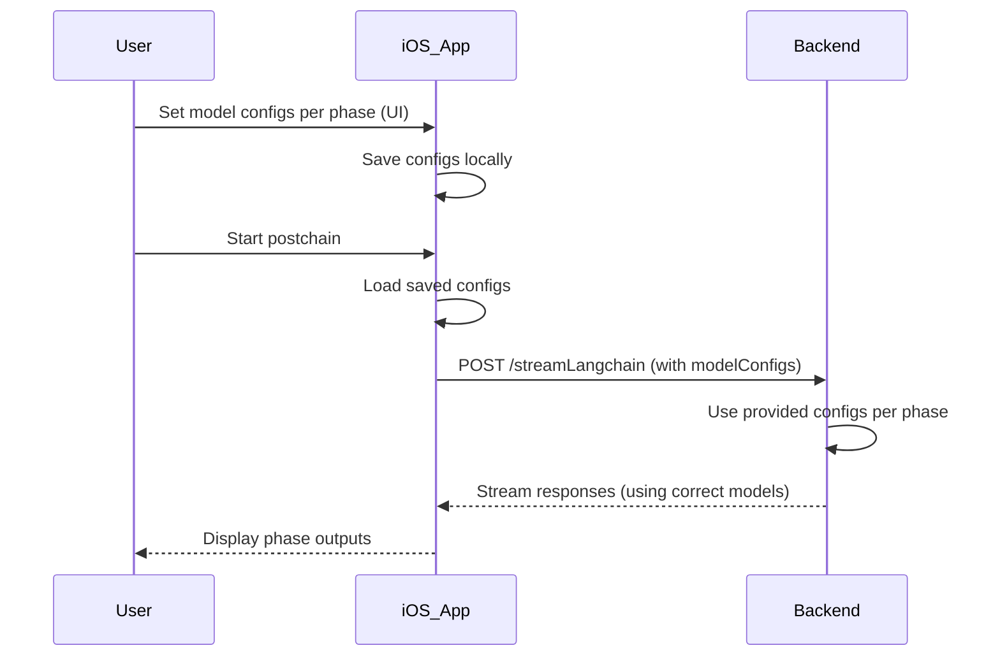

# Root Cause Analysis: Experience Phases Always Using `quasar-alpha`

## Summary

Regardless of saved model configurations, the **experiencevectors** and **experienceweb** phases always use the `quasar-alpha` model. This behavior is due to the backend falling back on hardcoded defaults because the iOS app does **not send** per-phase model configs in API requests.

---

## Investigation Findings

### Backend (`api/app/postchain/langchain_workflow.py`)

- The backend **assigns default models** for each phase if **no override is provided**:
  ```python
  experience_vectors_model_config = experience_vectors_mc_override or ModelConfig(provider="openrouter", model_name="openrouter/quasar-alpha", temperature=default_temp)
  experience_web_model_config = experience_web_mc_override or ModelConfig(provider="openrouter", model_name="openrouter/quasar-alpha", temperature=default_temp)
  ```
- So, **without explicit overrides**, these phases **always use `quasar-alpha`**.

---

### iOS App (Swift)

- The app **supports** sending per-phase model configs via the `modelConfigs` parameter in:
  ```swift
  RESTPostchainAPIClient.streamLangchain(query:threadId:modelConfigs:onPhaseUpdate:)
  ```
- The app **does NOT currently pass** any `modelConfigs` in API requests.
- Therefore, the backend **always falls back to defaults**.

---

### Saved Configs

- Saved model configs are stored locally in the app UI.
- However, they are **not sent** to the backend during execution.
- This disconnect causes the backend to **ignore user preferences**.

---

## Root Cause

- The **absence of per-phase model configs** in the API request payload.
- Backend defaults are used instead, leading to persistent use of `quasar-alpha` for experience phases.

---

## Solution Design

### Goals

- **Always provide per-phase model configs** in API requests.
- Allow **dynamic, on-the-fly changes** to model configs.
- Override backend defaults **completely**.

---

### Implementation Plan

1. **Retrieve saved/current configs** in the ViewModel before starting a postchain.
2. **Pass these configs** as the `modelConfigs` parameter to `RESTPostchainAPIClient.streamLangchain()`.
3. **Backend will respect** these overrides (already implemented).
4. **Verify** that the correct models are used during execution.

---

## Data Flow After Fix



---

## Conclusion

- The **core fix** is to **always pass the current model configs** in the API request.
- This will override backend defaults and enable **dynamic, per-phase model selection**.
- The backend logic already supports this override mechanism.

---

## Next Steps

- Implement the fix in the ViewModel.
- Test end-to-end with different saved configs.
- Confirm that experience phases use the intended models.
