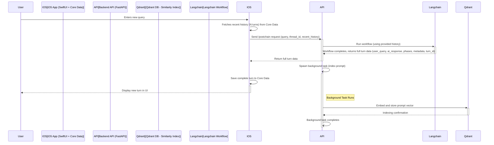

# Refactoring Plan: Client-Side Persistence & Simplified Backend

**Date:** 2025-04-06

**Status:** Agreed

## 1. Background & Motivation

Following the exploration of Qdrant for persistence (`qdrant_persistence.md`), we identified limitations in using it as both an application database and a vector search engine. This led to architectural complexity and didn't leverage Qdrant's core strengths effectively.

This refactoring plan pivots to a clearer architecture based on these key learnings:

*   **Separation of Concerns:** Application data (message history) should be managed separately from the similarity search index.
*   **Data Ownership:** Conversation history fundamentally belongs to the user and is best managed client-side.
*   **Turn-Based Model:** Structuring data and logic around conversation turns (User Query + AI Response cycle) simplifies state management.

## 2. New Architectural Principles

1.  **Client-Side Source of Truth:** The iOS app, using Core Data, will store and manage the user's threads and message history (turns).
2.  **API as Orchestrator:** The FastAPI backend receives the user query and necessary context (recent history) from the client, runs the PostChain workflow, and returns the complete turn data back to the client.
3.  **Qdrant for Similarity Search Only:** Qdrant's role is reduced to indexing user prompts (and potentially final AI responses) *after* they occur, solely for future similarity searches. It is not involved in storing the primary conversation log.
4.  **Server-Side State is Ephemeral:** Any state held server-side during processing is treated as a temporary cache, reconstructible from the client's data or Qdrant's index.
5.  **Turn-Based Data Model:** The fundamental unit of persisted history is a "turn," containing the user query and the corresponding AI response with its associated phase outputs and metadata.

## 3. Proposed Data Flow

## 4. Refactoring Plan Phases

**Phase 1: Client-Side Persistence (Core Data)**

1.  **Define Core Data Model:**
    *   `CDThread`: `id: UUID`, `title: String`, `createdAt: Date`, `lastActivity: Date`, `turns: Relationship<Set<CDTurn>>`
    *   `CDTurn`: `id: UUID`, `timestamp: Date`, `userQuery: String`, `aiResponseContent: String`, `phaseOutputsJSON: String?`, `metadataJSON: String?`, `thread: Relationship<CDThread>`
2.  **Implement Core Data Stack:** Set up `NSPersistentContainer`, context management in the iOS app.
3.  **Create PersistenceManager (Swift):** Encapsulate Core Data CRUD operations for `CDThread` and `CDTurn`.
4.  **Refactor UI (SwiftUI):**
    *   `ContentView`: Load/display `CDThread` list from Core Data. Handle new thread creation locally.
    *   `ChoirThreadDetailView`: Load/display `CDTurn` list for the selected thread from Core Data.
    *   Adapt `ChoirThread` ObservableObject if necessary to work with Core Data entities.
5.  **Implement Message Sending Flow:**
    *   Display user query optimistically.
    *   Call API (Phase 2 changes).
    *   On receiving full turn data from API, save `CDTurn` via `PersistenceManager`.
    *   Rely on Core Data updates (e.g., `@FetchRequest` or manual refresh) to update the UI.

**Phase 2: API Endpoint & Workflow Refactoring**

1.  **Modify `/postchain/langchain` Endpoint (`api/app/routers/postchain.py`):**
    *   Update `SimplePostChainRequest` Pydantic model: Add `recent_history: List[Dict]`, remove fields no longer needed.
    *   Update response mechanism: Ensure the final, complete turn data (including `user_query`, `ai_response_content`, `phase_outputs`, `metadata`, `timestamp`, `turn_id`) is returned upon successful workflow completion (likely via the final streaming event or a dedicated response structure).
2.  **Refactor `api/app/postchain/langchain_workflow.py`:**
    *   Remove internal history loading (`db.get_message_history`).
    *   Consume `recent_history` from input arguments for context.
    *   Remove final state saving (`db.save_message`).
    *   Structure and return the complete turn data.

**Phase 3: API Database Layer & Router Simplification**

1.  **Refactor `api/app/database.py`:**
    *   **Remove:** Functions related to managing user/thread/message history (`get_message_history`, `create_user`, `get_user`, `create_thread`, `get_thread`, `get_thread_messages`, `get_user_threads`, etc.).
    *   **Keep/Refactor:** Functions purely for vector similarity search (`search_similar`, `store_vector`/`index_prompt`, `delete_vector`, `get_vector`). Ensure these operate independently of the conversation history logic.
2.  **Deprecate/Refactor Routers (`api/app/routers/`):**
    *   Remove or disable `/users` and `/threads` routers.
    *   Refocus `/vectors` router (if kept) solely on managing the similarity search index.

**Phase 4: Qdrant Re-purposing & Indexing Strategy**

1.  **Define Indexing Scope:** Primarily user prompts.
2.  **Implement Indexing Trigger (Option B - Server Async):**
    *   The `/postchain/langchain` endpoint handler will spawn a background task (e.g., using FastAPI's `BackgroundTasks`) *after* successfully preparing the response to send back to the client.
3.  **Implement Indexing Logic:**
    *   The background task will receive necessary data (e.g., `turn_id`, `thread_id`, `user_query`, `timestamp`).
    *   It will call an embedding function (ensure model consistency).
    *   It will use the refactored `database.py` function (`store_vector`/`index_prompt`) to save the vector and payload to Qdrant.
4.  **Define Qdrant Schema:** Use a dedicated collection (e.g., `prompt_index`) with fields: `id` (turn UUID), `vector`, `payload` (`thread_id`, `user_query`, `timestamp`).

**Phase 5: Client Networking Adaptation (Swift)**

1.  **Update API Client (`ChoirAPIClient`, `RESTPostchainAPIClient`):**
    *   Modify the function calling `/postchain/langchain` to fetch recent history from `PersistenceManager` and include it in the request body.
    *   Adapt response handling to parse the final, complete turn data structure returned by the API.
2.  **Update Coordinator (`RESTPostchainCoordinator`):**
    *   Integrate with `PersistenceManager` to fetch history before API calls.
    *   Trigger saving the received turn data to Core Data via `PersistenceManager` upon successful API response.
    *   Remove calls related to fetching threads/messages history from the API.

**Phase 6: Testing**

1.  **Client:** Unit test `PersistenceManager`, Core Data interactions, UI updates from local data. Mock API responses.
2.  **API:** Unit test refactored workflow logic, new/refactored `database.py` functions (mocking Qdrant client), background indexing task logic.
3.  **Integration:** Test the end-to-end flow: sending a message, API processing, client saving to Core Data, API background task indexing in Qdrant. Verify data consistency in Core Data and Qdrant.

## 5. Key Benefits

*   **Clear Separation of Concerns:** Core Data for user history, Qdrant for similarity search.
*   **Correct Data Ownership:** User history resides on their device.
*   **Offline Access Foundation:** Enables future offline viewing.
*   **API Scalability:** Backend becomes more stateless regarding history.
*   **Simplified Backend:** Reduces complexity in the core conversation flow.
*   **Leverages Learnings:** Incorporates turn-based model and refactoring insights.
